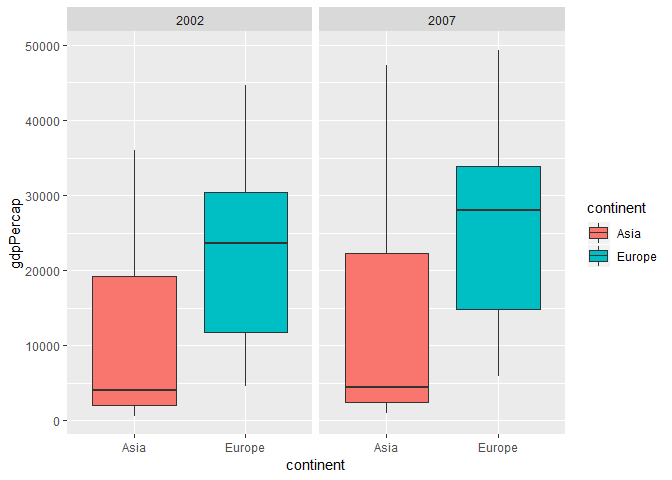
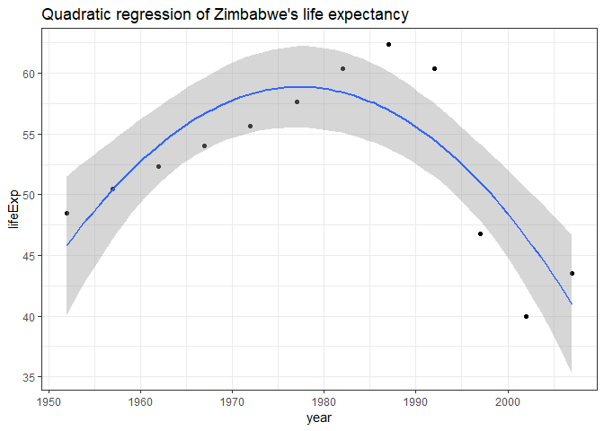

hw-06 data wrangling wrap up
================

-   [Question 1 - Character Data](#question-1---character-data)
-   [Initialize](#initialize)
    -   [14.2.5 String basics](#string-basics)
    -   [14.3.1.1 Matching Patterns with Regex - Basic Matches](#matching-patterns-with-regex---basic-matches)
    -   [14.3.2.1 Matching Patterns with Regex - Anchors](#matching-patterns-with-regex---anchors)
    -   [14.3.3.1 Matching Patterns with Regex - Character classes and alternatives](#matching-patterns-with-regex---character-classes-and-alternatives)
    -   [14.3.4.1 Matching Patterns with Regex - Repetition](#matching-patterns-with-regex---repetition)
    -   [14.3.5.1 Matching Patterns with Regex - Grouping and backreferences](#matching-patterns-with-regex---grouping-and-backreferences)
    -   [14.4.2 Tools](#tools)
    -   [14.4.3.1 Tools - Extract matches](#tools---extract-matches)
    -   [14.4.4.1 Tools - Grouped matches](#tools---grouped-matches)
    -   [14.4.5.1 Tools - Replacing matches](#tools---replacing-matches)
    -   [14.4.6.1 Splitting](#splitting)
    -   [14.5.1 Other types of patterns](#other-types-of-patterns)
    -   [14.7.1 stringi](#stringi)
-   [Question 2 - Write a function](#question-2---write-a-function)
    -   [Initialize](#initialize-1)
    -   [Method](#method)
    -   [Code](#code)
-   [Resources](#resources)

Question 1 - Character Data
---------------------------

Exercises from **Strings** chapter in **R for Data Science**.

Initialize
----------

-   Load the required libraries:

``` r
suppressPackageStartupMessages(library(tidyverse))
suppressPackageStartupMessages(library(stringr))
suppressPackageStartupMessages(library(stringi))
```

### 14.2.5 String basics

**1. In code that doesn’t use stringr, you’ll often see paste() and paste0(). What’s the difference between the two functions? What stringr function are they equivalent to? How do the functions differ in their handling of NA?**

-   `paste()` separates strings by spaces by default, whereas `paste0()` doesn't
-   The stringr function `str_c()` is equivalent to `paste0()`
-   In terms of how the functions handle NA: `str_c()` converts it to a missing value; paste0() converts it the string `"NA"`

**2. In your own words, describe the difference between the sep and collapse arguments to str\_c().**

-   `sep` is the string inserted between arguments
-   `collapse` is the string that separates any elements of the character vector into a character vector of length one.

**3. Use str\_length() and str\_sub() to extract the middle character from a string. What will you do if the string has an even number of characters?**

We can select either the higher above the middle character using the *ceiling* function:

``` r
x <- c("p", "pur", "purr", "purrr", "purrrr")
length <- str_length(x)
middle <- ceiling(length / 2)
str_sub(x, middle, middle)
```

    ## [1] "p" "u" "u" "r" "r"

**4. What does str\_wrap() do? When might you want to use it?**

`str_wrap()` wraps text so that it fits within a certain width.

**5. What does str\_trim() do? What’s the opposite of str\_trim()?**

`str_trim()` trims the whitespace from a string. The opposite of `str_trim()` is `str_pad()`, which adds characters to each side.

``` r
str_trim(" hello ", side = "left")
```

    ## [1] "hello "

``` r
str_pad("hello", 5, side = "both")
```

    ## [1] "hello"

``` r
str_pad("hello", 4, side = "right")
```

    ## [1] "hello"

**6. Write a function that turns (e.g.) a vector c("a", "b", "c") into the string a, b, and c. Think carefully about what it should do if given a vector of length 0, 1, or 2.**

``` r
str_convert <- function(x, delim = ",") {
  n <- length(x)
  if (n == 0) { #Tells the function how to handle length 0
    ""
  } else if (n == 1) { #Tells the function how to handle length 1
    x
  } else if (n == 2) { #Tells the function how to handle length 2
    # no comma before and when n == 2
    str_c(x[[1]], "and", x[[2]], sep = " ")
  } else { #Tells the function how to handle all other lengths
    not_last <- str_c(x[seq_len(n - 1)], delim)
    last <- str_c("and", x[[n]], sep = " ")
    str_c(c(not_last, last), collapse = " ")
  }
}

#Test function
str_convert(c("a", "b", "c", "d"))
```

    ## [1] "a, b, c, and d"

### 14.3.1.1 Matching Patterns with Regex - Basic Matches

**1. Explain why each of these strings don’t match a ": "", "\\", "\\"."**

-   `"\"`: Escapes the next character in the R string
-   `"\\"`: Resolves to `\` in the regular expression, which escapes the next character in the regular expression.
-   `"\\\"`: Resolves to a literal backslash in the regular expression, and escapes the next character.

**2. How would you match the sequence "'"?**

    str_view("\"'\\", "\"'\\\\")

**3. What patterns will the regular expression "......"" match? How would you represent it as a string?**

``` r
str_view(c(".a.b.c", ".a.b", "....."), c("\\..\\..\\.."))
```

<!--html_preserve-->

<script type="application/json" data-for="htmlwidget-e0356e8879ccea75b798">{"x":{"html":"<ul>\n  <li><span class='match'>.a.b.c<\/span><\/li>\n  <li>.a.b<\/li>\n  <li>.....<\/li>\n<\/ul>"},"evals":[],"jsHooks":[]}</script>
<!--/html_preserve-->
### 14.3.2.1 Matching Patterns with Regex - Anchors

**1. How would you match the literal string "$^$"?**

``` r
str_view(c("$^$", "ab$^$sfas"), "^\\$\\^\\$$")
```

<!--html_preserve-->

<script type="application/json" data-for="htmlwidget-097ab07bc46301576399">{"x":{"html":"<ul>\n  <li><span class='match'>$^$<\/span><\/li>\n  <li>ab$^$sfas<\/li>\n<\/ul>"},"evals":[],"jsHooks":[]}</script>
<!--/html_preserve-->
**2. Given the corpus of common words in stringr::words, create regular expressions that find all words that:**

-   Start with “y”

``` r
    str_view(stringr::words, "^y", match =TRUE) %>% head()
```

    ## $x
    ## $x$html
    ## <ul>
    ##   <li><span class='match'>y</span>ear</li>
    ##   <li><span class='match'>y</span>es</li>
    ##   <li><span class='match'>y</span>esterday</li>
    ##   <li><span class='match'>y</span>et</li>
    ##   <li><span class='match'>y</span>ou</li>
    ##   <li><span class='match'>y</span>oung</li>
    ## </ul>
    ## 
    ## 
    ## $width
    ## NULL
    ## 
    ## $height
    ## NULL
    ## 
    ## $sizingPolicy
    ## $sizingPolicy$defaultWidth
    ## NULL
    ## 
    ## $sizingPolicy$defaultHeight
    ## [1] 60
    ## 
    ## $sizingPolicy$padding
    ## NULL
    ## 
    ## $sizingPolicy$viewer
    ## $sizingPolicy$viewer$defaultWidth
    ## NULL
    ## 
    ## $sizingPolicy$viewer$defaultHeight
    ## NULL
    ## 
    ## $sizingPolicy$viewer$padding
    ## NULL
    ## 
    ## $sizingPolicy$viewer$fill
    ## [1] TRUE
    ## 
    ## $sizingPolicy$viewer$suppress
    ## [1] FALSE
    ## 
    ## $sizingPolicy$viewer$paneHeight
    ## NULL
    ## 
    ## 
    ## $sizingPolicy$browser
    ## $sizingPolicy$browser$defaultWidth
    ## NULL
    ## 
    ## $sizingPolicy$browser$defaultHeight
    ## NULL
    ## 
    ## $sizingPolicy$browser$padding
    ## NULL
    ## 
    ## $sizingPolicy$browser$fill
    ## [1] FALSE
    ## 
    ## $sizingPolicy$browser$external
    ## [1] FALSE
    ## 
    ## 
    ## $sizingPolicy$knitr
    ## $sizingPolicy$knitr$defaultWidth
    ## NULL
    ## 
    ## $sizingPolicy$knitr$defaultHeight
    ## [1] "100%"
    ## 
    ## $sizingPolicy$knitr$figure
    ## [1] FALSE
    ## 
    ## 
    ## 
    ## $dependencies
    ## NULL
    ## 
    ## $elementId
    ## NULL

-   End with “x”

``` r
    str_view(stringr::words, "x$", match = TRUE) %>% head()
```

    ## $x
    ## $x$html
    ## <ul>
    ##   <li>bo<span class='match'>x</span></li>
    ##   <li>se<span class='match'>x</span></li>
    ##   <li>si<span class='match'>x</span></li>
    ##   <li>ta<span class='match'>x</span></li>
    ## </ul>
    ## 
    ## 
    ## $width
    ## NULL
    ## 
    ## $height
    ## NULL
    ## 
    ## $sizingPolicy
    ## $sizingPolicy$defaultWidth
    ## NULL
    ## 
    ## $sizingPolicy$defaultHeight
    ## [1] 40
    ## 
    ## $sizingPolicy$padding
    ## NULL
    ## 
    ## $sizingPolicy$viewer
    ## $sizingPolicy$viewer$defaultWidth
    ## NULL
    ## 
    ## $sizingPolicy$viewer$defaultHeight
    ## NULL
    ## 
    ## $sizingPolicy$viewer$padding
    ## NULL
    ## 
    ## $sizingPolicy$viewer$fill
    ## [1] TRUE
    ## 
    ## $sizingPolicy$viewer$suppress
    ## [1] FALSE
    ## 
    ## $sizingPolicy$viewer$paneHeight
    ## NULL
    ## 
    ## 
    ## $sizingPolicy$browser
    ## $sizingPolicy$browser$defaultWidth
    ## NULL
    ## 
    ## $sizingPolicy$browser$defaultHeight
    ## NULL
    ## 
    ## $sizingPolicy$browser$padding
    ## NULL
    ## 
    ## $sizingPolicy$browser$fill
    ## [1] FALSE
    ## 
    ## $sizingPolicy$browser$external
    ## [1] FALSE
    ## 
    ## 
    ## $sizingPolicy$knitr
    ## $sizingPolicy$knitr$defaultWidth
    ## NULL
    ## 
    ## $sizingPolicy$knitr$defaultHeight
    ## [1] "100%"
    ## 
    ## $sizingPolicy$knitr$figure
    ## [1] FALSE
    ## 
    ## 
    ## 
    ## $dependencies
    ## NULL
    ## 
    ## $elementId
    ## NULL

-   Are exactly three letters long.

``` r
    str_view(stringr::words, "^...$", match = TRUE) %>% head()
```

    ## $x
    ## $x$html
    ## <ul>
    ##   <li><span class='match'>act</span></li>
    ##   <li><span class='match'>add</span></li>
    ##   <li><span class='match'>age</span></li>
    ##   <li><span class='match'>ago</span></li>
    ##   <li><span class='match'>air</span></li>
    ##   <li><span class='match'>all</span></li>
    ##   <li><span class='match'>and</span></li>
    ##   <li><span class='match'>any</span></li>
    ##   <li><span class='match'>arm</span></li>
    ##   <li><span class='match'>art</span></li>
    ##   <li><span class='match'>ask</span></li>
    ##   <li><span class='match'>bad</span></li>
    ##   <li><span class='match'>bag</span></li>
    ##   <li><span class='match'>bar</span></li>
    ##   <li><span class='match'>bed</span></li>
    ##   <li><span class='match'>bet</span></li>
    ##   <li><span class='match'>big</span></li>
    ##   <li><span class='match'>bit</span></li>
    ##   <li><span class='match'>box</span></li>
    ##   <li><span class='match'>boy</span></li>
    ##   <li><span class='match'>bus</span></li>
    ##   <li><span class='match'>but</span></li>
    ##   <li><span class='match'>buy</span></li>
    ##   <li><span class='match'>can</span></li>
    ##   <li><span class='match'>car</span></li>
    ##   <li><span class='match'>cat</span></li>
    ##   <li><span class='match'>cup</span></li>
    ##   <li><span class='match'>cut</span></li>
    ##   <li><span class='match'>dad</span></li>
    ##   <li><span class='match'>day</span></li>
    ##   <li><span class='match'>die</span></li>
    ##   <li><span class='match'>dog</span></li>
    ##   <li><span class='match'>dry</span></li>
    ##   <li><span class='match'>due</span></li>
    ##   <li><span class='match'>eat</span></li>
    ##   <li><span class='match'>egg</span></li>
    ##   <li><span class='match'>end</span></li>
    ##   <li><span class='match'>eye</span></li>
    ##   <li><span class='match'>far</span></li>
    ##   <li><span class='match'>few</span></li>
    ##   <li><span class='match'>fit</span></li>
    ##   <li><span class='match'>fly</span></li>
    ##   <li><span class='match'>for</span></li>
    ##   <li><span class='match'>fun</span></li>
    ##   <li><span class='match'>gas</span></li>
    ##   <li><span class='match'>get</span></li>
    ##   <li><span class='match'>god</span></li>
    ##   <li><span class='match'>guy</span></li>
    ##   <li><span class='match'>hit</span></li>
    ##   <li><span class='match'>hot</span></li>
    ##   <li><span class='match'>how</span></li>
    ##   <li><span class='match'>job</span></li>
    ##   <li><span class='match'>key</span></li>
    ##   <li><span class='match'>kid</span></li>
    ##   <li><span class='match'>lad</span></li>
    ##   <li><span class='match'>law</span></li>
    ##   <li><span class='match'>lay</span></li>
    ##   <li><span class='match'>leg</span></li>
    ##   <li><span class='match'>let</span></li>
    ##   <li><span class='match'>lie</span></li>
    ##   <li><span class='match'>lot</span></li>
    ##   <li><span class='match'>low</span></li>
    ##   <li><span class='match'>man</span></li>
    ##   <li><span class='match'>may</span></li>
    ##   <li><span class='match'>mrs</span></li>
    ##   <li><span class='match'>new</span></li>
    ##   <li><span class='match'>non</span></li>
    ##   <li><span class='match'>not</span></li>
    ##   <li><span class='match'>now</span></li>
    ##   <li><span class='match'>odd</span></li>
    ##   <li><span class='match'>off</span></li>
    ##   <li><span class='match'>old</span></li>
    ##   <li><span class='match'>one</span></li>
    ##   <li><span class='match'>out</span></li>
    ##   <li><span class='match'>own</span></li>
    ##   <li><span class='match'>pay</span></li>
    ##   <li><span class='match'>per</span></li>
    ##   <li><span class='match'>put</span></li>
    ##   <li><span class='match'>red</span></li>
    ##   <li><span class='match'>rid</span></li>
    ##   <li><span class='match'>run</span></li>
    ##   <li><span class='match'>say</span></li>
    ##   <li><span class='match'>see</span></li>
    ##   <li><span class='match'>set</span></li>
    ##   <li><span class='match'>sex</span></li>
    ##   <li><span class='match'>she</span></li>
    ##   <li><span class='match'>sir</span></li>
    ##   <li><span class='match'>sit</span></li>
    ##   <li><span class='match'>six</span></li>
    ##   <li><span class='match'>son</span></li>
    ##   <li><span class='match'>sun</span></li>
    ##   <li><span class='match'>tax</span></li>
    ##   <li><span class='match'>tea</span></li>
    ##   <li><span class='match'>ten</span></li>
    ##   <li><span class='match'>the</span></li>
    ##   <li><span class='match'>tie</span></li>
    ##   <li><span class='match'>too</span></li>
    ##   <li><span class='match'>top</span></li>
    ##   <li><span class='match'>try</span></li>
    ##   <li><span class='match'>two</span></li>
    ##   <li><span class='match'>use</span></li>
    ##   <li><span class='match'>war</span></li>
    ##   <li><span class='match'>way</span></li>
    ##   <li><span class='match'>wee</span></li>
    ##   <li><span class='match'>who</span></li>
    ##   <li><span class='match'>why</span></li>
    ##   <li><span class='match'>win</span></li>
    ##   <li><span class='match'>yes</span></li>
    ##   <li><span class='match'>yet</span></li>
    ##   <li><span class='match'>you</span></li>
    ## </ul>
    ## 
    ## 
    ## $width
    ## NULL
    ## 
    ## $height
    ## NULL
    ## 
    ## $sizingPolicy
    ## $sizingPolicy$defaultWidth
    ## NULL
    ## 
    ## $sizingPolicy$defaultHeight
    ## [1] 300
    ## 
    ## $sizingPolicy$padding
    ## NULL
    ## 
    ## $sizingPolicy$viewer
    ## $sizingPolicy$viewer$defaultWidth
    ## NULL
    ## 
    ## $sizingPolicy$viewer$defaultHeight
    ## NULL
    ## 
    ## $sizingPolicy$viewer$padding
    ## NULL
    ## 
    ## $sizingPolicy$viewer$fill
    ## [1] TRUE
    ## 
    ## $sizingPolicy$viewer$suppress
    ## [1] FALSE
    ## 
    ## $sizingPolicy$viewer$paneHeight
    ## NULL
    ## 
    ## 
    ## $sizingPolicy$browser
    ## $sizingPolicy$browser$defaultWidth
    ## NULL
    ## 
    ## $sizingPolicy$browser$defaultHeight
    ## NULL
    ## 
    ## $sizingPolicy$browser$padding
    ## NULL
    ## 
    ## $sizingPolicy$browser$fill
    ## [1] FALSE
    ## 
    ## $sizingPolicy$browser$external
    ## [1] FALSE
    ## 
    ## 
    ## $sizingPolicy$knitr
    ## $sizingPolicy$knitr$defaultWidth
    ## NULL
    ## 
    ## $sizingPolicy$knitr$defaultHeight
    ## [1] "100%"
    ## 
    ## $sizingPolicy$knitr$figure
    ## [1] FALSE
    ## 
    ## 
    ## 
    ## $dependencies
    ## NULL
    ## 
    ## $elementId
    ## NULL

-   Have seven letters or more.

``` r
    str_view(stringr::words, ".......", match = TRUE) %>% head()
```

    ## $x
    ## $x$html
    ## <ul>
    ##   <li><span class='match'>absolut</span>e</li>
    ##   <li><span class='match'>account</span></li>
    ##   <li><span class='match'>achieve</span></li>
    ##   <li><span class='match'>address</span></li>
    ##   <li><span class='match'>adverti</span>se</li>
    ##   <li><span class='match'>afterno</span>on</li>
    ##   <li><span class='match'>against</span></li>
    ##   <li><span class='match'>already</span></li>
    ##   <li><span class='match'>alright</span></li>
    ##   <li><span class='match'>althoug</span>h</li>
    ##   <li><span class='match'>america</span></li>
    ##   <li><span class='match'>another</span></li>
    ##   <li><span class='match'>apparen</span>t</li>
    ##   <li><span class='match'>appoint</span></li>
    ##   <li><span class='match'>approac</span>h</li>
    ##   <li><span class='match'>appropr</span>iate</li>
    ##   <li><span class='match'>arrange</span></li>
    ##   <li><span class='match'>associa</span>te</li>
    ##   <li><span class='match'>authori</span>ty</li>
    ##   <li><span class='match'>availab</span>le</li>
    ##   <li><span class='match'>balance</span></li>
    ##   <li><span class='match'>because</span></li>
    ##   <li><span class='match'>believe</span></li>
    ##   <li><span class='match'>benefit</span></li>
    ##   <li><span class='match'>between</span></li>
    ##   <li><span class='match'>brillia</span>nt</li>
    ##   <li><span class='match'>britain</span></li>
    ##   <li><span class='match'>brother</span></li>
    ##   <li><span class='match'>busines</span>s</li>
    ##   <li><span class='match'>certain</span></li>
    ##   <li><span class='match'>chairma</span>n</li>
    ##   <li><span class='match'>charact</span>er</li>
    ##   <li><span class='match'>Christm</span>as</li>
    ##   <li><span class='match'>colleag</span>ue</li>
    ##   <li><span class='match'>collect</span></li>
    ##   <li><span class='match'>college</span></li>
    ##   <li><span class='match'>comment</span></li>
    ##   <li><span class='match'>committ</span>ee</li>
    ##   <li><span class='match'>communi</span>ty</li>
    ##   <li><span class='match'>company</span></li>
    ##   <li><span class='match'>compare</span></li>
    ##   <li><span class='match'>complet</span>e</li>
    ##   <li><span class='match'>compute</span></li>
    ##   <li><span class='match'>concern</span></li>
    ##   <li><span class='match'>conditi</span>on</li>
    ##   <li><span class='match'>conside</span>r</li>
    ##   <li><span class='match'>consult</span></li>
    ##   <li><span class='match'>contact</span></li>
    ##   <li><span class='match'>continu</span>e</li>
    ##   <li><span class='match'>contrac</span>t</li>
    ##   <li><span class='match'>control</span></li>
    ##   <li><span class='match'>convers</span>e</li>
    ##   <li><span class='match'>correct</span></li>
    ##   <li><span class='match'>council</span></li>
    ##   <li><span class='match'>country</span></li>
    ##   <li><span class='match'>current</span></li>
    ##   <li><span class='match'>decisio</span>n</li>
    ##   <li><span class='match'>definit</span>e</li>
    ##   <li><span class='match'>departm</span>ent</li>
    ##   <li><span class='match'>describ</span>e</li>
    ##   <li><span class='match'>develop</span></li>
    ##   <li><span class='match'>differe</span>nce</li>
    ##   <li><span class='match'>difficu</span>lt</li>
    ##   <li><span class='match'>discuss</span></li>
    ##   <li><span class='match'>distric</span>t</li>
    ##   <li><span class='match'>documen</span>t</li>
    ##   <li><span class='match'>economy</span></li>
    ##   <li><span class='match'>educate</span></li>
    ##   <li><span class='match'>electri</span>c</li>
    ##   <li><span class='match'>encoura</span>ge</li>
    ##   <li><span class='match'>english</span></li>
    ##   <li><span class='match'>environ</span>ment</li>
    ##   <li><span class='match'>especia</span>l</li>
    ##   <li><span class='match'>evening</span></li>
    ##   <li><span class='match'>evidenc</span>e</li>
    ##   <li><span class='match'>example</span></li>
    ##   <li><span class='match'>exercis</span>e</li>
    ##   <li><span class='match'>expense</span></li>
    ##   <li><span class='match'>experie</span>nce</li>
    ##   <li><span class='match'>explain</span></li>
    ##   <li><span class='match'>express</span></li>
    ##   <li><span class='match'>finance</span></li>
    ##   <li><span class='match'>fortune</span></li>
    ##   <li><span class='match'>forward</span></li>
    ##   <li><span class='match'>functio</span>n</li>
    ##   <li><span class='match'>further</span></li>
    ##   <li><span class='match'>general</span></li>
    ##   <li><span class='match'>germany</span></li>
    ##   <li><span class='match'>goodbye</span></li>
    ##   <li><span class='match'>history</span></li>
    ##   <li><span class='match'>holiday</span></li>
    ##   <li><span class='match'>hospita</span>l</li>
    ##   <li><span class='match'>however</span></li>
    ##   <li><span class='match'>hundred</span></li>
    ##   <li><span class='match'>husband</span></li>
    ##   <li><span class='match'>identif</span>y</li>
    ##   <li><span class='match'>imagine</span></li>
    ##   <li><span class='match'>importa</span>nt</li>
    ##   <li><span class='match'>improve</span></li>
    ##   <li><span class='match'>include</span></li>
    ##   <li><span class='match'>increas</span>e</li>
    ##   <li><span class='match'>individ</span>ual</li>
    ##   <li><span class='match'>industr</span>y</li>
    ##   <li><span class='match'>instead</span></li>
    ##   <li><span class='match'>interes</span>t</li>
    ##   <li><span class='match'>introdu</span>ce</li>
    ##   <li><span class='match'>involve</span></li>
    ##   <li><span class='match'>kitchen</span></li>
    ##   <li><span class='match'>languag</span>e</li>
    ##   <li><span class='match'>machine</span></li>
    ##   <li><span class='match'>meaning</span></li>
    ##   <li><span class='match'>measure</span></li>
    ##   <li><span class='match'>mention</span></li>
    ##   <li><span class='match'>million</span></li>
    ##   <li><span class='match'>ministe</span>r</li>
    ##   <li><span class='match'>morning</span></li>
    ##   <li><span class='match'>necessa</span>ry</li>
    ##   <li><span class='match'>obvious</span></li>
    ##   <li><span class='match'>occasio</span>n</li>
    ##   <li><span class='match'>operate</span></li>
    ##   <li><span class='match'>opportu</span>nity</li>
    ##   <li><span class='match'>organiz</span>e</li>
    ##   <li><span class='match'>origina</span>l</li>
    ##   <li><span class='match'>otherwi</span>se</li>
    ##   <li><span class='match'>paragra</span>ph</li>
    ##   <li><span class='match'>particu</span>lar</li>
    ##   <li><span class='match'>pension</span></li>
    ##   <li><span class='match'>percent</span></li>
    ##   <li><span class='match'>perfect</span></li>
    ##   <li><span class='match'>perhaps</span></li>
    ##   <li><span class='match'>photogr</span>aph</li>
    ##   <li><span class='match'>picture</span></li>
    ##   <li><span class='match'>politic</span></li>
    ##   <li><span class='match'>positio</span>n</li>
    ##   <li><span class='match'>positiv</span>e</li>
    ##   <li><span class='match'>possibl</span>e</li>
    ##   <li><span class='match'>practis</span>e</li>
    ##   <li><span class='match'>prepare</span></li>
    ##   <li><span class='match'>present</span></li>
    ##   <li><span class='match'>pressur</span>e</li>
    ##   <li><span class='match'>presume</span></li>
    ##   <li><span class='match'>previou</span>s</li>
    ##   <li><span class='match'>private</span></li>
    ##   <li><span class='match'>probabl</span>e</li>
    ##   <li><span class='match'>problem</span></li>
    ##   <li><span class='match'>proceed</span></li>
    ##   <li><span class='match'>process</span></li>
    ##   <li><span class='match'>produce</span></li>
    ##   <li><span class='match'>product</span></li>
    ##   <li><span class='match'>program</span>me</li>
    ##   <li><span class='match'>project</span></li>
    ##   <li><span class='match'>propose</span></li>
    ##   <li><span class='match'>protect</span></li>
    ##   <li><span class='match'>provide</span></li>
    ##   <li><span class='match'>purpose</span></li>
    ##   <li><span class='match'>quality</span></li>
    ##   <li><span class='match'>quarter</span></li>
    ##   <li><span class='match'>questio</span>n</li>
    ##   <li><span class='match'>realise</span></li>
    ##   <li><span class='match'>receive</span></li>
    ##   <li><span class='match'>recogni</span>ze</li>
    ##   <li><span class='match'>recomme</span>nd</li>
    ##   <li><span class='match'>relatio</span>n</li>
    ##   <li><span class='match'>remembe</span>r</li>
    ##   <li><span class='match'>represe</span>nt</li>
    ##   <li><span class='match'>require</span></li>
    ##   <li><span class='match'>researc</span>h</li>
    ##   <li><span class='match'>resourc</span>e</li>
    ##   <li><span class='match'>respect</span></li>
    ##   <li><span class='match'>respons</span>ible</li>
    ##   <li><span class='match'>saturda</span>y</li>
    ##   <li><span class='match'>science</span></li>
    ##   <li><span class='match'>scotlan</span>d</li>
    ##   <li><span class='match'>secreta</span>ry</li>
    ##   <li><span class='match'>section</span></li>
    ##   <li><span class='match'>separat</span>e</li>
    ##   <li><span class='match'>serious</span></li>
    ##   <li><span class='match'>service</span></li>
    ##   <li><span class='match'>similar</span></li>
    ##   <li><span class='match'>situate</span></li>
    ##   <li><span class='match'>society</span></li>
    ##   <li><span class='match'>special</span></li>
    ##   <li><span class='match'>specifi</span>c</li>
    ##   <li><span class='match'>standar</span>d</li>
    ##   <li><span class='match'>station</span></li>
    ##   <li><span class='match'>straigh</span>t</li>
    ##   <li><span class='match'>strateg</span>y</li>
    ##   <li><span class='match'>structu</span>re</li>
    ##   <li><span class='match'>student</span></li>
    ##   <li><span class='match'>subject</span></li>
    ##   <li><span class='match'>succeed</span></li>
    ##   <li><span class='match'>suggest</span></li>
    ##   <li><span class='match'>support</span></li>
    ##   <li><span class='match'>suppose</span></li>
    ##   <li><span class='match'>surpris</span>e</li>
    ##   <li><span class='match'>telepho</span>ne</li>
    ##   <li><span class='match'>televis</span>ion</li>
    ##   <li><span class='match'>terribl</span>e</li>
    ##   <li><span class='match'>therefo</span>re</li>
    ##   <li><span class='match'>thirtee</span>n</li>
    ##   <li><span class='match'>thousan</span>d</li>
    ##   <li><span class='match'>through</span></li>
    ##   <li><span class='match'>thursda</span>y</li>
    ##   <li><span class='match'>togethe</span>r</li>
    ##   <li><span class='match'>tomorro</span>w</li>
    ##   <li><span class='match'>tonight</span></li>
    ##   <li><span class='match'>traffic</span></li>
    ##   <li><span class='match'>transpo</span>rt</li>
    ##   <li><span class='match'>trouble</span></li>
    ##   <li><span class='match'>tuesday</span></li>
    ##   <li><span class='match'>underst</span>and</li>
    ##   <li><span class='match'>univers</span>ity</li>
    ##   <li><span class='match'>various</span></li>
    ##   <li><span class='match'>village</span></li>
    ##   <li><span class='match'>wednesd</span>ay</li>
    ##   <li><span class='match'>welcome</span></li>
    ##   <li><span class='match'>whether</span></li>
    ##   <li><span class='match'>without</span></li>
    ##   <li><span class='match'>yesterd</span>ay</li>
    ## </ul>
    ## 
    ## 
    ## $width
    ## NULL
    ## 
    ## $height
    ## NULL
    ## 
    ## $sizingPolicy
    ## $sizingPolicy$defaultWidth
    ## NULL
    ## 
    ## $sizingPolicy$defaultHeight
    ## [1] 300
    ## 
    ## $sizingPolicy$padding
    ## NULL
    ## 
    ## $sizingPolicy$viewer
    ## $sizingPolicy$viewer$defaultWidth
    ## NULL
    ## 
    ## $sizingPolicy$viewer$defaultHeight
    ## NULL
    ## 
    ## $sizingPolicy$viewer$padding
    ## NULL
    ## 
    ## $sizingPolicy$viewer$fill
    ## [1] TRUE
    ## 
    ## $sizingPolicy$viewer$suppress
    ## [1] FALSE
    ## 
    ## $sizingPolicy$viewer$paneHeight
    ## NULL
    ## 
    ## 
    ## $sizingPolicy$browser
    ## $sizingPolicy$browser$defaultWidth
    ## NULL
    ## 
    ## $sizingPolicy$browser$defaultHeight
    ## NULL
    ## 
    ## $sizingPolicy$browser$padding
    ## NULL
    ## 
    ## $sizingPolicy$browser$fill
    ## [1] FALSE
    ## 
    ## $sizingPolicy$browser$external
    ## [1] FALSE
    ## 
    ## 
    ## $sizingPolicy$knitr
    ## $sizingPolicy$knitr$defaultWidth
    ## NULL
    ## 
    ## $sizingPolicy$knitr$defaultHeight
    ## [1] "100%"
    ## 
    ## $sizingPolicy$knitr$figure
    ## [1] FALSE
    ## 
    ## 
    ## 
    ## $dependencies
    ## NULL
    ## 
    ## $elementId
    ## NULL

### 14.3.3.1 Matching Patterns with Regex - Character classes and alternatives

**1. Create regular expressions to find all words that:**

-   Start with a vowel

``` r
    str_view(stringr::words, "^[aeiou]", match = TRUE) %>% head()
```

    ## $x
    ## $x$html
    ## <ul>
    ##   <li><span class='match'>a</span></li>
    ##   <li><span class='match'>a</span>ble</li>
    ##   <li><span class='match'>a</span>bout</li>
    ##   <li><span class='match'>a</span>bsolute</li>
    ##   <li><span class='match'>a</span>ccept</li>
    ##   <li><span class='match'>a</span>ccount</li>
    ##   <li><span class='match'>a</span>chieve</li>
    ##   <li><span class='match'>a</span>cross</li>
    ##   <li><span class='match'>a</span>ct</li>
    ##   <li><span class='match'>a</span>ctive</li>
    ##   <li><span class='match'>a</span>ctual</li>
    ##   <li><span class='match'>a</span>dd</li>
    ##   <li><span class='match'>a</span>ddress</li>
    ##   <li><span class='match'>a</span>dmit</li>
    ##   <li><span class='match'>a</span>dvertise</li>
    ##   <li><span class='match'>a</span>ffect</li>
    ##   <li><span class='match'>a</span>fford</li>
    ##   <li><span class='match'>a</span>fter</li>
    ##   <li><span class='match'>a</span>fternoon</li>
    ##   <li><span class='match'>a</span>gain</li>
    ##   <li><span class='match'>a</span>gainst</li>
    ##   <li><span class='match'>a</span>ge</li>
    ##   <li><span class='match'>a</span>gent</li>
    ##   <li><span class='match'>a</span>go</li>
    ##   <li><span class='match'>a</span>gree</li>
    ##   <li><span class='match'>a</span>ir</li>
    ##   <li><span class='match'>a</span>ll</li>
    ##   <li><span class='match'>a</span>llow</li>
    ##   <li><span class='match'>a</span>lmost</li>
    ##   <li><span class='match'>a</span>long</li>
    ##   <li><span class='match'>a</span>lready</li>
    ##   <li><span class='match'>a</span>lright</li>
    ##   <li><span class='match'>a</span>lso</li>
    ##   <li><span class='match'>a</span>lthough</li>
    ##   <li><span class='match'>a</span>lways</li>
    ##   <li><span class='match'>a</span>merica</li>
    ##   <li><span class='match'>a</span>mount</li>
    ##   <li><span class='match'>a</span>nd</li>
    ##   <li><span class='match'>a</span>nother</li>
    ##   <li><span class='match'>a</span>nswer</li>
    ##   <li><span class='match'>a</span>ny</li>
    ##   <li><span class='match'>a</span>part</li>
    ##   <li><span class='match'>a</span>pparent</li>
    ##   <li><span class='match'>a</span>ppear</li>
    ##   <li><span class='match'>a</span>pply</li>
    ##   <li><span class='match'>a</span>ppoint</li>
    ##   <li><span class='match'>a</span>pproach</li>
    ##   <li><span class='match'>a</span>ppropriate</li>
    ##   <li><span class='match'>a</span>rea</li>
    ##   <li><span class='match'>a</span>rgue</li>
    ##   <li><span class='match'>a</span>rm</li>
    ##   <li><span class='match'>a</span>round</li>
    ##   <li><span class='match'>a</span>rrange</li>
    ##   <li><span class='match'>a</span>rt</li>
    ##   <li><span class='match'>a</span>s</li>
    ##   <li><span class='match'>a</span>sk</li>
    ##   <li><span class='match'>a</span>ssociate</li>
    ##   <li><span class='match'>a</span>ssume</li>
    ##   <li><span class='match'>a</span>t</li>
    ##   <li><span class='match'>a</span>ttend</li>
    ##   <li><span class='match'>a</span>uthority</li>
    ##   <li><span class='match'>a</span>vailable</li>
    ##   <li><span class='match'>a</span>ware</li>
    ##   <li><span class='match'>a</span>way</li>
    ##   <li><span class='match'>a</span>wful</li>
    ##   <li><span class='match'>e</span>ach</li>
    ##   <li><span class='match'>e</span>arly</li>
    ##   <li><span class='match'>e</span>ast</li>
    ##   <li><span class='match'>e</span>asy</li>
    ##   <li><span class='match'>e</span>at</li>
    ##   <li><span class='match'>e</span>conomy</li>
    ##   <li><span class='match'>e</span>ducate</li>
    ##   <li><span class='match'>e</span>ffect</li>
    ##   <li><span class='match'>e</span>gg</li>
    ##   <li><span class='match'>e</span>ight</li>
    ##   <li><span class='match'>e</span>ither</li>
    ##   <li><span class='match'>e</span>lect</li>
    ##   <li><span class='match'>e</span>lectric</li>
    ##   <li><span class='match'>e</span>leven</li>
    ##   <li><span class='match'>e</span>lse</li>
    ##   <li><span class='match'>e</span>mploy</li>
    ##   <li><span class='match'>e</span>ncourage</li>
    ##   <li><span class='match'>e</span>nd</li>
    ##   <li><span class='match'>e</span>ngine</li>
    ##   <li><span class='match'>e</span>nglish</li>
    ##   <li><span class='match'>e</span>njoy</li>
    ##   <li><span class='match'>e</span>nough</li>
    ##   <li><span class='match'>e</span>nter</li>
    ##   <li><span class='match'>e</span>nvironment</li>
    ##   <li><span class='match'>e</span>qual</li>
    ##   <li><span class='match'>e</span>special</li>
    ##   <li><span class='match'>e</span>urope</li>
    ##   <li><span class='match'>e</span>ven</li>
    ##   <li><span class='match'>e</span>vening</li>
    ##   <li><span class='match'>e</span>ver</li>
    ##   <li><span class='match'>e</span>very</li>
    ##   <li><span class='match'>e</span>vidence</li>
    ##   <li><span class='match'>e</span>xact</li>
    ##   <li><span class='match'>e</span>xample</li>
    ##   <li><span class='match'>e</span>xcept</li>
    ##   <li><span class='match'>e</span>xcuse</li>
    ##   <li><span class='match'>e</span>xercise</li>
    ##   <li><span class='match'>e</span>xist</li>
    ##   <li><span class='match'>e</span>xpect</li>
    ##   <li><span class='match'>e</span>xpense</li>
    ##   <li><span class='match'>e</span>xperience</li>
    ##   <li><span class='match'>e</span>xplain</li>
    ##   <li><span class='match'>e</span>xpress</li>
    ##   <li><span class='match'>e</span>xtra</li>
    ##   <li><span class='match'>e</span>ye</li>
    ##   <li><span class='match'>i</span>dea</li>
    ##   <li><span class='match'>i</span>dentify</li>
    ##   <li><span class='match'>i</span>f</li>
    ##   <li><span class='match'>i</span>magine</li>
    ##   <li><span class='match'>i</span>mportant</li>
    ##   <li><span class='match'>i</span>mprove</li>
    ##   <li><span class='match'>i</span>n</li>
    ##   <li><span class='match'>i</span>nclude</li>
    ##   <li><span class='match'>i</span>ncome</li>
    ##   <li><span class='match'>i</span>ncrease</li>
    ##   <li><span class='match'>i</span>ndeed</li>
    ##   <li><span class='match'>i</span>ndividual</li>
    ##   <li><span class='match'>i</span>ndustry</li>
    ##   <li><span class='match'>i</span>nform</li>
    ##   <li><span class='match'>i</span>nside</li>
    ##   <li><span class='match'>i</span>nstead</li>
    ##   <li><span class='match'>i</span>nsure</li>
    ##   <li><span class='match'>i</span>nterest</li>
    ##   <li><span class='match'>i</span>nto</li>
    ##   <li><span class='match'>i</span>ntroduce</li>
    ##   <li><span class='match'>i</span>nvest</li>
    ##   <li><span class='match'>i</span>nvolve</li>
    ##   <li><span class='match'>i</span>ssue</li>
    ##   <li><span class='match'>i</span>t</li>
    ##   <li><span class='match'>i</span>tem</li>
    ##   <li><span class='match'>o</span>bvious</li>
    ##   <li><span class='match'>o</span>ccasion</li>
    ##   <li><span class='match'>o</span>dd</li>
    ##   <li><span class='match'>o</span>f</li>
    ##   <li><span class='match'>o</span>ff</li>
    ##   <li><span class='match'>o</span>ffer</li>
    ##   <li><span class='match'>o</span>ffice</li>
    ##   <li><span class='match'>o</span>ften</li>
    ##   <li><span class='match'>o</span>kay</li>
    ##   <li><span class='match'>o</span>ld</li>
    ##   <li><span class='match'>o</span>n</li>
    ##   <li><span class='match'>o</span>nce</li>
    ##   <li><span class='match'>o</span>ne</li>
    ##   <li><span class='match'>o</span>nly</li>
    ##   <li><span class='match'>o</span>pen</li>
    ##   <li><span class='match'>o</span>perate</li>
    ##   <li><span class='match'>o</span>pportunity</li>
    ##   <li><span class='match'>o</span>ppose</li>
    ##   <li><span class='match'>o</span>r</li>
    ##   <li><span class='match'>o</span>rder</li>
    ##   <li><span class='match'>o</span>rganize</li>
    ##   <li><span class='match'>o</span>riginal</li>
    ##   <li><span class='match'>o</span>ther</li>
    ##   <li><span class='match'>o</span>therwise</li>
    ##   <li><span class='match'>o</span>ught</li>
    ##   <li><span class='match'>o</span>ut</li>
    ##   <li><span class='match'>o</span>ver</li>
    ##   <li><span class='match'>o</span>wn</li>
    ##   <li><span class='match'>u</span>nder</li>
    ##   <li><span class='match'>u</span>nderstand</li>
    ##   <li><span class='match'>u</span>nion</li>
    ##   <li><span class='match'>u</span>nit</li>
    ##   <li><span class='match'>u</span>nite</li>
    ##   <li><span class='match'>u</span>niversity</li>
    ##   <li><span class='match'>u</span>nless</li>
    ##   <li><span class='match'>u</span>ntil</li>
    ##   <li><span class='match'>u</span>p</li>
    ##   <li><span class='match'>u</span>pon</li>
    ##   <li><span class='match'>u</span>se</li>
    ##   <li><span class='match'>u</span>sual</li>
    ## </ul>
    ## 
    ## 
    ## $width
    ## NULL
    ## 
    ## $height
    ## NULL
    ## 
    ## $sizingPolicy
    ## $sizingPolicy$defaultWidth
    ## NULL
    ## 
    ## $sizingPolicy$defaultHeight
    ## [1] 300
    ## 
    ## $sizingPolicy$padding
    ## NULL
    ## 
    ## $sizingPolicy$viewer
    ## $sizingPolicy$viewer$defaultWidth
    ## NULL
    ## 
    ## $sizingPolicy$viewer$defaultHeight
    ## NULL
    ## 
    ## $sizingPolicy$viewer$padding
    ## NULL
    ## 
    ## $sizingPolicy$viewer$fill
    ## [1] TRUE
    ## 
    ## $sizingPolicy$viewer$suppress
    ## [1] FALSE
    ## 
    ## $sizingPolicy$viewer$paneHeight
    ## NULL
    ## 
    ## 
    ## $sizingPolicy$browser
    ## $sizingPolicy$browser$defaultWidth
    ## NULL
    ## 
    ## $sizingPolicy$browser$defaultHeight
    ## NULL
    ## 
    ## $sizingPolicy$browser$padding
    ## NULL
    ## 
    ## $sizingPolicy$browser$fill
    ## [1] FALSE
    ## 
    ## $sizingPolicy$browser$external
    ## [1] FALSE
    ## 
    ## 
    ## $sizingPolicy$knitr
    ## $sizingPolicy$knitr$defaultWidth
    ## NULL
    ## 
    ## $sizingPolicy$knitr$defaultHeight
    ## [1] "100%"
    ## 
    ## $sizingPolicy$knitr$figure
    ## [1] FALSE
    ## 
    ## 
    ## 
    ## $dependencies
    ## NULL
    ## 
    ## $elementId
    ## NULL

-   That only contain consonants. (Hint: thinking about matching “not”-vowels.)

``` r
    str_view(stringr::words, "^[^aeiou]+$", match=TRUE) %>% head()
```

    ## $x
    ## $x$html
    ## <ul>
    ##   <li><span class='match'>by</span></li>
    ##   <li><span class='match'>dry</span></li>
    ##   <li><span class='match'>fly</span></li>
    ##   <li><span class='match'>mrs</span></li>
    ##   <li><span class='match'>try</span></li>
    ##   <li><span class='match'>why</span></li>
    ## </ul>
    ## 
    ## 
    ## $width
    ## NULL
    ## 
    ## $height
    ## NULL
    ## 
    ## $sizingPolicy
    ## $sizingPolicy$defaultWidth
    ## NULL
    ## 
    ## $sizingPolicy$defaultHeight
    ## [1] 60
    ## 
    ## $sizingPolicy$padding
    ## NULL
    ## 
    ## $sizingPolicy$viewer
    ## $sizingPolicy$viewer$defaultWidth
    ## NULL
    ## 
    ## $sizingPolicy$viewer$defaultHeight
    ## NULL
    ## 
    ## $sizingPolicy$viewer$padding
    ## NULL
    ## 
    ## $sizingPolicy$viewer$fill
    ## [1] TRUE
    ## 
    ## $sizingPolicy$viewer$suppress
    ## [1] FALSE
    ## 
    ## $sizingPolicy$viewer$paneHeight
    ## NULL
    ## 
    ## 
    ## $sizingPolicy$browser
    ## $sizingPolicy$browser$defaultWidth
    ## NULL
    ## 
    ## $sizingPolicy$browser$defaultHeight
    ## NULL
    ## 
    ## $sizingPolicy$browser$padding
    ## NULL
    ## 
    ## $sizingPolicy$browser$fill
    ## [1] FALSE
    ## 
    ## $sizingPolicy$browser$external
    ## [1] FALSE
    ## 
    ## 
    ## $sizingPolicy$knitr
    ## $sizingPolicy$knitr$defaultWidth
    ## NULL
    ## 
    ## $sizingPolicy$knitr$defaultHeight
    ## [1] "100%"
    ## 
    ## $sizingPolicy$knitr$figure
    ## [1] FALSE
    ## 
    ## 
    ## 
    ## $dependencies
    ## NULL
    ## 
    ## $elementId
    ## NULL

-   End with ed, but not with eed.

``` r
    str_view(stringr::words, "^ed$|[^e]ed$", match = TRUE) %>% head()
```

    ## $x
    ## $x$html
    ## <ul>
    ##   <li><span class='match'>bed</span></li>
    ##   <li>hund<span class='match'>red</span></li>
    ##   <li><span class='match'>red</span></li>
    ## </ul>
    ## 
    ## 
    ## $width
    ## NULL
    ## 
    ## $height
    ## NULL
    ## 
    ## $sizingPolicy
    ## $sizingPolicy$defaultWidth
    ## NULL
    ## 
    ## $sizingPolicy$defaultHeight
    ## [1] 30
    ## 
    ## $sizingPolicy$padding
    ## NULL
    ## 
    ## $sizingPolicy$viewer
    ## $sizingPolicy$viewer$defaultWidth
    ## NULL
    ## 
    ## $sizingPolicy$viewer$defaultHeight
    ## NULL
    ## 
    ## $sizingPolicy$viewer$padding
    ## NULL
    ## 
    ## $sizingPolicy$viewer$fill
    ## [1] TRUE
    ## 
    ## $sizingPolicy$viewer$suppress
    ## [1] FALSE
    ## 
    ## $sizingPolicy$viewer$paneHeight
    ## NULL
    ## 
    ## 
    ## $sizingPolicy$browser
    ## $sizingPolicy$browser$defaultWidth
    ## NULL
    ## 
    ## $sizingPolicy$browser$defaultHeight
    ## NULL
    ## 
    ## $sizingPolicy$browser$padding
    ## NULL
    ## 
    ## $sizingPolicy$browser$fill
    ## [1] FALSE
    ## 
    ## $sizingPolicy$browser$external
    ## [1] FALSE
    ## 
    ## 
    ## $sizingPolicy$knitr
    ## $sizingPolicy$knitr$defaultWidth
    ## NULL
    ## 
    ## $sizingPolicy$knitr$defaultHeight
    ## [1] "100%"
    ## 
    ## $sizingPolicy$knitr$figure
    ## [1] FALSE
    ## 
    ## 
    ## 
    ## $dependencies
    ## NULL
    ## 
    ## $elementId
    ## NULL

-   End with ing or ise.

``` r
    str_view(stringr::words, "i(ng|se)$", match = TRUE) %>% head()
```

    ## $x
    ## $x$html
    ## <ul>
    ##   <li>advert<span class='match'>ise</span></li>
    ##   <li>br<span class='match'>ing</span></li>
    ##   <li>dur<span class='match'>ing</span></li>
    ##   <li>even<span class='match'>ing</span></li>
    ##   <li>exerc<span class='match'>ise</span></li>
    ##   <li>k<span class='match'>ing</span></li>
    ##   <li>mean<span class='match'>ing</span></li>
    ##   <li>morn<span class='match'>ing</span></li>
    ##   <li>otherw<span class='match'>ise</span></li>
    ##   <li>pract<span class='match'>ise</span></li>
    ##   <li>ra<span class='match'>ise</span></li>
    ##   <li>real<span class='match'>ise</span></li>
    ##   <li>r<span class='match'>ing</span></li>
    ##   <li>r<span class='match'>ise</span></li>
    ##   <li>s<span class='match'>ing</span></li>
    ##   <li>surpr<span class='match'>ise</span></li>
    ##   <li>th<span class='match'>ing</span></li>
    ## </ul>
    ## 
    ## 
    ## $width
    ## NULL
    ## 
    ## $height
    ## NULL
    ## 
    ## $sizingPolicy
    ## $sizingPolicy$defaultWidth
    ## NULL
    ## 
    ## $sizingPolicy$defaultHeight
    ## [1] 170
    ## 
    ## $sizingPolicy$padding
    ## NULL
    ## 
    ## $sizingPolicy$viewer
    ## $sizingPolicy$viewer$defaultWidth
    ## NULL
    ## 
    ## $sizingPolicy$viewer$defaultHeight
    ## NULL
    ## 
    ## $sizingPolicy$viewer$padding
    ## NULL
    ## 
    ## $sizingPolicy$viewer$fill
    ## [1] TRUE
    ## 
    ## $sizingPolicy$viewer$suppress
    ## [1] FALSE
    ## 
    ## $sizingPolicy$viewer$paneHeight
    ## NULL
    ## 
    ## 
    ## $sizingPolicy$browser
    ## $sizingPolicy$browser$defaultWidth
    ## NULL
    ## 
    ## $sizingPolicy$browser$defaultHeight
    ## NULL
    ## 
    ## $sizingPolicy$browser$padding
    ## NULL
    ## 
    ## $sizingPolicy$browser$fill
    ## [1] FALSE
    ## 
    ## $sizingPolicy$browser$external
    ## [1] FALSE
    ## 
    ## 
    ## $sizingPolicy$knitr
    ## $sizingPolicy$knitr$defaultWidth
    ## NULL
    ## 
    ## $sizingPolicy$knitr$defaultHeight
    ## [1] "100%"
    ## 
    ## $sizingPolicy$knitr$figure
    ## [1] FALSE
    ## 
    ## 
    ## 
    ## $dependencies
    ## NULL
    ## 
    ## $elementId
    ## NULL

**2. Empirically verify the rule “i before e except after c”.**

``` r
str_view(stringr::words, "(cei|[^c]ie)", match = TRUE) %>% head()
```

    ## $x
    ## $x$html
    ## <ul>
    ##   <li>ac<span class='match'>hie</span>ve</li>
    ##   <li>be<span class='match'>lie</span>ve</li>
    ##   <li>b<span class='match'>rie</span>f</li>
    ##   <li>c<span class='match'>lie</span>nt</li>
    ##   <li><span class='match'>die</span></li>
    ##   <li>expe<span class='match'>rie</span>nce</li>
    ##   <li><span class='match'>fie</span>ld</li>
    ##   <li>f<span class='match'>rie</span>nd</li>
    ##   <li><span class='match'>lie</span></li>
    ##   <li><span class='match'>pie</span>ce</li>
    ##   <li>q<span class='match'>uie</span>t</li>
    ##   <li>re<span class='match'>cei</span>ve</li>
    ##   <li><span class='match'>tie</span></li>
    ##   <li><span class='match'>vie</span>w</li>
    ## </ul>
    ## 
    ## 
    ## $width
    ## NULL
    ## 
    ## $height
    ## NULL
    ## 
    ## $sizingPolicy
    ## $sizingPolicy$defaultWidth
    ## NULL
    ## 
    ## $sizingPolicy$defaultHeight
    ## [1] 140
    ## 
    ## $sizingPolicy$padding
    ## NULL
    ## 
    ## $sizingPolicy$viewer
    ## $sizingPolicy$viewer$defaultWidth
    ## NULL
    ## 
    ## $sizingPolicy$viewer$defaultHeight
    ## NULL
    ## 
    ## $sizingPolicy$viewer$padding
    ## NULL
    ## 
    ## $sizingPolicy$viewer$fill
    ## [1] TRUE
    ## 
    ## $sizingPolicy$viewer$suppress
    ## [1] FALSE
    ## 
    ## $sizingPolicy$viewer$paneHeight
    ## NULL
    ## 
    ## 
    ## $sizingPolicy$browser
    ## $sizingPolicy$browser$defaultWidth
    ## NULL
    ## 
    ## $sizingPolicy$browser$defaultHeight
    ## NULL
    ## 
    ## $sizingPolicy$browser$padding
    ## NULL
    ## 
    ## $sizingPolicy$browser$fill
    ## [1] FALSE
    ## 
    ## $sizingPolicy$browser$external
    ## [1] FALSE
    ## 
    ## 
    ## $sizingPolicy$knitr
    ## $sizingPolicy$knitr$defaultWidth
    ## NULL
    ## 
    ## $sizingPolicy$knitr$defaultHeight
    ## [1] "100%"
    ## 
    ## $sizingPolicy$knitr$figure
    ## [1] FALSE
    ## 
    ## 
    ## 
    ## $dependencies
    ## NULL
    ## 
    ## $elementId
    ## NULL

``` r
str_view(stringr::words, "(cie|[^c]ei)", match = TRUE) %>% head()
```

    ## $x
    ## $x$html
    ## <ul>
    ##   <li>s<span class='match'>cie</span>nce</li>
    ##   <li>so<span class='match'>cie</span>ty</li>
    ##   <li><span class='match'>wei</span>gh</li>
    ## </ul>
    ## 
    ## 
    ## $width
    ## NULL
    ## 
    ## $height
    ## NULL
    ## 
    ## $sizingPolicy
    ## $sizingPolicy$defaultWidth
    ## NULL
    ## 
    ## $sizingPolicy$defaultHeight
    ## [1] 30
    ## 
    ## $sizingPolicy$padding
    ## NULL
    ## 
    ## $sizingPolicy$viewer
    ## $sizingPolicy$viewer$defaultWidth
    ## NULL
    ## 
    ## $sizingPolicy$viewer$defaultHeight
    ## NULL
    ## 
    ## $sizingPolicy$viewer$padding
    ## NULL
    ## 
    ## $sizingPolicy$viewer$fill
    ## [1] TRUE
    ## 
    ## $sizingPolicy$viewer$suppress
    ## [1] FALSE
    ## 
    ## $sizingPolicy$viewer$paneHeight
    ## NULL
    ## 
    ## 
    ## $sizingPolicy$browser
    ## $sizingPolicy$browser$defaultWidth
    ## NULL
    ## 
    ## $sizingPolicy$browser$defaultHeight
    ## NULL
    ## 
    ## $sizingPolicy$browser$padding
    ## NULL
    ## 
    ## $sizingPolicy$browser$fill
    ## [1] FALSE
    ## 
    ## $sizingPolicy$browser$external
    ## [1] FALSE
    ## 
    ## 
    ## $sizingPolicy$knitr
    ## $sizingPolicy$knitr$defaultWidth
    ## NULL
    ## 
    ## $sizingPolicy$knitr$defaultHeight
    ## [1] "100%"
    ## 
    ## $sizingPolicy$knitr$figure
    ## [1] FALSE
    ## 
    ## 
    ## 
    ## $dependencies
    ## NULL
    ## 
    ## $elementId
    ## NULL

``` r
sum(str_detect(stringr::words, "(cei|[^c]ie)")) #count the number of words in each case
```

    ## [1] 14

``` r
sum(str_detect(stringr::words, "(cie|[^c]ei)"))
```

    ## [1] 3

**3. Is “q” always followed by a “u”?**

Yes, in the given database.

``` r
str_view(stringr::words, "q[^u]", match = TRUE) %>% head()
```

    ## $x
    ## $x$html
    ## <ul>
    ##   <li></li>
    ## </ul>
    ## 
    ## 
    ## $width
    ## NULL
    ## 
    ## $height
    ## NULL
    ## 
    ## $sizingPolicy
    ## $sizingPolicy$defaultWidth
    ## NULL
    ## 
    ## $sizingPolicy$defaultHeight
    ## [1] 0
    ## 
    ## $sizingPolicy$padding
    ## NULL
    ## 
    ## $sizingPolicy$viewer
    ## $sizingPolicy$viewer$defaultWidth
    ## NULL
    ## 
    ## $sizingPolicy$viewer$defaultHeight
    ## NULL
    ## 
    ## $sizingPolicy$viewer$padding
    ## NULL
    ## 
    ## $sizingPolicy$viewer$fill
    ## [1] TRUE
    ## 
    ## $sizingPolicy$viewer$suppress
    ## [1] FALSE
    ## 
    ## $sizingPolicy$viewer$paneHeight
    ## NULL
    ## 
    ## 
    ## $sizingPolicy$browser
    ## $sizingPolicy$browser$defaultWidth
    ## NULL
    ## 
    ## $sizingPolicy$browser$defaultHeight
    ## NULL
    ## 
    ## $sizingPolicy$browser$padding
    ## NULL
    ## 
    ## $sizingPolicy$browser$fill
    ## [1] FALSE
    ## 
    ## $sizingPolicy$browser$external
    ## [1] FALSE
    ## 
    ## 
    ## $sizingPolicy$knitr
    ## $sizingPolicy$knitr$defaultWidth
    ## NULL
    ## 
    ## $sizingPolicy$knitr$defaultHeight
    ## [1] "100%"
    ## 
    ## $sizingPolicy$knitr$figure
    ## [1] FALSE
    ## 
    ## 
    ## 
    ## $dependencies
    ## NULL
    ## 
    ## $elementId
    ## NULL

**4. Write a regular expression that matches a word if it’s probably written in British English, not American English.**

Assuming British English tends to use the following:

-   "ou" instead of "o"
-   ends in `ise` instead of `ize`

Use the regex `ou|ise$`.

**5. Create a regular expression that will match telephone numbers as commonly written in your country.**

``` r
x <- c("123-456-7890", "1235-2351")
str_view(x, "\\d\\d\\d-\\d\\d\\d-\\d\\d\\d\\d")
```

<!--html_preserve-->

<script type="application/json" data-for="htmlwidget-f7cf531f0887b049f8bf">{"x":{"html":"<ul>\n  <li><span class='match'>123-456-7890<\/span><\/li>\n  <li>1235-2351<\/li>\n<\/ul>"},"evals":[],"jsHooks":[]}</script>
<!--/html_preserve-->
### 14.3.4.1 Matching Patterns with Regex - Repetition

**1. Describe the equivalents of ?, +, \* in {m,n} form.**

-   `?` = `{0,1}` = Match at most 1
-   `+` = `{1,}` = Match 1 or more
-   `*` = `{0,}` = Match 0 or more

**2. Describe in words what these regular expressions match:**

-   "^.\*$"" Will match any string

-   "\\{.+\\}" Will match any string with curly braces surrounding at least one character

-   "--"" Will match four digits followed by a hyphen, followed by two digits followed by a hyphen, followed by another two digits

-   "\\\\{4}" Will match four backslashes

**3. Create regular expressions to find all words that:**

-   Start with three consonants.

``` r
    str_view(words, "^[^aeiou]{3}") %>% head()
```

    ## $x
    ## $x$html
    ## <ul>
    ##   <li>a</li>
    ##   <li>able</li>
    ##   <li>about</li>
    ##   <li>absolute</li>
    ##   <li>accept</li>
    ##   <li>account</li>
    ##   <li>achieve</li>
    ##   <li>across</li>
    ##   <li>act</li>
    ##   <li>active</li>
    ##   <li>actual</li>
    ##   <li>add</li>
    ##   <li>address</li>
    ##   <li>admit</li>
    ##   <li>advertise</li>
    ##   <li>affect</li>
    ##   <li>afford</li>
    ##   <li>after</li>
    ##   <li>afternoon</li>
    ##   <li>again</li>
    ##   <li>against</li>
    ##   <li>age</li>
    ##   <li>agent</li>
    ##   <li>ago</li>
    ##   <li>agree</li>
    ##   <li>air</li>
    ##   <li>all</li>
    ##   <li>allow</li>
    ##   <li>almost</li>
    ##   <li>along</li>
    ##   <li>already</li>
    ##   <li>alright</li>
    ##   <li>also</li>
    ##   <li>although</li>
    ##   <li>always</li>
    ##   <li>america</li>
    ##   <li>amount</li>
    ##   <li>and</li>
    ##   <li>another</li>
    ##   <li>answer</li>
    ##   <li>any</li>
    ##   <li>apart</li>
    ##   <li>apparent</li>
    ##   <li>appear</li>
    ##   <li>apply</li>
    ##   <li>appoint</li>
    ##   <li>approach</li>
    ##   <li>appropriate</li>
    ##   <li>area</li>
    ##   <li>argue</li>
    ##   <li>arm</li>
    ##   <li>around</li>
    ##   <li>arrange</li>
    ##   <li>art</li>
    ##   <li>as</li>
    ##   <li>ask</li>
    ##   <li>associate</li>
    ##   <li>assume</li>
    ##   <li>at</li>
    ##   <li>attend</li>
    ##   <li>authority</li>
    ##   <li>available</li>
    ##   <li>aware</li>
    ##   <li>away</li>
    ##   <li>awful</li>
    ##   <li>baby</li>
    ##   <li>back</li>
    ##   <li>bad</li>
    ##   <li>bag</li>
    ##   <li>balance</li>
    ##   <li>ball</li>
    ##   <li>bank</li>
    ##   <li>bar</li>
    ##   <li>base</li>
    ##   <li>basis</li>
    ##   <li>be</li>
    ##   <li>bear</li>
    ##   <li>beat</li>
    ##   <li>beauty</li>
    ##   <li>because</li>
    ##   <li>become</li>
    ##   <li>bed</li>
    ##   <li>before</li>
    ##   <li>begin</li>
    ##   <li>behind</li>
    ##   <li>believe</li>
    ##   <li>benefit</li>
    ##   <li>best</li>
    ##   <li>bet</li>
    ##   <li>between</li>
    ##   <li>big</li>
    ##   <li>bill</li>
    ##   <li>birth</li>
    ##   <li>bit</li>
    ##   <li>black</li>
    ##   <li>bloke</li>
    ##   <li>blood</li>
    ##   <li>blow</li>
    ##   <li>blue</li>
    ##   <li>board</li>
    ##   <li>boat</li>
    ##   <li>body</li>
    ##   <li>book</li>
    ##   <li>both</li>
    ##   <li>bother</li>
    ##   <li>bottle</li>
    ##   <li>bottom</li>
    ##   <li>box</li>
    ##   <li>boy</li>
    ##   <li>break</li>
    ##   <li>brief</li>
    ##   <li>brilliant</li>
    ##   <li>bring</li>
    ##   <li>britain</li>
    ##   <li>brother</li>
    ##   <li>budget</li>
    ##   <li>build</li>
    ##   <li>bus</li>
    ##   <li>business</li>
    ##   <li>busy</li>
    ##   <li>but</li>
    ##   <li>buy</li>
    ##   <li>by</li>
    ##   <li>cake</li>
    ##   <li>call</li>
    ##   <li>can</li>
    ##   <li>car</li>
    ##   <li>card</li>
    ##   <li>care</li>
    ##   <li>carry</li>
    ##   <li>case</li>
    ##   <li>cat</li>
    ##   <li>catch</li>
    ##   <li>cause</li>
    ##   <li>cent</li>
    ##   <li>centre</li>
    ##   <li>certain</li>
    ##   <li>chair</li>
    ##   <li>chairman</li>
    ##   <li>chance</li>
    ##   <li>change</li>
    ##   <li>chap</li>
    ##   <li>character</li>
    ##   <li>charge</li>
    ##   <li>cheap</li>
    ##   <li>check</li>
    ##   <li>child</li>
    ##   <li>choice</li>
    ##   <li>choose</li>
    ##   <li><span class='match'>Chr</span>ist</li>
    ##   <li><span class='match'>Chr</span>istmas</li>
    ##   <li>church</li>
    ##   <li>city</li>
    ##   <li>claim</li>
    ##   <li>class</li>
    ##   <li>clean</li>
    ##   <li>clear</li>
    ##   <li>client</li>
    ##   <li>clock</li>
    ##   <li>close</li>
    ##   <li>closes</li>
    ##   <li>clothe</li>
    ##   <li>club</li>
    ##   <li>coffee</li>
    ##   <li>cold</li>
    ##   <li>colleague</li>
    ##   <li>collect</li>
    ##   <li>college</li>
    ##   <li>colour</li>
    ##   <li>come</li>
    ##   <li>comment</li>
    ##   <li>commit</li>
    ##   <li>committee</li>
    ##   <li>common</li>
    ##   <li>community</li>
    ##   <li>company</li>
    ##   <li>compare</li>
    ##   <li>complete</li>
    ##   <li>compute</li>
    ##   <li>concern</li>
    ##   <li>condition</li>
    ##   <li>confer</li>
    ##   <li>consider</li>
    ##   <li>consult</li>
    ##   <li>contact</li>
    ##   <li>continue</li>
    ##   <li>contract</li>
    ##   <li>control</li>
    ##   <li>converse</li>
    ##   <li>cook</li>
    ##   <li>copy</li>
    ##   <li>corner</li>
    ##   <li>correct</li>
    ##   <li>cost</li>
    ##   <li>could</li>
    ##   <li>council</li>
    ##   <li>count</li>
    ##   <li>country</li>
    ##   <li>county</li>
    ##   <li>couple</li>
    ##   <li>course</li>
    ##   <li>court</li>
    ##   <li>cover</li>
    ##   <li>create</li>
    ##   <li>cross</li>
    ##   <li>cup</li>
    ##   <li>current</li>
    ##   <li>cut</li>
    ##   <li>dad</li>
    ##   <li>danger</li>
    ##   <li>date</li>
    ##   <li>day</li>
    ##   <li>dead</li>
    ##   <li>deal</li>
    ##   <li>dear</li>
    ##   <li>debate</li>
    ##   <li>decide</li>
    ##   <li>decision</li>
    ##   <li>deep</li>
    ##   <li>definite</li>
    ##   <li>degree</li>
    ##   <li>department</li>
    ##   <li>depend</li>
    ##   <li>describe</li>
    ##   <li>design</li>
    ##   <li>detail</li>
    ##   <li>develop</li>
    ##   <li>die</li>
    ##   <li>difference</li>
    ##   <li>difficult</li>
    ##   <li>dinner</li>
    ##   <li>direct</li>
    ##   <li>discuss</li>
    ##   <li>district</li>
    ##   <li>divide</li>
    ##   <li>do</li>
    ##   <li>doctor</li>
    ##   <li>document</li>
    ##   <li>dog</li>
    ##   <li>door</li>
    ##   <li>double</li>
    ##   <li>doubt</li>
    ##   <li>down</li>
    ##   <li>draw</li>
    ##   <li>dress</li>
    ##   <li>drink</li>
    ##   <li>drive</li>
    ##   <li>drop</li>
    ##   <li><span class='match'>dry</span></li>
    ##   <li>due</li>
    ##   <li>during</li>
    ##   <li>each</li>
    ##   <li>early</li>
    ##   <li>east</li>
    ##   <li>easy</li>
    ##   <li>eat</li>
    ##   <li>economy</li>
    ##   <li>educate</li>
    ##   <li>effect</li>
    ##   <li>egg</li>
    ##   <li>eight</li>
    ##   <li>either</li>
    ##   <li>elect</li>
    ##   <li>electric</li>
    ##   <li>eleven</li>
    ##   <li>else</li>
    ##   <li>employ</li>
    ##   <li>encourage</li>
    ##   <li>end</li>
    ##   <li>engine</li>
    ##   <li>english</li>
    ##   <li>enjoy</li>
    ##   <li>enough</li>
    ##   <li>enter</li>
    ##   <li>environment</li>
    ##   <li>equal</li>
    ##   <li>especial</li>
    ##   <li>europe</li>
    ##   <li>even</li>
    ##   <li>evening</li>
    ##   <li>ever</li>
    ##   <li>every</li>
    ##   <li>evidence</li>
    ##   <li>exact</li>
    ##   <li>example</li>
    ##   <li>except</li>
    ##   <li>excuse</li>
    ##   <li>exercise</li>
    ##   <li>exist</li>
    ##   <li>expect</li>
    ##   <li>expense</li>
    ##   <li>experience</li>
    ##   <li>explain</li>
    ##   <li>express</li>
    ##   <li>extra</li>
    ##   <li>eye</li>
    ##   <li>face</li>
    ##   <li>fact</li>
    ##   <li>fair</li>
    ##   <li>fall</li>
    ##   <li>family</li>
    ##   <li>far</li>
    ##   <li>farm</li>
    ##   <li>fast</li>
    ##   <li>father</li>
    ##   <li>favour</li>
    ##   <li>feed</li>
    ##   <li>feel</li>
    ##   <li>few</li>
    ##   <li>field</li>
    ##   <li>fight</li>
    ##   <li>figure</li>
    ##   <li>file</li>
    ##   <li>fill</li>
    ##   <li>film</li>
    ##   <li>final</li>
    ##   <li>finance</li>
    ##   <li>find</li>
    ##   <li>fine</li>
    ##   <li>finish</li>
    ##   <li>fire</li>
    ##   <li>first</li>
    ##   <li>fish</li>
    ##   <li>fit</li>
    ##   <li>five</li>
    ##   <li>flat</li>
    ##   <li>floor</li>
    ##   <li><span class='match'>fly</span></li>
    ##   <li>follow</li>
    ##   <li>food</li>
    ##   <li>foot</li>
    ##   <li>for</li>
    ##   <li>force</li>
    ##   <li>forget</li>
    ##   <li>form</li>
    ##   <li>fortune</li>
    ##   <li>forward</li>
    ##   <li>four</li>
    ##   <li>france</li>
    ##   <li>free</li>
    ##   <li>friday</li>
    ##   <li>friend</li>
    ##   <li>from</li>
    ##   <li>front</li>
    ##   <li>full</li>
    ##   <li>fun</li>
    ##   <li>function</li>
    ##   <li>fund</li>
    ##   <li>further</li>
    ##   <li>future</li>
    ##   <li>game</li>
    ##   <li>garden</li>
    ##   <li>gas</li>
    ##   <li>general</li>
    ##   <li>germany</li>
    ##   <li>get</li>
    ##   <li>girl</li>
    ##   <li>give</li>
    ##   <li>glass</li>
    ##   <li>go</li>
    ##   <li>god</li>
    ##   <li>good</li>
    ##   <li>goodbye</li>
    ##   <li>govern</li>
    ##   <li>grand</li>
    ##   <li>grant</li>
    ##   <li>great</li>
    ##   <li>green</li>
    ##   <li>ground</li>
    ##   <li>group</li>
    ##   <li>grow</li>
    ##   <li>guess</li>
    ##   <li>guy</li>
    ##   <li>hair</li>
    ##   <li>half</li>
    ##   <li>hall</li>
    ##   <li>hand</li>
    ##   <li>hang</li>
    ##   <li>happen</li>
    ##   <li>happy</li>
    ##   <li>hard</li>
    ##   <li>hate</li>
    ##   <li>have</li>
    ##   <li>he</li>
    ##   <li>head</li>
    ##   <li>health</li>
    ##   <li>hear</li>
    ##   <li>heart</li>
    ##   <li>heat</li>
    ##   <li>heavy</li>
    ##   <li>hell</li>
    ##   <li>help</li>
    ##   <li>here</li>
    ##   <li>high</li>
    ##   <li>history</li>
    ##   <li>hit</li>
    ##   <li>hold</li>
    ##   <li>holiday</li>
    ##   <li>home</li>
    ##   <li>honest</li>
    ##   <li>hope</li>
    ##   <li>horse</li>
    ##   <li>hospital</li>
    ##   <li>hot</li>
    ##   <li>hour</li>
    ##   <li>house</li>
    ##   <li>how</li>
    ##   <li>however</li>
    ##   <li>hullo</li>
    ##   <li>hundred</li>
    ##   <li>husband</li>
    ##   <li>idea</li>
    ##   <li>identify</li>
    ##   <li>if</li>
    ##   <li>imagine</li>
    ##   <li>important</li>
    ##   <li>improve</li>
    ##   <li>in</li>
    ##   <li>include</li>
    ##   <li>income</li>
    ##   <li>increase</li>
    ##   <li>indeed</li>
    ##   <li>individual</li>
    ##   <li>industry</li>
    ##   <li>inform</li>
    ##   <li>inside</li>
    ##   <li>instead</li>
    ##   <li>insure</li>
    ##   <li>interest</li>
    ##   <li>into</li>
    ##   <li>introduce</li>
    ##   <li>invest</li>
    ##   <li>involve</li>
    ##   <li>issue</li>
    ##   <li>it</li>
    ##   <li>item</li>
    ##   <li>jesus</li>
    ##   <li>job</li>
    ##   <li>join</li>
    ##   <li>judge</li>
    ##   <li>jump</li>
    ##   <li>just</li>
    ##   <li>keep</li>
    ##   <li>key</li>
    ##   <li>kid</li>
    ##   <li>kill</li>
    ##   <li>kind</li>
    ##   <li>king</li>
    ##   <li>kitchen</li>
    ##   <li>knock</li>
    ##   <li>know</li>
    ##   <li>labour</li>
    ##   <li>lad</li>
    ##   <li>lady</li>
    ##   <li>land</li>
    ##   <li>language</li>
    ##   <li>large</li>
    ##   <li>last</li>
    ##   <li>late</li>
    ##   <li>laugh</li>
    ##   <li>law</li>
    ##   <li>lay</li>
    ##   <li>lead</li>
    ##   <li>learn</li>
    ##   <li>leave</li>
    ##   <li>left</li>
    ##   <li>leg</li>
    ##   <li>less</li>
    ##   <li>let</li>
    ##   <li>letter</li>
    ##   <li>level</li>
    ##   <li>lie</li>
    ##   <li>life</li>
    ##   <li>light</li>
    ##   <li>like</li>
    ##   <li>likely</li>
    ##   <li>limit</li>
    ##   <li>line</li>
    ##   <li>link</li>
    ##   <li>list</li>
    ##   <li>listen</li>
    ##   <li>little</li>
    ##   <li>live</li>
    ##   <li>load</li>
    ##   <li>local</li>
    ##   <li>lock</li>
    ##   <li>london</li>
    ##   <li>long</li>
    ##   <li>look</li>
    ##   <li>lord</li>
    ##   <li>lose</li>
    ##   <li>lot</li>
    ##   <li>love</li>
    ##   <li>low</li>
    ##   <li>luck</li>
    ##   <li>lunch</li>
    ##   <li>machine</li>
    ##   <li>main</li>
    ##   <li>major</li>
    ##   <li>make</li>
    ##   <li>man</li>
    ##   <li>manage</li>
    ##   <li>many</li>
    ##   <li>mark</li>
    ##   <li>market</li>
    ##   <li>marry</li>
    ##   <li>match</li>
    ##   <li>matter</li>
    ##   <li>may</li>
    ##   <li>maybe</li>
    ##   <li>mean</li>
    ##   <li>meaning</li>
    ##   <li>measure</li>
    ##   <li>meet</li>
    ##   <li>member</li>
    ##   <li>mention</li>
    ##   <li>middle</li>
    ##   <li>might</li>
    ##   <li>mile</li>
    ##   <li>milk</li>
    ##   <li>million</li>
    ##   <li>mind</li>
    ##   <li>minister</li>
    ##   <li>minus</li>
    ##   <li>minute</li>
    ##   <li>miss</li>
    ##   <li>mister</li>
    ##   <li>moment</li>
    ##   <li>monday</li>
    ##   <li>money</li>
    ##   <li>month</li>
    ##   <li>more</li>
    ##   <li>morning</li>
    ##   <li>most</li>
    ##   <li>mother</li>
    ##   <li>motion</li>
    ##   <li>move</li>
    ##   <li><span class='match'>mrs</span></li>
    ##   <li>much</li>
    ##   <li>music</li>
    ##   <li>must</li>
    ##   <li>name</li>
    ##   <li>nation</li>
    ##   <li>nature</li>
    ##   <li>near</li>
    ##   <li>necessary</li>
    ##   <li>need</li>
    ##   <li>never</li>
    ##   <li>new</li>
    ##   <li>news</li>
    ##   <li>next</li>
    ##   <li>nice</li>
    ##   <li>night</li>
    ##   <li>nine</li>
    ##   <li>no</li>
    ##   <li>non</li>
    ##   <li>none</li>
    ##   <li>normal</li>
    ##   <li>north</li>
    ##   <li>not</li>
    ##   <li>note</li>
    ##   <li>notice</li>
    ##   <li>now</li>
    ##   <li>number</li>
    ##   <li>obvious</li>
    ##   <li>occasion</li>
    ##   <li>odd</li>
    ##   <li>of</li>
    ##   <li>off</li>
    ##   <li>offer</li>
    ##   <li>office</li>
    ##   <li>often</li>
    ##   <li>okay</li>
    ##   <li>old</li>
    ##   <li>on</li>
    ##   <li>once</li>
    ##   <li>one</li>
    ##   <li>only</li>
    ##   <li>open</li>
    ##   <li>operate</li>
    ##   <li>opportunity</li>
    ##   <li>oppose</li>
    ##   <li>or</li>
    ##   <li>order</li>
    ##   <li>organize</li>
    ##   <li>original</li>
    ##   <li>other</li>
    ##   <li>otherwise</li>
    ##   <li>ought</li>
    ##   <li>out</li>
    ##   <li>over</li>
    ##   <li>own</li>
    ##   <li>pack</li>
    ##   <li>page</li>
    ##   <li>paint</li>
    ##   <li>pair</li>
    ##   <li>paper</li>
    ##   <li>paragraph</li>
    ##   <li>pardon</li>
    ##   <li>parent</li>
    ##   <li>park</li>
    ##   <li>part</li>
    ##   <li>particular</li>
    ##   <li>party</li>
    ##   <li>pass</li>
    ##   <li>past</li>
    ##   <li>pay</li>
    ##   <li>pence</li>
    ##   <li>pension</li>
    ##   <li>people</li>
    ##   <li>per</li>
    ##   <li>percent</li>
    ##   <li>perfect</li>
    ##   <li>perhaps</li>
    ##   <li>period</li>
    ##   <li>person</li>
    ##   <li>photograph</li>
    ##   <li>pick</li>
    ##   <li>picture</li>
    ##   <li>piece</li>
    ##   <li>place</li>
    ##   <li>plan</li>
    ##   <li>play</li>
    ##   <li>please</li>
    ##   <li>plus</li>
    ##   <li>point</li>
    ##   <li>police</li>
    ##   <li>policy</li>
    ##   <li>politic</li>
    ##   <li>poor</li>
    ##   <li>position</li>
    ##   <li>positive</li>
    ##   <li>possible</li>
    ##   <li>post</li>
    ##   <li>pound</li>
    ##   <li>power</li>
    ##   <li>practise</li>
    ##   <li>prepare</li>
    ##   <li>present</li>
    ##   <li>press</li>
    ##   <li>pressure</li>
    ##   <li>presume</li>
    ##   <li>pretty</li>
    ##   <li>previous</li>
    ##   <li>price</li>
    ##   <li>print</li>
    ##   <li>private</li>
    ##   <li>probable</li>
    ##   <li>problem</li>
    ##   <li>proceed</li>
    ##   <li>process</li>
    ##   <li>produce</li>
    ##   <li>product</li>
    ##   <li>programme</li>
    ##   <li>project</li>
    ##   <li>proper</li>
    ##   <li>propose</li>
    ##   <li>protect</li>
    ##   <li>provide</li>
    ##   <li>public</li>
    ##   <li>pull</li>
    ##   <li>purpose</li>
    ##   <li>push</li>
    ##   <li>put</li>
    ##   <li>quality</li>
    ##   <li>quarter</li>
    ##   <li>question</li>
    ##   <li>quick</li>
    ##   <li>quid</li>
    ##   <li>quiet</li>
    ##   <li>quite</li>
    ##   <li>radio</li>
    ##   <li>rail</li>
    ##   <li>raise</li>
    ##   <li>range</li>
    ##   <li>rate</li>
    ##   <li>rather</li>
    ##   <li>read</li>
    ##   <li>ready</li>
    ##   <li>real</li>
    ##   <li>realise</li>
    ##   <li>really</li>
    ##   <li>reason</li>
    ##   <li>receive</li>
    ##   <li>recent</li>
    ##   <li>reckon</li>
    ##   <li>recognize</li>
    ##   <li>recommend</li>
    ##   <li>record</li>
    ##   <li>red</li>
    ##   <li>reduce</li>
    ##   <li>refer</li>
    ##   <li>regard</li>
    ##   <li>region</li>
    ##   <li>relation</li>
    ##   <li>remember</li>
    ##   <li>report</li>
    ##   <li>represent</li>
    ##   <li>require</li>
    ##   <li>research</li>
    ##   <li>resource</li>
    ##   <li>respect</li>
    ##   <li>responsible</li>
    ##   <li>rest</li>
    ##   <li>result</li>
    ##   <li>return</li>
    ##   <li>rid</li>
    ##   <li>right</li>
    ##   <li>ring</li>
    ##   <li>rise</li>
    ##   <li>road</li>
    ##   <li>role</li>
    ##   <li>roll</li>
    ##   <li>room</li>
    ##   <li>round</li>
    ##   <li>rule</li>
    ##   <li>run</li>
    ##   <li>safe</li>
    ##   <li>sale</li>
    ##   <li>same</li>
    ##   <li>saturday</li>
    ##   <li>save</li>
    ##   <li>say</li>
    ##   <li><span class='match'>sch</span>eme</li>
    ##   <li><span class='match'>sch</span>ool</li>
    ##   <li>science</li>
    ##   <li>score</li>
    ##   <li>scotland</li>
    ##   <li>seat</li>
    ##   <li>second</li>
    ##   <li>secretary</li>
    ##   <li>section</li>
    ##   <li>secure</li>
    ##   <li>see</li>
    ##   <li>seem</li>
    ##   <li>self</li>
    ##   <li>sell</li>
    ##   <li>send</li>
    ##   <li>sense</li>
    ##   <li>separate</li>
    ##   <li>serious</li>
    ##   <li>serve</li>
    ##   <li>service</li>
    ##   <li>set</li>
    ##   <li>settle</li>
    ##   <li>seven</li>
    ##   <li>sex</li>
    ##   <li>shall</li>
    ##   <li>share</li>
    ##   <li>she</li>
    ##   <li>sheet</li>
    ##   <li>shoe</li>
    ##   <li>shoot</li>
    ##   <li>shop</li>
    ##   <li>short</li>
    ##   <li>should</li>
    ##   <li>show</li>
    ##   <li>shut</li>
    ##   <li>sick</li>
    ##   <li>side</li>
    ##   <li>sign</li>
    ##   <li>similar</li>
    ##   <li>simple</li>
    ##   <li>since</li>
    ##   <li>sing</li>
    ##   <li>single</li>
    ##   <li>sir</li>
    ##   <li>sister</li>
    ##   <li>sit</li>
    ##   <li>site</li>
    ##   <li>situate</li>
    ##   <li>six</li>
    ##   <li>size</li>
    ##   <li>sleep</li>
    ##   <li>slight</li>
    ##   <li>slow</li>
    ##   <li>small</li>
    ##   <li>smoke</li>
    ##   <li>so</li>
    ##   <li>social</li>
    ##   <li>society</li>
    ##   <li>some</li>
    ##   <li>son</li>
    ##   <li>soon</li>
    ##   <li>sorry</li>
    ##   <li>sort</li>
    ##   <li>sound</li>
    ##   <li>south</li>
    ##   <li>space</li>
    ##   <li>speak</li>
    ##   <li>special</li>
    ##   <li>specific</li>
    ##   <li>speed</li>
    ##   <li>spell</li>
    ##   <li>spend</li>
    ##   <li>square</li>
    ##   <li>staff</li>
    ##   <li>stage</li>
    ##   <li>stairs</li>
    ##   <li>stand</li>
    ##   <li>standard</li>
    ##   <li>start</li>
    ##   <li>state</li>
    ##   <li>station</li>
    ##   <li>stay</li>
    ##   <li>step</li>
    ##   <li>stick</li>
    ##   <li>still</li>
    ##   <li>stop</li>
    ##   <li>story</li>
    ##   <li><span class='match'>str</span>aight</li>
    ##   <li><span class='match'>str</span>ategy</li>
    ##   <li><span class='match'>str</span>eet</li>
    ##   <li><span class='match'>str</span>ike</li>
    ##   <li><span class='match'>str</span>ong</li>
    ##   <li><span class='match'>str</span>ucture</li>
    ##   <li>student</li>
    ##   <li>study</li>
    ##   <li>stuff</li>
    ##   <li>stupid</li>
    ##   <li>subject</li>
    ##   <li>succeed</li>
    ##   <li>such</li>
    ##   <li>sudden</li>
    ##   <li>suggest</li>
    ##   <li>suit</li>
    ##   <li>summer</li>
    ##   <li>sun</li>
    ##   <li>sunday</li>
    ##   <li>supply</li>
    ##   <li>support</li>
    ##   <li>suppose</li>
    ##   <li>sure</li>
    ##   <li>surprise</li>
    ##   <li>switch</li>
    ##   <li><span class='match'>sys</span>tem</li>
    ##   <li>table</li>
    ##   <li>take</li>
    ##   <li>talk</li>
    ##   <li>tape</li>
    ##   <li>tax</li>
    ##   <li>tea</li>
    ##   <li>teach</li>
    ##   <li>team</li>
    ##   <li>telephone</li>
    ##   <li>television</li>
    ##   <li>tell</li>
    ##   <li>ten</li>
    ##   <li>tend</li>
    ##   <li>term</li>
    ##   <li>terrible</li>
    ##   <li>test</li>
    ##   <li>than</li>
    ##   <li>thank</li>
    ##   <li>the</li>
    ##   <li>then</li>
    ##   <li>there</li>
    ##   <li>therefore</li>
    ##   <li>they</li>
    ##   <li>thing</li>
    ##   <li>think</li>
    ##   <li>thirteen</li>
    ##   <li>thirty</li>
    ##   <li>this</li>
    ##   <li>thou</li>
    ##   <li>though</li>
    ##   <li>thousand</li>
    ##   <li><span class='match'>thr</span>ee</li>
    ##   <li><span class='match'>thr</span>ough</li>
    ##   <li><span class='match'>thr</span>ow</li>
    ##   <li>thursday</li>
    ##   <li>tie</li>
    ##   <li>time</li>
    ##   <li>to</li>
    ##   <li>today</li>
    ##   <li>together</li>
    ##   <li>tomorrow</li>
    ##   <li>tonight</li>
    ##   <li>too</li>
    ##   <li>top</li>
    ##   <li>total</li>
    ##   <li>touch</li>
    ##   <li>toward</li>
    ##   <li>town</li>
    ##   <li>trade</li>
    ##   <li>traffic</li>
    ##   <li>train</li>
    ##   <li>transport</li>
    ##   <li>travel</li>
    ##   <li>treat</li>
    ##   <li>tree</li>
    ##   <li>trouble</li>
    ##   <li>true</li>
    ##   <li>trust</li>
    ##   <li><span class='match'>try</span></li>
    ##   <li>tuesday</li>
    ##   <li>turn</li>
    ##   <li>twelve</li>
    ##   <li>twenty</li>
    ##   <li>two</li>
    ##   <li><span class='match'>typ</span>e</li>
    ##   <li>under</li>
    ##   <li>understand</li>
    ##   <li>union</li>
    ##   <li>unit</li>
    ##   <li>unite</li>
    ##   <li>university</li>
    ##   <li>unless</li>
    ##   <li>until</li>
    ##   <li>up</li>
    ##   <li>upon</li>
    ##   <li>use</li>
    ##   <li>usual</li>
    ##   <li>value</li>
    ##   <li>various</li>
    ##   <li>very</li>
    ##   <li>video</li>
    ##   <li>view</li>
    ##   <li>village</li>
    ##   <li>visit</li>
    ##   <li>vote</li>
    ##   <li>wage</li>
    ##   <li>wait</li>
    ##   <li>walk</li>
    ##   <li>wall</li>
    ##   <li>want</li>
    ##   <li>war</li>
    ##   <li>warm</li>
    ##   <li>wash</li>
    ##   <li>waste</li>
    ##   <li>watch</li>
    ##   <li>water</li>
    ##   <li>way</li>
    ##   <li>we</li>
    ##   <li>wear</li>
    ##   <li>wednesday</li>
    ##   <li>wee</li>
    ##   <li>week</li>
    ##   <li>weigh</li>
    ##   <li>welcome</li>
    ##   <li>well</li>
    ##   <li>west</li>
    ##   <li>what</li>
    ##   <li>when</li>
    ##   <li>where</li>
    ##   <li>whether</li>
    ##   <li>which</li>
    ##   <li>while</li>
    ##   <li>white</li>
    ##   <li>who</li>
    ##   <li>whole</li>
    ##   <li><span class='match'>why</span></li>
    ##   <li>wide</li>
    ##   <li>wife</li>
    ##   <li>will</li>
    ##   <li>win</li>
    ##   <li>wind</li>
    ##   <li>window</li>
    ##   <li>wish</li>
    ##   <li>with</li>
    ##   <li>within</li>
    ##   <li>without</li>
    ##   <li>woman</li>
    ##   <li>wonder</li>
    ##   <li>wood</li>
    ##   <li>word</li>
    ##   <li>work</li>
    ##   <li>world</li>
    ##   <li>worry</li>
    ##   <li>worse</li>
    ##   <li>worth</li>
    ##   <li>would</li>
    ##   <li>write</li>
    ##   <li>wrong</li>
    ##   <li>year</li>
    ##   <li>yes</li>
    ##   <li>yesterday</li>
    ##   <li>yet</li>
    ##   <li>you</li>
    ##   <li>young</li>
    ## </ul>
    ## 
    ## 
    ## $width
    ## NULL
    ## 
    ## $height
    ## NULL
    ## 
    ## $sizingPolicy
    ## $sizingPolicy$defaultWidth
    ## NULL
    ## 
    ## $sizingPolicy$defaultHeight
    ## [1] 300
    ## 
    ## $sizingPolicy$padding
    ## NULL
    ## 
    ## $sizingPolicy$viewer
    ## $sizingPolicy$viewer$defaultWidth
    ## NULL
    ## 
    ## $sizingPolicy$viewer$defaultHeight
    ## NULL
    ## 
    ## $sizingPolicy$viewer$padding
    ## NULL
    ## 
    ## $sizingPolicy$viewer$fill
    ## [1] TRUE
    ## 
    ## $sizingPolicy$viewer$suppress
    ## [1] FALSE
    ## 
    ## $sizingPolicy$viewer$paneHeight
    ## NULL
    ## 
    ## 
    ## $sizingPolicy$browser
    ## $sizingPolicy$browser$defaultWidth
    ## NULL
    ## 
    ## $sizingPolicy$browser$defaultHeight
    ## NULL
    ## 
    ## $sizingPolicy$browser$padding
    ## NULL
    ## 
    ## $sizingPolicy$browser$fill
    ## [1] FALSE
    ## 
    ## $sizingPolicy$browser$external
    ## [1] FALSE
    ## 
    ## 
    ## $sizingPolicy$knitr
    ## $sizingPolicy$knitr$defaultWidth
    ## NULL
    ## 
    ## $sizingPolicy$knitr$defaultHeight
    ## [1] "100%"
    ## 
    ## $sizingPolicy$knitr$figure
    ## [1] FALSE
    ## 
    ## 
    ## 
    ## $dependencies
    ## NULL
    ## 
    ## $elementId
    ## NULL

-   Have three or more vowels in a row.

``` r
    str_view(words, "[aeiou]{3,}") %>% head()
```

    ## $x
    ## $x$html
    ## <ul>
    ##   <li>a</li>
    ##   <li>able</li>
    ##   <li>about</li>
    ##   <li>absolute</li>
    ##   <li>accept</li>
    ##   <li>account</li>
    ##   <li>achieve</li>
    ##   <li>across</li>
    ##   <li>act</li>
    ##   <li>active</li>
    ##   <li>actual</li>
    ##   <li>add</li>
    ##   <li>address</li>
    ##   <li>admit</li>
    ##   <li>advertise</li>
    ##   <li>affect</li>
    ##   <li>afford</li>
    ##   <li>after</li>
    ##   <li>afternoon</li>
    ##   <li>again</li>
    ##   <li>against</li>
    ##   <li>age</li>
    ##   <li>agent</li>
    ##   <li>ago</li>
    ##   <li>agree</li>
    ##   <li>air</li>
    ##   <li>all</li>
    ##   <li>allow</li>
    ##   <li>almost</li>
    ##   <li>along</li>
    ##   <li>already</li>
    ##   <li>alright</li>
    ##   <li>also</li>
    ##   <li>although</li>
    ##   <li>always</li>
    ##   <li>america</li>
    ##   <li>amount</li>
    ##   <li>and</li>
    ##   <li>another</li>
    ##   <li>answer</li>
    ##   <li>any</li>
    ##   <li>apart</li>
    ##   <li>apparent</li>
    ##   <li>appear</li>
    ##   <li>apply</li>
    ##   <li>appoint</li>
    ##   <li>approach</li>
    ##   <li>appropriate</li>
    ##   <li>area</li>
    ##   <li>argue</li>
    ##   <li>arm</li>
    ##   <li>around</li>
    ##   <li>arrange</li>
    ##   <li>art</li>
    ##   <li>as</li>
    ##   <li>ask</li>
    ##   <li>associate</li>
    ##   <li>assume</li>
    ##   <li>at</li>
    ##   <li>attend</li>
    ##   <li>authority</li>
    ##   <li>available</li>
    ##   <li>aware</li>
    ##   <li>away</li>
    ##   <li>awful</li>
    ##   <li>baby</li>
    ##   <li>back</li>
    ##   <li>bad</li>
    ##   <li>bag</li>
    ##   <li>balance</li>
    ##   <li>ball</li>
    ##   <li>bank</li>
    ##   <li>bar</li>
    ##   <li>base</li>
    ##   <li>basis</li>
    ##   <li>be</li>
    ##   <li>bear</li>
    ##   <li>beat</li>
    ##   <li>b<span class='match'>eau</span>ty</li>
    ##   <li>because</li>
    ##   <li>become</li>
    ##   <li>bed</li>
    ##   <li>before</li>
    ##   <li>begin</li>
    ##   <li>behind</li>
    ##   <li>believe</li>
    ##   <li>benefit</li>
    ##   <li>best</li>
    ##   <li>bet</li>
    ##   <li>between</li>
    ##   <li>big</li>
    ##   <li>bill</li>
    ##   <li>birth</li>
    ##   <li>bit</li>
    ##   <li>black</li>
    ##   <li>bloke</li>
    ##   <li>blood</li>
    ##   <li>blow</li>
    ##   <li>blue</li>
    ##   <li>board</li>
    ##   <li>boat</li>
    ##   <li>body</li>
    ##   <li>book</li>
    ##   <li>both</li>
    ##   <li>bother</li>
    ##   <li>bottle</li>
    ##   <li>bottom</li>
    ##   <li>box</li>
    ##   <li>boy</li>
    ##   <li>break</li>
    ##   <li>brief</li>
    ##   <li>brilliant</li>
    ##   <li>bring</li>
    ##   <li>britain</li>
    ##   <li>brother</li>
    ##   <li>budget</li>
    ##   <li>build</li>
    ##   <li>bus</li>
    ##   <li>business</li>
    ##   <li>busy</li>
    ##   <li>but</li>
    ##   <li>buy</li>
    ##   <li>by</li>
    ##   <li>cake</li>
    ##   <li>call</li>
    ##   <li>can</li>
    ##   <li>car</li>
    ##   <li>card</li>
    ##   <li>care</li>
    ##   <li>carry</li>
    ##   <li>case</li>
    ##   <li>cat</li>
    ##   <li>catch</li>
    ##   <li>cause</li>
    ##   <li>cent</li>
    ##   <li>centre</li>
    ##   <li>certain</li>
    ##   <li>chair</li>
    ##   <li>chairman</li>
    ##   <li>chance</li>
    ##   <li>change</li>
    ##   <li>chap</li>
    ##   <li>character</li>
    ##   <li>charge</li>
    ##   <li>cheap</li>
    ##   <li>check</li>
    ##   <li>child</li>
    ##   <li>choice</li>
    ##   <li>choose</li>
    ##   <li>Christ</li>
    ##   <li>Christmas</li>
    ##   <li>church</li>
    ##   <li>city</li>
    ##   <li>claim</li>
    ##   <li>class</li>
    ##   <li>clean</li>
    ##   <li>clear</li>
    ##   <li>client</li>
    ##   <li>clock</li>
    ##   <li>close</li>
    ##   <li>closes</li>
    ##   <li>clothe</li>
    ##   <li>club</li>
    ##   <li>coffee</li>
    ##   <li>cold</li>
    ##   <li>colleague</li>
    ##   <li>collect</li>
    ##   <li>college</li>
    ##   <li>colour</li>
    ##   <li>come</li>
    ##   <li>comment</li>
    ##   <li>commit</li>
    ##   <li>committee</li>
    ##   <li>common</li>
    ##   <li>community</li>
    ##   <li>company</li>
    ##   <li>compare</li>
    ##   <li>complete</li>
    ##   <li>compute</li>
    ##   <li>concern</li>
    ##   <li>condition</li>
    ##   <li>confer</li>
    ##   <li>consider</li>
    ##   <li>consult</li>
    ##   <li>contact</li>
    ##   <li>continue</li>
    ##   <li>contract</li>
    ##   <li>control</li>
    ##   <li>converse</li>
    ##   <li>cook</li>
    ##   <li>copy</li>
    ##   <li>corner</li>
    ##   <li>correct</li>
    ##   <li>cost</li>
    ##   <li>could</li>
    ##   <li>council</li>
    ##   <li>count</li>
    ##   <li>country</li>
    ##   <li>county</li>
    ##   <li>couple</li>
    ##   <li>course</li>
    ##   <li>court</li>
    ##   <li>cover</li>
    ##   <li>create</li>
    ##   <li>cross</li>
    ##   <li>cup</li>
    ##   <li>current</li>
    ##   <li>cut</li>
    ##   <li>dad</li>
    ##   <li>danger</li>
    ##   <li>date</li>
    ##   <li>day</li>
    ##   <li>dead</li>
    ##   <li>deal</li>
    ##   <li>dear</li>
    ##   <li>debate</li>
    ##   <li>decide</li>
    ##   <li>decision</li>
    ##   <li>deep</li>
    ##   <li>definite</li>
    ##   <li>degree</li>
    ##   <li>department</li>
    ##   <li>depend</li>
    ##   <li>describe</li>
    ##   <li>design</li>
    ##   <li>detail</li>
    ##   <li>develop</li>
    ##   <li>die</li>
    ##   <li>difference</li>
    ##   <li>difficult</li>
    ##   <li>dinner</li>
    ##   <li>direct</li>
    ##   <li>discuss</li>
    ##   <li>district</li>
    ##   <li>divide</li>
    ##   <li>do</li>
    ##   <li>doctor</li>
    ##   <li>document</li>
    ##   <li>dog</li>
    ##   <li>door</li>
    ##   <li>double</li>
    ##   <li>doubt</li>
    ##   <li>down</li>
    ##   <li>draw</li>
    ##   <li>dress</li>
    ##   <li>drink</li>
    ##   <li>drive</li>
    ##   <li>drop</li>
    ##   <li>dry</li>
    ##   <li>due</li>
    ##   <li>during</li>
    ##   <li>each</li>
    ##   <li>early</li>
    ##   <li>east</li>
    ##   <li>easy</li>
    ##   <li>eat</li>
    ##   <li>economy</li>
    ##   <li>educate</li>
    ##   <li>effect</li>
    ##   <li>egg</li>
    ##   <li>eight</li>
    ##   <li>either</li>
    ##   <li>elect</li>
    ##   <li>electric</li>
    ##   <li>eleven</li>
    ##   <li>else</li>
    ##   <li>employ</li>
    ##   <li>encourage</li>
    ##   <li>end</li>
    ##   <li>engine</li>
    ##   <li>english</li>
    ##   <li>enjoy</li>
    ##   <li>enough</li>
    ##   <li>enter</li>
    ##   <li>environment</li>
    ##   <li>equal</li>
    ##   <li>especial</li>
    ##   <li>europe</li>
    ##   <li>even</li>
    ##   <li>evening</li>
    ##   <li>ever</li>
    ##   <li>every</li>
    ##   <li>evidence</li>
    ##   <li>exact</li>
    ##   <li>example</li>
    ##   <li>except</li>
    ##   <li>excuse</li>
    ##   <li>exercise</li>
    ##   <li>exist</li>
    ##   <li>expect</li>
    ##   <li>expense</li>
    ##   <li>experience</li>
    ##   <li>explain</li>
    ##   <li>express</li>
    ##   <li>extra</li>
    ##   <li>eye</li>
    ##   <li>face</li>
    ##   <li>fact</li>
    ##   <li>fair</li>
    ##   <li>fall</li>
    ##   <li>family</li>
    ##   <li>far</li>
    ##   <li>farm</li>
    ##   <li>fast</li>
    ##   <li>father</li>
    ##   <li>favour</li>
    ##   <li>feed</li>
    ##   <li>feel</li>
    ##   <li>few</li>
    ##   <li>field</li>
    ##   <li>fight</li>
    ##   <li>figure</li>
    ##   <li>file</li>
    ##   <li>fill</li>
    ##   <li>film</li>
    ##   <li>final</li>
    ##   <li>finance</li>
    ##   <li>find</li>
    ##   <li>fine</li>
    ##   <li>finish</li>
    ##   <li>fire</li>
    ##   <li>first</li>
    ##   <li>fish</li>
    ##   <li>fit</li>
    ##   <li>five</li>
    ##   <li>flat</li>
    ##   <li>floor</li>
    ##   <li>fly</li>
    ##   <li>follow</li>
    ##   <li>food</li>
    ##   <li>foot</li>
    ##   <li>for</li>
    ##   <li>force</li>
    ##   <li>forget</li>
    ##   <li>form</li>
    ##   <li>fortune</li>
    ##   <li>forward</li>
    ##   <li>four</li>
    ##   <li>france</li>
    ##   <li>free</li>
    ##   <li>friday</li>
    ##   <li>friend</li>
    ##   <li>from</li>
    ##   <li>front</li>
    ##   <li>full</li>
    ##   <li>fun</li>
    ##   <li>function</li>
    ##   <li>fund</li>
    ##   <li>further</li>
    ##   <li>future</li>
    ##   <li>game</li>
    ##   <li>garden</li>
    ##   <li>gas</li>
    ##   <li>general</li>
    ##   <li>germany</li>
    ##   <li>get</li>
    ##   <li>girl</li>
    ##   <li>give</li>
    ##   <li>glass</li>
    ##   <li>go</li>
    ##   <li>god</li>
    ##   <li>good</li>
    ##   <li>goodbye</li>
    ##   <li>govern</li>
    ##   <li>grand</li>
    ##   <li>grant</li>
    ##   <li>great</li>
    ##   <li>green</li>
    ##   <li>ground</li>
    ##   <li>group</li>
    ##   <li>grow</li>
    ##   <li>guess</li>
    ##   <li>guy</li>
    ##   <li>hair</li>
    ##   <li>half</li>
    ##   <li>hall</li>
    ##   <li>hand</li>
    ##   <li>hang</li>
    ##   <li>happen</li>
    ##   <li>happy</li>
    ##   <li>hard</li>
    ##   <li>hate</li>
    ##   <li>have</li>
    ##   <li>he</li>
    ##   <li>head</li>
    ##   <li>health</li>
    ##   <li>hear</li>
    ##   <li>heart</li>
    ##   <li>heat</li>
    ##   <li>heavy</li>
    ##   <li>hell</li>
    ##   <li>help</li>
    ##   <li>here</li>
    ##   <li>high</li>
    ##   <li>history</li>
    ##   <li>hit</li>
    ##   <li>hold</li>
    ##   <li>holiday</li>
    ##   <li>home</li>
    ##   <li>honest</li>
    ##   <li>hope</li>
    ##   <li>horse</li>
    ##   <li>hospital</li>
    ##   <li>hot</li>
    ##   <li>hour</li>
    ##   <li>house</li>
    ##   <li>how</li>
    ##   <li>however</li>
    ##   <li>hullo</li>
    ##   <li>hundred</li>
    ##   <li>husband</li>
    ##   <li>idea</li>
    ##   <li>identify</li>
    ##   <li>if</li>
    ##   <li>imagine</li>
    ##   <li>important</li>
    ##   <li>improve</li>
    ##   <li>in</li>
    ##   <li>include</li>
    ##   <li>income</li>
    ##   <li>increase</li>
    ##   <li>indeed</li>
    ##   <li>individual</li>
    ##   <li>industry</li>
    ##   <li>inform</li>
    ##   <li>inside</li>
    ##   <li>instead</li>
    ##   <li>insure</li>
    ##   <li>interest</li>
    ##   <li>into</li>
    ##   <li>introduce</li>
    ##   <li>invest</li>
    ##   <li>involve</li>
    ##   <li>issue</li>
    ##   <li>it</li>
    ##   <li>item</li>
    ##   <li>jesus</li>
    ##   <li>job</li>
    ##   <li>join</li>
    ##   <li>judge</li>
    ##   <li>jump</li>
    ##   <li>just</li>
    ##   <li>keep</li>
    ##   <li>key</li>
    ##   <li>kid</li>
    ##   <li>kill</li>
    ##   <li>kind</li>
    ##   <li>king</li>
    ##   <li>kitchen</li>
    ##   <li>knock</li>
    ##   <li>know</li>
    ##   <li>labour</li>
    ##   <li>lad</li>
    ##   <li>lady</li>
    ##   <li>land</li>
    ##   <li>language</li>
    ##   <li>large</li>
    ##   <li>last</li>
    ##   <li>late</li>
    ##   <li>laugh</li>
    ##   <li>law</li>
    ##   <li>lay</li>
    ##   <li>lead</li>
    ##   <li>learn</li>
    ##   <li>leave</li>
    ##   <li>left</li>
    ##   <li>leg</li>
    ##   <li>less</li>
    ##   <li>let</li>
    ##   <li>letter</li>
    ##   <li>level</li>
    ##   <li>lie</li>
    ##   <li>life</li>
    ##   <li>light</li>
    ##   <li>like</li>
    ##   <li>likely</li>
    ##   <li>limit</li>
    ##   <li>line</li>
    ##   <li>link</li>
    ##   <li>list</li>
    ##   <li>listen</li>
    ##   <li>little</li>
    ##   <li>live</li>
    ##   <li>load</li>
    ##   <li>local</li>
    ##   <li>lock</li>
    ##   <li>london</li>
    ##   <li>long</li>
    ##   <li>look</li>
    ##   <li>lord</li>
    ##   <li>lose</li>
    ##   <li>lot</li>
    ##   <li>love</li>
    ##   <li>low</li>
    ##   <li>luck</li>
    ##   <li>lunch</li>
    ##   <li>machine</li>
    ##   <li>main</li>
    ##   <li>major</li>
    ##   <li>make</li>
    ##   <li>man</li>
    ##   <li>manage</li>
    ##   <li>many</li>
    ##   <li>mark</li>
    ##   <li>market</li>
    ##   <li>marry</li>
    ##   <li>match</li>
    ##   <li>matter</li>
    ##   <li>may</li>
    ##   <li>maybe</li>
    ##   <li>mean</li>
    ##   <li>meaning</li>
    ##   <li>measure</li>
    ##   <li>meet</li>
    ##   <li>member</li>
    ##   <li>mention</li>
    ##   <li>middle</li>
    ##   <li>might</li>
    ##   <li>mile</li>
    ##   <li>milk</li>
    ##   <li>million</li>
    ##   <li>mind</li>
    ##   <li>minister</li>
    ##   <li>minus</li>
    ##   <li>minute</li>
    ##   <li>miss</li>
    ##   <li>mister</li>
    ##   <li>moment</li>
    ##   <li>monday</li>
    ##   <li>money</li>
    ##   <li>month</li>
    ##   <li>more</li>
    ##   <li>morning</li>
    ##   <li>most</li>
    ##   <li>mother</li>
    ##   <li>motion</li>
    ##   <li>move</li>
    ##   <li>mrs</li>
    ##   <li>much</li>
    ##   <li>music</li>
    ##   <li>must</li>
    ##   <li>name</li>
    ##   <li>nation</li>
    ##   <li>nature</li>
    ##   <li>near</li>
    ##   <li>necessary</li>
    ##   <li>need</li>
    ##   <li>never</li>
    ##   <li>new</li>
    ##   <li>news</li>
    ##   <li>next</li>
    ##   <li>nice</li>
    ##   <li>night</li>
    ##   <li>nine</li>
    ##   <li>no</li>
    ##   <li>non</li>
    ##   <li>none</li>
    ##   <li>normal</li>
    ##   <li>north</li>
    ##   <li>not</li>
    ##   <li>note</li>
    ##   <li>notice</li>
    ##   <li>now</li>
    ##   <li>number</li>
    ##   <li>obv<span class='match'>iou</span>s</li>
    ##   <li>occasion</li>
    ##   <li>odd</li>
    ##   <li>of</li>
    ##   <li>off</li>
    ##   <li>offer</li>
    ##   <li>office</li>
    ##   <li>often</li>
    ##   <li>okay</li>
    ##   <li>old</li>
    ##   <li>on</li>
    ##   <li>once</li>
    ##   <li>one</li>
    ##   <li>only</li>
    ##   <li>open</li>
    ##   <li>operate</li>
    ##   <li>opportunity</li>
    ##   <li>oppose</li>
    ##   <li>or</li>
    ##   <li>order</li>
    ##   <li>organize</li>
    ##   <li>original</li>
    ##   <li>other</li>
    ##   <li>otherwise</li>
    ##   <li>ought</li>
    ##   <li>out</li>
    ##   <li>over</li>
    ##   <li>own</li>
    ##   <li>pack</li>
    ##   <li>page</li>
    ##   <li>paint</li>
    ##   <li>pair</li>
    ##   <li>paper</li>
    ##   <li>paragraph</li>
    ##   <li>pardon</li>
    ##   <li>parent</li>
    ##   <li>park</li>
    ##   <li>part</li>
    ##   <li>particular</li>
    ##   <li>party</li>
    ##   <li>pass</li>
    ##   <li>past</li>
    ##   <li>pay</li>
    ##   <li>pence</li>
    ##   <li>pension</li>
    ##   <li>people</li>
    ##   <li>per</li>
    ##   <li>percent</li>
    ##   <li>perfect</li>
    ##   <li>perhaps</li>
    ##   <li>period</li>
    ##   <li>person</li>
    ##   <li>photograph</li>
    ##   <li>pick</li>
    ##   <li>picture</li>
    ##   <li>piece</li>
    ##   <li>place</li>
    ##   <li>plan</li>
    ##   <li>play</li>
    ##   <li>please</li>
    ##   <li>plus</li>
    ##   <li>point</li>
    ##   <li>police</li>
    ##   <li>policy</li>
    ##   <li>politic</li>
    ##   <li>poor</li>
    ##   <li>position</li>
    ##   <li>positive</li>
    ##   <li>possible</li>
    ##   <li>post</li>
    ##   <li>pound</li>
    ##   <li>power</li>
    ##   <li>practise</li>
    ##   <li>prepare</li>
    ##   <li>present</li>
    ##   <li>press</li>
    ##   <li>pressure</li>
    ##   <li>presume</li>
    ##   <li>pretty</li>
    ##   <li>prev<span class='match'>iou</span>s</li>
    ##   <li>price</li>
    ##   <li>print</li>
    ##   <li>private</li>
    ##   <li>probable</li>
    ##   <li>problem</li>
    ##   <li>proceed</li>
    ##   <li>process</li>
    ##   <li>produce</li>
    ##   <li>product</li>
    ##   <li>programme</li>
    ##   <li>project</li>
    ##   <li>proper</li>
    ##   <li>propose</li>
    ##   <li>protect</li>
    ##   <li>provide</li>
    ##   <li>public</li>
    ##   <li>pull</li>
    ##   <li>purpose</li>
    ##   <li>push</li>
    ##   <li>put</li>
    ##   <li>quality</li>
    ##   <li>quarter</li>
    ##   <li>question</li>
    ##   <li>quick</li>
    ##   <li>quid</li>
    ##   <li>q<span class='match'>uie</span>t</li>
    ##   <li>quite</li>
    ##   <li>radio</li>
    ##   <li>rail</li>
    ##   <li>raise</li>
    ##   <li>range</li>
    ##   <li>rate</li>
    ##   <li>rather</li>
    ##   <li>read</li>
    ##   <li>ready</li>
    ##   <li>real</li>
    ##   <li>realise</li>
    ##   <li>really</li>
    ##   <li>reason</li>
    ##   <li>receive</li>
    ##   <li>recent</li>
    ##   <li>reckon</li>
    ##   <li>recognize</li>
    ##   <li>recommend</li>
    ##   <li>record</li>
    ##   <li>red</li>
    ##   <li>reduce</li>
    ##   <li>refer</li>
    ##   <li>regard</li>
    ##   <li>region</li>
    ##   <li>relation</li>
    ##   <li>remember</li>
    ##   <li>report</li>
    ##   <li>represent</li>
    ##   <li>require</li>
    ##   <li>research</li>
    ##   <li>resource</li>
    ##   <li>respect</li>
    ##   <li>responsible</li>
    ##   <li>rest</li>
    ##   <li>result</li>
    ##   <li>return</li>
    ##   <li>rid</li>
    ##   <li>right</li>
    ##   <li>ring</li>
    ##   <li>rise</li>
    ##   <li>road</li>
    ##   <li>role</li>
    ##   <li>roll</li>
    ##   <li>room</li>
    ##   <li>round</li>
    ##   <li>rule</li>
    ##   <li>run</li>
    ##   <li>safe</li>
    ##   <li>sale</li>
    ##   <li>same</li>
    ##   <li>saturday</li>
    ##   <li>save</li>
    ##   <li>say</li>
    ##   <li>scheme</li>
    ##   <li>school</li>
    ##   <li>science</li>
    ##   <li>score</li>
    ##   <li>scotland</li>
    ##   <li>seat</li>
    ##   <li>second</li>
    ##   <li>secretary</li>
    ##   <li>section</li>
    ##   <li>secure</li>
    ##   <li>see</li>
    ##   <li>seem</li>
    ##   <li>self</li>
    ##   <li>sell</li>
    ##   <li>send</li>
    ##   <li>sense</li>
    ##   <li>separate</li>
    ##   <li>ser<span class='match'>iou</span>s</li>
    ##   <li>serve</li>
    ##   <li>service</li>
    ##   <li>set</li>
    ##   <li>settle</li>
    ##   <li>seven</li>
    ##   <li>sex</li>
    ##   <li>shall</li>
    ##   <li>share</li>
    ##   <li>she</li>
    ##   <li>sheet</li>
    ##   <li>shoe</li>
    ##   <li>shoot</li>
    ##   <li>shop</li>
    ##   <li>short</li>
    ##   <li>should</li>
    ##   <li>show</li>
    ##   <li>shut</li>
    ##   <li>sick</li>
    ##   <li>side</li>
    ##   <li>sign</li>
    ##   <li>similar</li>
    ##   <li>simple</li>
    ##   <li>since</li>
    ##   <li>sing</li>
    ##   <li>single</li>
    ##   <li>sir</li>
    ##   <li>sister</li>
    ##   <li>sit</li>
    ##   <li>site</li>
    ##   <li>situate</li>
    ##   <li>six</li>
    ##   <li>size</li>
    ##   <li>sleep</li>
    ##   <li>slight</li>
    ##   <li>slow</li>
    ##   <li>small</li>
    ##   <li>smoke</li>
    ##   <li>so</li>
    ##   <li>social</li>
    ##   <li>society</li>
    ##   <li>some</li>
    ##   <li>son</li>
    ##   <li>soon</li>
    ##   <li>sorry</li>
    ##   <li>sort</li>
    ##   <li>sound</li>
    ##   <li>south</li>
    ##   <li>space</li>
    ##   <li>speak</li>
    ##   <li>special</li>
    ##   <li>specific</li>
    ##   <li>speed</li>
    ##   <li>spell</li>
    ##   <li>spend</li>
    ##   <li>square</li>
    ##   <li>staff</li>
    ##   <li>stage</li>
    ##   <li>stairs</li>
    ##   <li>stand</li>
    ##   <li>standard</li>
    ##   <li>start</li>
    ##   <li>state</li>
    ##   <li>station</li>
    ##   <li>stay</li>
    ##   <li>step</li>
    ##   <li>stick</li>
    ##   <li>still</li>
    ##   <li>stop</li>
    ##   <li>story</li>
    ##   <li>straight</li>
    ##   <li>strategy</li>
    ##   <li>street</li>
    ##   <li>strike</li>
    ##   <li>strong</li>
    ##   <li>structure</li>
    ##   <li>student</li>
    ##   <li>study</li>
    ##   <li>stuff</li>
    ##   <li>stupid</li>
    ##   <li>subject</li>
    ##   <li>succeed</li>
    ##   <li>such</li>
    ##   <li>sudden</li>
    ##   <li>suggest</li>
    ##   <li>suit</li>
    ##   <li>summer</li>
    ##   <li>sun</li>
    ##   <li>sunday</li>
    ##   <li>supply</li>
    ##   <li>support</li>
    ##   <li>suppose</li>
    ##   <li>sure</li>
    ##   <li>surprise</li>
    ##   <li>switch</li>
    ##   <li>system</li>
    ##   <li>table</li>
    ##   <li>take</li>
    ##   <li>talk</li>
    ##   <li>tape</li>
    ##   <li>tax</li>
    ##   <li>tea</li>
    ##   <li>teach</li>
    ##   <li>team</li>
    ##   <li>telephone</li>
    ##   <li>television</li>
    ##   <li>tell</li>
    ##   <li>ten</li>
    ##   <li>tend</li>
    ##   <li>term</li>
    ##   <li>terrible</li>
    ##   <li>test</li>
    ##   <li>than</li>
    ##   <li>thank</li>
    ##   <li>the</li>
    ##   <li>then</li>
    ##   <li>there</li>
    ##   <li>therefore</li>
    ##   <li>they</li>
    ##   <li>thing</li>
    ##   <li>think</li>
    ##   <li>thirteen</li>
    ##   <li>thirty</li>
    ##   <li>this</li>
    ##   <li>thou</li>
    ##   <li>though</li>
    ##   <li>thousand</li>
    ##   <li>three</li>
    ##   <li>through</li>
    ##   <li>throw</li>
    ##   <li>thursday</li>
    ##   <li>tie</li>
    ##   <li>time</li>
    ##   <li>to</li>
    ##   <li>today</li>
    ##   <li>together</li>
    ##   <li>tomorrow</li>
    ##   <li>tonight</li>
    ##   <li>too</li>
    ##   <li>top</li>
    ##   <li>total</li>
    ##   <li>touch</li>
    ##   <li>toward</li>
    ##   <li>town</li>
    ##   <li>trade</li>
    ##   <li>traffic</li>
    ##   <li>train</li>
    ##   <li>transport</li>
    ##   <li>travel</li>
    ##   <li>treat</li>
    ##   <li>tree</li>
    ##   <li>trouble</li>
    ##   <li>true</li>
    ##   <li>trust</li>
    ##   <li>try</li>
    ##   <li>tuesday</li>
    ##   <li>turn</li>
    ##   <li>twelve</li>
    ##   <li>twenty</li>
    ##   <li>two</li>
    ##   <li>type</li>
    ##   <li>under</li>
    ##   <li>understand</li>
    ##   <li>union</li>
    ##   <li>unit</li>
    ##   <li>unite</li>
    ##   <li>university</li>
    ##   <li>unless</li>
    ##   <li>until</li>
    ##   <li>up</li>
    ##   <li>upon</li>
    ##   <li>use</li>
    ##   <li>usual</li>
    ##   <li>value</li>
    ##   <li>var<span class='match'>iou</span>s</li>
    ##   <li>very</li>
    ##   <li>video</li>
    ##   <li>view</li>
    ##   <li>village</li>
    ##   <li>visit</li>
    ##   <li>vote</li>
    ##   <li>wage</li>
    ##   <li>wait</li>
    ##   <li>walk</li>
    ##   <li>wall</li>
    ##   <li>want</li>
    ##   <li>war</li>
    ##   <li>warm</li>
    ##   <li>wash</li>
    ##   <li>waste</li>
    ##   <li>watch</li>
    ##   <li>water</li>
    ##   <li>way</li>
    ##   <li>we</li>
    ##   <li>wear</li>
    ##   <li>wednesday</li>
    ##   <li>wee</li>
    ##   <li>week</li>
    ##   <li>weigh</li>
    ##   <li>welcome</li>
    ##   <li>well</li>
    ##   <li>west</li>
    ##   <li>what</li>
    ##   <li>when</li>
    ##   <li>where</li>
    ##   <li>whether</li>
    ##   <li>which</li>
    ##   <li>while</li>
    ##   <li>white</li>
    ##   <li>who</li>
    ##   <li>whole</li>
    ##   <li>why</li>
    ##   <li>wide</li>
    ##   <li>wife</li>
    ##   <li>will</li>
    ##   <li>win</li>
    ##   <li>wind</li>
    ##   <li>window</li>
    ##   <li>wish</li>
    ##   <li>with</li>
    ##   <li>within</li>
    ##   <li>without</li>
    ##   <li>woman</li>
    ##   <li>wonder</li>
    ##   <li>wood</li>
    ##   <li>word</li>
    ##   <li>work</li>
    ##   <li>world</li>
    ##   <li>worry</li>
    ##   <li>worse</li>
    ##   <li>worth</li>
    ##   <li>would</li>
    ##   <li>write</li>
    ##   <li>wrong</li>
    ##   <li>year</li>
    ##   <li>yes</li>
    ##   <li>yesterday</li>
    ##   <li>yet</li>
    ##   <li>you</li>
    ##   <li>young</li>
    ## </ul>
    ## 
    ## 
    ## $width
    ## NULL
    ## 
    ## $height
    ## NULL
    ## 
    ## $sizingPolicy
    ## $sizingPolicy$defaultWidth
    ## NULL
    ## 
    ## $sizingPolicy$defaultHeight
    ## [1] 300
    ## 
    ## $sizingPolicy$padding
    ## NULL
    ## 
    ## $sizingPolicy$viewer
    ## $sizingPolicy$viewer$defaultWidth
    ## NULL
    ## 
    ## $sizingPolicy$viewer$defaultHeight
    ## NULL
    ## 
    ## $sizingPolicy$viewer$padding
    ## NULL
    ## 
    ## $sizingPolicy$viewer$fill
    ## [1] TRUE
    ## 
    ## $sizingPolicy$viewer$suppress
    ## [1] FALSE
    ## 
    ## $sizingPolicy$viewer$paneHeight
    ## NULL
    ## 
    ## 
    ## $sizingPolicy$browser
    ## $sizingPolicy$browser$defaultWidth
    ## NULL
    ## 
    ## $sizingPolicy$browser$defaultHeight
    ## NULL
    ## 
    ## $sizingPolicy$browser$padding
    ## NULL
    ## 
    ## $sizingPolicy$browser$fill
    ## [1] FALSE
    ## 
    ## $sizingPolicy$browser$external
    ## [1] FALSE
    ## 
    ## 
    ## $sizingPolicy$knitr
    ## $sizingPolicy$knitr$defaultWidth
    ## NULL
    ## 
    ## $sizingPolicy$knitr$defaultHeight
    ## [1] "100%"
    ## 
    ## $sizingPolicy$knitr$figure
    ## [1] FALSE
    ## 
    ## 
    ## 
    ## $dependencies
    ## NULL
    ## 
    ## $elementId
    ## NULL

-   Have two or more vowel-consonant pairs in a row.

``` r
    str_view(words, "([aeiou][^aeiou]){2,}") %>% head()
```

    ## $x
    ## $x$html
    ## <ul>
    ##   <li>a</li>
    ##   <li>able</li>
    ##   <li>about</li>
    ##   <li>abs<span class='match'>olut</span>e</li>
    ##   <li>accept</li>
    ##   <li>account</li>
    ##   <li>achieve</li>
    ##   <li>across</li>
    ##   <li>act</li>
    ##   <li>active</li>
    ##   <li>actual</li>
    ##   <li>add</li>
    ##   <li>address</li>
    ##   <li>admit</li>
    ##   <li>advertise</li>
    ##   <li>affect</li>
    ##   <li>afford</li>
    ##   <li>after</li>
    ##   <li>afternoon</li>
    ##   <li>again</li>
    ##   <li>against</li>
    ##   <li>age</li>
    ##   <li><span class='match'>agen</span>t</li>
    ##   <li>ago</li>
    ##   <li>agree</li>
    ##   <li>air</li>
    ##   <li>all</li>
    ##   <li>allow</li>
    ##   <li>almost</li>
    ##   <li><span class='match'>alon</span>g</li>
    ##   <li>already</li>
    ##   <li>alright</li>
    ##   <li>also</li>
    ##   <li>although</li>
    ##   <li>always</li>
    ##   <li><span class='match'>americ</span>a</li>
    ##   <li>amount</li>
    ##   <li>and</li>
    ##   <li><span class='match'>anot</span>her</li>
    ##   <li>answer</li>
    ##   <li>any</li>
    ##   <li><span class='match'>apar</span>t</li>
    ##   <li>app<span class='match'>aren</span>t</li>
    ##   <li>appear</li>
    ##   <li>apply</li>
    ##   <li>appoint</li>
    ##   <li>approach</li>
    ##   <li>appropriate</li>
    ##   <li>area</li>
    ##   <li>argue</li>
    ##   <li>arm</li>
    ##   <li>around</li>
    ##   <li>arrange</li>
    ##   <li>art</li>
    ##   <li>as</li>
    ##   <li>ask</li>
    ##   <li>associate</li>
    ##   <li>assume</li>
    ##   <li>at</li>
    ##   <li>attend</li>
    ##   <li>auth<span class='match'>orit</span>y</li>
    ##   <li>ava<span class='match'>ilab</span>le</li>
    ##   <li><span class='match'>awar</span>e</li>
    ##   <li><span class='match'>away</span></li>
    ##   <li>awful</li>
    ##   <li>baby</li>
    ##   <li>back</li>
    ##   <li>bad</li>
    ##   <li>bag</li>
    ##   <li>b<span class='match'>alan</span>ce</li>
    ##   <li>ball</li>
    ##   <li>bank</li>
    ##   <li>bar</li>
    ##   <li>base</li>
    ##   <li>b<span class='match'>asis</span></li>
    ##   <li>be</li>
    ##   <li>bear</li>
    ##   <li>beat</li>
    ##   <li>beauty</li>
    ##   <li>because</li>
    ##   <li>b<span class='match'>ecom</span>e</li>
    ##   <li>bed</li>
    ##   <li>b<span class='match'>efor</span>e</li>
    ##   <li>b<span class='match'>egin</span></li>
    ##   <li>b<span class='match'>ehin</span>d</li>
    ##   <li>believe</li>
    ##   <li>b<span class='match'>enefit</span></li>
    ##   <li>best</li>
    ##   <li>bet</li>
    ##   <li>between</li>
    ##   <li>big</li>
    ##   <li>bill</li>
    ##   <li>birth</li>
    ##   <li>bit</li>
    ##   <li>black</li>
    ##   <li>bloke</li>
    ##   <li>blood</li>
    ##   <li>blow</li>
    ##   <li>blue</li>
    ##   <li>board</li>
    ##   <li>boat</li>
    ##   <li>body</li>
    ##   <li>book</li>
    ##   <li>both</li>
    ##   <li>bother</li>
    ##   <li>bottle</li>
    ##   <li>bottom</li>
    ##   <li>box</li>
    ##   <li>boy</li>
    ##   <li>break</li>
    ##   <li>brief</li>
    ##   <li>brilliant</li>
    ##   <li>bring</li>
    ##   <li>britain</li>
    ##   <li>brother</li>
    ##   <li>budget</li>
    ##   <li>build</li>
    ##   <li>bus</li>
    ##   <li>b<span class='match'>usines</span>s</li>
    ##   <li>busy</li>
    ##   <li>but</li>
    ##   <li>buy</li>
    ##   <li>by</li>
    ##   <li>cake</li>
    ##   <li>call</li>
    ##   <li>can</li>
    ##   <li>car</li>
    ##   <li>card</li>
    ##   <li>care</li>
    ##   <li>carry</li>
    ##   <li>case</li>
    ##   <li>cat</li>
    ##   <li>catch</li>
    ##   <li>cause</li>
    ##   <li>cent</li>
    ##   <li>centre</li>
    ##   <li>certain</li>
    ##   <li>chair</li>
    ##   <li>chairman</li>
    ##   <li>chance</li>
    ##   <li>change</li>
    ##   <li>chap</li>
    ##   <li>ch<span class='match'>arac</span>ter</li>
    ##   <li>charge</li>
    ##   <li>cheap</li>
    ##   <li>check</li>
    ##   <li>child</li>
    ##   <li>choice</li>
    ##   <li>choose</li>
    ##   <li>Christ</li>
    ##   <li>Christmas</li>
    ##   <li>church</li>
    ##   <li>city</li>
    ##   <li>claim</li>
    ##   <li>class</li>
    ##   <li>clean</li>
    ##   <li>clear</li>
    ##   <li>client</li>
    ##   <li>clock</li>
    ##   <li>close</li>
    ##   <li>cl<span class='match'>oses</span></li>
    ##   <li>clothe</li>
    ##   <li>club</li>
    ##   <li>coffee</li>
    ##   <li>cold</li>
    ##   <li>colleague</li>
    ##   <li>collect</li>
    ##   <li>college</li>
    ##   <li>colour</li>
    ##   <li>come</li>
    ##   <li>comment</li>
    ##   <li>commit</li>
    ##   <li>committee</li>
    ##   <li>common</li>
    ##   <li>comm<span class='match'>unit</span>y</li>
    ##   <li>company</li>
    ##   <li>compare</li>
    ##   <li>complete</li>
    ##   <li>compute</li>
    ##   <li>concern</li>
    ##   <li>condition</li>
    ##   <li>confer</li>
    ##   <li>cons<span class='match'>ider</span></li>
    ##   <li>consult</li>
    ##   <li>contact</li>
    ##   <li>continue</li>
    ##   <li>contract</li>
    ##   <li>control</li>
    ##   <li>converse</li>
    ##   <li>cook</li>
    ##   <li>copy</li>
    ##   <li>corner</li>
    ##   <li>correct</li>
    ##   <li>cost</li>
    ##   <li>could</li>
    ##   <li>council</li>
    ##   <li>count</li>
    ##   <li>country</li>
    ##   <li>county</li>
    ##   <li>couple</li>
    ##   <li>course</li>
    ##   <li>court</li>
    ##   <li>c<span class='match'>over</span></li>
    ##   <li>create</li>
    ##   <li>cross</li>
    ##   <li>cup</li>
    ##   <li>current</li>
    ##   <li>cut</li>
    ##   <li>dad</li>
    ##   <li>danger</li>
    ##   <li>date</li>
    ##   <li>day</li>
    ##   <li>dead</li>
    ##   <li>deal</li>
    ##   <li>dear</li>
    ##   <li>d<span class='match'>ebat</span>e</li>
    ##   <li>d<span class='match'>ecid</span>e</li>
    ##   <li>d<span class='match'>ecis</span>ion</li>
    ##   <li>deep</li>
    ##   <li>d<span class='match'>efinit</span>e</li>
    ##   <li>degree</li>
    ##   <li>d<span class='match'>epar</span>tment</li>
    ##   <li>d<span class='match'>epen</span>d</li>
    ##   <li>describe</li>
    ##   <li>d<span class='match'>esig</span>n</li>
    ##   <li>detail</li>
    ##   <li>d<span class='match'>evelop</span></li>
    ##   <li>die</li>
    ##   <li>diff<span class='match'>eren</span>ce</li>
    ##   <li>diff<span class='match'>icul</span>t</li>
    ##   <li>dinner</li>
    ##   <li>d<span class='match'>irec</span>t</li>
    ##   <li>discuss</li>
    ##   <li>district</li>
    ##   <li>d<span class='match'>ivid</span>e</li>
    ##   <li>do</li>
    ##   <li>doctor</li>
    ##   <li>d<span class='match'>ocumen</span>t</li>
    ##   <li>dog</li>
    ##   <li>door</li>
    ##   <li>double</li>
    ##   <li>doubt</li>
    ##   <li>down</li>
    ##   <li>draw</li>
    ##   <li>dress</li>
    ##   <li>drink</li>
    ##   <li>drive</li>
    ##   <li>drop</li>
    ##   <li>dry</li>
    ##   <li>due</li>
    ##   <li>d<span class='match'>urin</span>g</li>
    ##   <li>each</li>
    ##   <li>early</li>
    ##   <li>east</li>
    ##   <li>easy</li>
    ##   <li>eat</li>
    ##   <li><span class='match'>econom</span>y</li>
    ##   <li><span class='match'>educat</span>e</li>
    ##   <li>effect</li>
    ##   <li>egg</li>
    ##   <li>eight</li>
    ##   <li>either</li>
    ##   <li><span class='match'>elec</span>t</li>
    ##   <li><span class='match'>elec</span>tric</li>
    ##   <li><span class='match'>eleven</span></li>
    ##   <li>else</li>
    ##   <li>employ</li>
    ##   <li>enco<span class='match'>urag</span>e</li>
    ##   <li>end</li>
    ##   <li>engine</li>
    ##   <li>english</li>
    ##   <li>enjoy</li>
    ##   <li>enough</li>
    ##   <li>enter</li>
    ##   <li>env<span class='match'>iron</span>ment</li>
    ##   <li>equal</li>
    ##   <li>especial</li>
    ##   <li>e<span class='match'>urop</span>e</li>
    ##   <li><span class='match'>even</span></li>
    ##   <li><span class='match'>evenin</span>g</li>
    ##   <li><span class='match'>ever</span></li>
    ##   <li><span class='match'>ever</span>y</li>
    ##   <li><span class='match'>eviden</span>ce</li>
    ##   <li><span class='match'>exac</span>t</li>
    ##   <li><span class='match'>exam</span>ple</li>
    ##   <li>except</li>
    ##   <li>excuse</li>
    ##   <li><span class='match'>exer</span>cise</li>
    ##   <li><span class='match'>exis</span>t</li>
    ##   <li>expect</li>
    ##   <li>expense</li>
    ##   <li>experience</li>
    ##   <li>explain</li>
    ##   <li>express</li>
    ##   <li>extra</li>
    ##   <li>eye</li>
    ##   <li>face</li>
    ##   <li>fact</li>
    ##   <li>fair</li>
    ##   <li>fall</li>
    ##   <li>f<span class='match'>amil</span>y</li>
    ##   <li>far</li>
    ##   <li>farm</li>
    ##   <li>fast</li>
    ##   <li>father</li>
    ##   <li>favour</li>
    ##   <li>feed</li>
    ##   <li>feel</li>
    ##   <li>few</li>
    ##   <li>field</li>
    ##   <li>fight</li>
    ##   <li>f<span class='match'>igur</span>e</li>
    ##   <li>file</li>
    ##   <li>fill</li>
    ##   <li>film</li>
    ##   <li>f<span class='match'>inal</span></li>
    ##   <li>f<span class='match'>inan</span>ce</li>
    ##   <li>find</li>
    ##   <li>fine</li>
    ##   <li>f<span class='match'>inis</span>h</li>
    ##   <li>fire</li>
    ##   <li>first</li>
    ##   <li>fish</li>
    ##   <li>fit</li>
    ##   <li>five</li>
    ##   <li>flat</li>
    ##   <li>floor</li>
    ##   <li>fly</li>
    ##   <li>follow</li>
    ##   <li>food</li>
    ##   <li>foot</li>
    ##   <li>for</li>
    ##   <li>force</li>
    ##   <li>forget</li>
    ##   <li>form</li>
    ##   <li>fortune</li>
    ##   <li>forward</li>
    ##   <li>four</li>
    ##   <li>france</li>
    ##   <li>free</li>
    ##   <li>fr<span class='match'>iday</span></li>
    ##   <li>friend</li>
    ##   <li>from</li>
    ##   <li>front</li>
    ##   <li>full</li>
    ##   <li>fun</li>
    ##   <li>function</li>
    ##   <li>fund</li>
    ##   <li>further</li>
    ##   <li>f<span class='match'>utur</span>e</li>
    ##   <li>game</li>
    ##   <li>garden</li>
    ##   <li>gas</li>
    ##   <li>g<span class='match'>eneral</span></li>
    ##   <li>germany</li>
    ##   <li>get</li>
    ##   <li>girl</li>
    ##   <li>give</li>
    ##   <li>glass</li>
    ##   <li>go</li>
    ##   <li>god</li>
    ##   <li>good</li>
    ##   <li>goodbye</li>
    ##   <li>g<span class='match'>over</span>n</li>
    ##   <li>grand</li>
    ##   <li>grant</li>
    ##   <li>great</li>
    ##   <li>green</li>
    ##   <li>ground</li>
    ##   <li>group</li>
    ##   <li>grow</li>
    ##   <li>guess</li>
    ##   <li>guy</li>
    ##   <li>hair</li>
    ##   <li>half</li>
    ##   <li>hall</li>
    ##   <li>hand</li>
    ##   <li>hang</li>
    ##   <li>happen</li>
    ##   <li>happy</li>
    ##   <li>hard</li>
    ##   <li>hate</li>
    ##   <li>have</li>
    ##   <li>he</li>
    ##   <li>head</li>
    ##   <li>health</li>
    ##   <li>hear</li>
    ##   <li>heart</li>
    ##   <li>heat</li>
    ##   <li>heavy</li>
    ##   <li>hell</li>
    ##   <li>help</li>
    ##   <li>here</li>
    ##   <li>high</li>
    ##   <li>history</li>
    ##   <li>hit</li>
    ##   <li>hold</li>
    ##   <li>h<span class='match'>oliday</span></li>
    ##   <li>home</li>
    ##   <li>h<span class='match'>ones</span>t</li>
    ##   <li>hope</li>
    ##   <li>horse</li>
    ##   <li>hosp<span class='match'>ital</span></li>
    ##   <li>hot</li>
    ##   <li>hour</li>
    ##   <li>house</li>
    ##   <li>how</li>
    ##   <li>h<span class='match'>owever</span></li>
    ##   <li>hullo</li>
    ##   <li>hundred</li>
    ##   <li>husband</li>
    ##   <li>idea</li>
    ##   <li><span class='match'>iden</span>tify</li>
    ##   <li>if</li>
    ##   <li><span class='match'>imagin</span>e</li>
    ##   <li>important</li>
    ##   <li>improve</li>
    ##   <li>in</li>
    ##   <li>include</li>
    ##   <li>income</li>
    ##   <li>increase</li>
    ##   <li>indeed</li>
    ##   <li>ind<span class='match'>ivid</span>ual</li>
    ##   <li>industry</li>
    ##   <li>inform</li>
    ##   <li>inside</li>
    ##   <li>instead</li>
    ##   <li>insure</li>
    ##   <li>int<span class='match'>eres</span>t</li>
    ##   <li>into</li>
    ##   <li>intr<span class='match'>oduc</span>e</li>
    ##   <li>invest</li>
    ##   <li>involve</li>
    ##   <li>issue</li>
    ##   <li>it</li>
    ##   <li><span class='match'>item</span></li>
    ##   <li>j<span class='match'>esus</span></li>
    ##   <li>job</li>
    ##   <li>join</li>
    ##   <li>judge</li>
    ##   <li>jump</li>
    ##   <li>just</li>
    ##   <li>keep</li>
    ##   <li>key</li>
    ##   <li>kid</li>
    ##   <li>kill</li>
    ##   <li>kind</li>
    ##   <li>king</li>
    ##   <li>kitchen</li>
    ##   <li>knock</li>
    ##   <li>know</li>
    ##   <li>labour</li>
    ##   <li>lad</li>
    ##   <li>lady</li>
    ##   <li>land</li>
    ##   <li>language</li>
    ##   <li>large</li>
    ##   <li>last</li>
    ##   <li>late</li>
    ##   <li>laugh</li>
    ##   <li>law</li>
    ##   <li>lay</li>
    ##   <li>lead</li>
    ##   <li>learn</li>
    ##   <li>leave</li>
    ##   <li>left</li>
    ##   <li>leg</li>
    ##   <li>less</li>
    ##   <li>let</li>
    ##   <li>letter</li>
    ##   <li>l<span class='match'>evel</span></li>
    ##   <li>lie</li>
    ##   <li>life</li>
    ##   <li>light</li>
    ##   <li>like</li>
    ##   <li>l<span class='match'>ikel</span>y</li>
    ##   <li>l<span class='match'>imit</span></li>
    ##   <li>line</li>
    ##   <li>link</li>
    ##   <li>list</li>
    ##   <li>listen</li>
    ##   <li>little</li>
    ##   <li>live</li>
    ##   <li>load</li>
    ##   <li>l<span class='match'>ocal</span></li>
    ##   <li>lock</li>
    ##   <li>london</li>
    ##   <li>long</li>
    ##   <li>look</li>
    ##   <li>lord</li>
    ##   <li>lose</li>
    ##   <li>lot</li>
    ##   <li>love</li>
    ##   <li>low</li>
    ##   <li>luck</li>
    ##   <li>lunch</li>
    ##   <li>machine</li>
    ##   <li>main</li>
    ##   <li>m<span class='match'>ajor</span></li>
    ##   <li>make</li>
    ##   <li>man</li>
    ##   <li>m<span class='match'>anag</span>e</li>
    ##   <li>many</li>
    ##   <li>mark</li>
    ##   <li>market</li>
    ##   <li>marry</li>
    ##   <li>match</li>
    ##   <li>matter</li>
    ##   <li>may</li>
    ##   <li>maybe</li>
    ##   <li>mean</li>
    ##   <li>me<span class='match'>anin</span>g</li>
    ##   <li>me<span class='match'>asur</span>e</li>
    ##   <li>meet</li>
    ##   <li>member</li>
    ##   <li>mention</li>
    ##   <li>middle</li>
    ##   <li>might</li>
    ##   <li>mile</li>
    ##   <li>milk</li>
    ##   <li>million</li>
    ##   <li>mind</li>
    ##   <li>m<span class='match'>inis</span>ter</li>
    ##   <li>m<span class='match'>inus</span></li>
    ##   <li>m<span class='match'>inut</span>e</li>
    ##   <li>miss</li>
    ##   <li>mister</li>
    ##   <li>m<span class='match'>omen</span>t</li>
    ##   <li>monday</li>
    ##   <li>m<span class='match'>oney</span></li>
    ##   <li>month</li>
    ##   <li>more</li>
    ##   <li>morning</li>
    ##   <li>most</li>
    ##   <li>mother</li>
    ##   <li>motion</li>
    ##   <li>move</li>
    ##   <li>mrs</li>
    ##   <li>much</li>
    ##   <li>m<span class='match'>usic</span></li>
    ##   <li>must</li>
    ##   <li>name</li>
    ##   <li>nation</li>
    ##   <li>n<span class='match'>atur</span>e</li>
    ##   <li>near</li>
    ##   <li>n<span class='match'>eces</span>sary</li>
    ##   <li>need</li>
    ##   <li>n<span class='match'>ever</span></li>
    ##   <li>new</li>
    ##   <li>news</li>
    ##   <li>next</li>
    ##   <li>nice</li>
    ##   <li>night</li>
    ##   <li>nine</li>
    ##   <li>no</li>
    ##   <li>non</li>
    ##   <li>none</li>
    ##   <li>normal</li>
    ##   <li>north</li>
    ##   <li>not</li>
    ##   <li>note</li>
    ##   <li>n<span class='match'>otic</span>e</li>
    ##   <li>now</li>
    ##   <li>number</li>
    ##   <li>obvious</li>
    ##   <li>occasion</li>
    ##   <li>odd</li>
    ##   <li>of</li>
    ##   <li>off</li>
    ##   <li>offer</li>
    ##   <li>office</li>
    ##   <li>often</li>
    ##   <li><span class='match'>okay</span></li>
    ##   <li>old</li>
    ##   <li>on</li>
    ##   <li>once</li>
    ##   <li>one</li>
    ##   <li>only</li>
    ##   <li><span class='match'>open</span></li>
    ##   <li><span class='match'>operat</span>e</li>
    ##   <li>opport<span class='match'>unit</span>y</li>
    ##   <li>oppose</li>
    ##   <li>or</li>
    ##   <li>order</li>
    ##   <li>org<span class='match'>aniz</span>e</li>
    ##   <li><span class='match'>original</span></li>
    ##   <li>other</li>
    ##   <li>otherwise</li>
    ##   <li>ought</li>
    ##   <li>out</li>
    ##   <li><span class='match'>over</span></li>
    ##   <li>own</li>
    ##   <li>pack</li>
    ##   <li>page</li>
    ##   <li>paint</li>
    ##   <li>pair</li>
    ##   <li>p<span class='match'>aper</span></li>
    ##   <li>p<span class='match'>arag</span>raph</li>
    ##   <li>pardon</li>
    ##   <li>p<span class='match'>aren</span>t</li>
    ##   <li>park</li>
    ##   <li>part</li>
    ##   <li>part<span class='match'>icular</span></li>
    ##   <li>party</li>
    ##   <li>pass</li>
    ##   <li>past</li>
    ##   <li>pay</li>
    ##   <li>pence</li>
    ##   <li>pension</li>
    ##   <li>people</li>
    ##   <li>per</li>
    ##   <li>percent</li>
    ##   <li>perfect</li>
    ##   <li>perhaps</li>
    ##   <li>period</li>
    ##   <li>person</li>
    ##   <li>ph<span class='match'>otog</span>raph</li>
    ##   <li>pick</li>
    ##   <li>picture</li>
    ##   <li>piece</li>
    ##   <li>place</li>
    ##   <li>plan</li>
    ##   <li>play</li>
    ##   <li>please</li>
    ##   <li>plus</li>
    ##   <li>point</li>
    ##   <li>p<span class='match'>olic</span>e</li>
    ##   <li>p<span class='match'>olic</span>y</li>
    ##   <li>p<span class='match'>olitic</span></li>
    ##   <li>poor</li>
    ##   <li>p<span class='match'>osit</span>ion</li>
    ##   <li>p<span class='match'>ositiv</span>e</li>
    ##   <li>possible</li>
    ##   <li>post</li>
    ##   <li>pound</li>
    ##   <li>p<span class='match'>ower</span></li>
    ##   <li>practise</li>
    ##   <li>pr<span class='match'>epar</span>e</li>
    ##   <li>pr<span class='match'>esen</span>t</li>
    ##   <li>press</li>
    ##   <li>pressure</li>
    ##   <li>pr<span class='match'>esum</span>e</li>
    ##   <li>pretty</li>
    ##   <li>previous</li>
    ##   <li>price</li>
    ##   <li>print</li>
    ##   <li>pr<span class='match'>ivat</span>e</li>
    ##   <li>pr<span class='match'>obab</span>le</li>
    ##   <li>problem</li>
    ##   <li>proceed</li>
    ##   <li>pr<span class='match'>oces</span>s</li>
    ##   <li>pr<span class='match'>oduc</span>e</li>
    ##   <li>pr<span class='match'>oduc</span>t</li>
    ##   <li>programme</li>
    ##   <li>pr<span class='match'>ojec</span>t</li>
    ##   <li>pr<span class='match'>oper</span></li>
    ##   <li>pr<span class='match'>opos</span>e</li>
    ##   <li>pr<span class='match'>otec</span>t</li>
    ##   <li>pr<span class='match'>ovid</span>e</li>
    ##   <li>public</li>
    ##   <li>pull</li>
    ##   <li>purpose</li>
    ##   <li>push</li>
    ##   <li>put</li>
    ##   <li>qu<span class='match'>alit</span>y</li>
    ##   <li>quarter</li>
    ##   <li>question</li>
    ##   <li>quick</li>
    ##   <li>quid</li>
    ##   <li>quiet</li>
    ##   <li>quite</li>
    ##   <li>radio</li>
    ##   <li>rail</li>
    ##   <li>raise</li>
    ##   <li>range</li>
    ##   <li>rate</li>
    ##   <li>rather</li>
    ##   <li>read</li>
    ##   <li>ready</li>
    ##   <li>real</li>
    ##   <li>re<span class='match'>alis</span>e</li>
    ##   <li>really</li>
    ##   <li>re<span class='match'>ason</span></li>
    ##   <li>receive</li>
    ##   <li>r<span class='match'>ecen</span>t</li>
    ##   <li>reckon</li>
    ##   <li>r<span class='match'>ecog</span>nize</li>
    ##   <li>r<span class='match'>ecom</span>mend</li>
    ##   <li>r<span class='match'>ecor</span>d</li>
    ##   <li>red</li>
    ##   <li>r<span class='match'>educ</span>e</li>
    ##   <li>r<span class='match'>efer</span></li>
    ##   <li>r<span class='match'>egar</span>d</li>
    ##   <li>region</li>
    ##   <li>r<span class='match'>elat</span>ion</li>
    ##   <li>r<span class='match'>emem</span>ber</li>
    ##   <li>r<span class='match'>epor</span>t</li>
    ##   <li>repr<span class='match'>esen</span>t</li>
    ##   <li>require</li>
    ##   <li>research</li>
    ##   <li>resource</li>
    ##   <li>respect</li>
    ##   <li>responsible</li>
    ##   <li>rest</li>
    ##   <li>r<span class='match'>esul</span>t</li>
    ##   <li>r<span class='match'>etur</span>n</li>
    ##   <li>rid</li>
    ##   <li>right</li>
    ##   <li>ring</li>
    ##   <li>rise</li>
    ##   <li>road</li>
    ##   <li>role</li>
    ##   <li>roll</li>
    ##   <li>room</li>
    ##   <li>round</li>
    ##   <li>rule</li>
    ##   <li>run</li>
    ##   <li>safe</li>
    ##   <li>sale</li>
    ##   <li>same</li>
    ##   <li>s<span class='match'>atur</span>day</li>
    ##   <li>save</li>
    ##   <li>say</li>
    ##   <li>scheme</li>
    ##   <li>school</li>
    ##   <li>science</li>
    ##   <li>score</li>
    ##   <li>scotland</li>
    ##   <li>seat</li>
    ##   <li>s<span class='match'>econ</span>d</li>
    ##   <li>secr<span class='match'>etar</span>y</li>
    ##   <li>section</li>
    ##   <li>s<span class='match'>ecur</span>e</li>
    ##   <li>see</li>
    ##   <li>seem</li>
    ##   <li>self</li>
    ##   <li>sell</li>
    ##   <li>send</li>
    ##   <li>sense</li>
    ##   <li>s<span class='match'>eparat</span>e</li>
    ##   <li>serious</li>
    ##   <li>serve</li>
    ##   <li>service</li>
    ##   <li>set</li>
    ##   <li>settle</li>
    ##   <li>s<span class='match'>even</span></li>
    ##   <li>sex</li>
    ##   <li>shall</li>
    ##   <li>share</li>
    ##   <li>she</li>
    ##   <li>sheet</li>
    ##   <li>shoe</li>
    ##   <li>shoot</li>
    ##   <li>shop</li>
    ##   <li>short</li>
    ##   <li>should</li>
    ##   <li>show</li>
    ##   <li>shut</li>
    ##   <li>sick</li>
    ##   <li>side</li>
    ##   <li>sign</li>
    ##   <li>s<span class='match'>imilar</span></li>
    ##   <li>simple</li>
    ##   <li>since</li>
    ##   <li>sing</li>
    ##   <li>single</li>
    ##   <li>sir</li>
    ##   <li>sister</li>
    ##   <li>sit</li>
    ##   <li>site</li>
    ##   <li>situate</li>
    ##   <li>six</li>
    ##   <li>size</li>
    ##   <li>sleep</li>
    ##   <li>slight</li>
    ##   <li>slow</li>
    ##   <li>small</li>
    ##   <li>smoke</li>
    ##   <li>so</li>
    ##   <li>social</li>
    ##   <li>society</li>
    ##   <li>some</li>
    ##   <li>son</li>
    ##   <li>soon</li>
    ##   <li>sorry</li>
    ##   <li>sort</li>
    ##   <li>sound</li>
    ##   <li>south</li>
    ##   <li>space</li>
    ##   <li>speak</li>
    ##   <li>special</li>
    ##   <li>sp<span class='match'>ecific</span></li>
    ##   <li>speed</li>
    ##   <li>spell</li>
    ##   <li>spend</li>
    ##   <li>square</li>
    ##   <li>staff</li>
    ##   <li>stage</li>
    ##   <li>stairs</li>
    ##   <li>stand</li>
    ##   <li>standard</li>
    ##   <li>start</li>
    ##   <li>state</li>
    ##   <li>station</li>
    ##   <li>stay</li>
    ##   <li>step</li>
    ##   <li>stick</li>
    ##   <li>still</li>
    ##   <li>stop</li>
    ##   <li>story</li>
    ##   <li>straight</li>
    ##   <li>str<span class='match'>ateg</span>y</li>
    ##   <li>street</li>
    ##   <li>strike</li>
    ##   <li>strong</li>
    ##   <li>structure</li>
    ##   <li>st<span class='match'>uden</span>t</li>
    ##   <li>study</li>
    ##   <li>stuff</li>
    ##   <li>st<span class='match'>upid</span></li>
    ##   <li>subject</li>
    ##   <li>succeed</li>
    ##   <li>such</li>
    ##   <li>sudden</li>
    ##   <li>suggest</li>
    ##   <li>suit</li>
    ##   <li>summer</li>
    ##   <li>sun</li>
    ##   <li>sunday</li>
    ##   <li>supply</li>
    ##   <li>support</li>
    ##   <li>suppose</li>
    ##   <li>sure</li>
    ##   <li>surprise</li>
    ##   <li>switch</li>
    ##   <li>system</li>
    ##   <li>table</li>
    ##   <li>take</li>
    ##   <li>talk</li>
    ##   <li>tape</li>
    ##   <li>tax</li>
    ##   <li>tea</li>
    ##   <li>teach</li>
    ##   <li>team</li>
    ##   <li>t<span class='match'>elep</span>hone</li>
    ##   <li>t<span class='match'>elevis</span>ion</li>
    ##   <li>tell</li>
    ##   <li>ten</li>
    ##   <li>tend</li>
    ##   <li>term</li>
    ##   <li>terrible</li>
    ##   <li>test</li>
    ##   <li>than</li>
    ##   <li>thank</li>
    ##   <li>the</li>
    ##   <li>then</li>
    ##   <li>there</li>
    ##   <li>th<span class='match'>erefor</span>e</li>
    ##   <li>they</li>
    ##   <li>thing</li>
    ##   <li>think</li>
    ##   <li>thirteen</li>
    ##   <li>thirty</li>
    ##   <li>this</li>
    ##   <li>thou</li>
    ##   <li>though</li>
    ##   <li>tho<span class='match'>usan</span>d</li>
    ##   <li>three</li>
    ##   <li>through</li>
    ##   <li>throw</li>
    ##   <li>thursday</li>
    ##   <li>tie</li>
    ##   <li>time</li>
    ##   <li>to</li>
    ##   <li>t<span class='match'>oday</span></li>
    ##   <li>t<span class='match'>oget</span>her</li>
    ##   <li>t<span class='match'>omor</span>row</li>
    ##   <li>t<span class='match'>onig</span>ht</li>
    ##   <li>too</li>
    ##   <li>top</li>
    ##   <li>t<span class='match'>otal</span></li>
    ##   <li>touch</li>
    ##   <li>t<span class='match'>owar</span>d</li>
    ##   <li>town</li>
    ##   <li>trade</li>
    ##   <li>traffic</li>
    ##   <li>train</li>
    ##   <li>transport</li>
    ##   <li>tr<span class='match'>avel</span></li>
    ##   <li>treat</li>
    ##   <li>tree</li>
    ##   <li>trouble</li>
    ##   <li>true</li>
    ##   <li>trust</li>
    ##   <li>try</li>
    ##   <li>tuesday</li>
    ##   <li>turn</li>
    ##   <li>twelve</li>
    ##   <li>twenty</li>
    ##   <li>two</li>
    ##   <li>type</li>
    ##   <li>under</li>
    ##   <li>understand</li>
    ##   <li>union</li>
    ##   <li><span class='match'>unit</span></li>
    ##   <li><span class='match'>unit</span>e</li>
    ##   <li><span class='match'>univer</span>sity</li>
    ##   <li>unless</li>
    ##   <li>until</li>
    ##   <li>up</li>
    ##   <li><span class='match'>upon</span></li>
    ##   <li>use</li>
    ##   <li>usual</li>
    ##   <li>value</li>
    ##   <li>various</li>
    ##   <li>very</li>
    ##   <li>video</li>
    ##   <li>view</li>
    ##   <li>village</li>
    ##   <li>v<span class='match'>isit</span></li>
    ##   <li>vote</li>
    ##   <li>wage</li>
    ##   <li>wait</li>
    ##   <li>walk</li>
    ##   <li>wall</li>
    ##   <li>want</li>
    ##   <li>war</li>
    ##   <li>warm</li>
    ##   <li>wash</li>
    ##   <li>waste</li>
    ##   <li>watch</li>
    ##   <li>w<span class='match'>ater</span></li>
    ##   <li>way</li>
    ##   <li>we</li>
    ##   <li>wear</li>
    ##   <li>wednesday</li>
    ##   <li>wee</li>
    ##   <li>week</li>
    ##   <li>weigh</li>
    ##   <li>welcome</li>
    ##   <li>well</li>
    ##   <li>west</li>
    ##   <li>what</li>
    ##   <li>when</li>
    ##   <li>where</li>
    ##   <li>whether</li>
    ##   <li>which</li>
    ##   <li>while</li>
    ##   <li>white</li>
    ##   <li>who</li>
    ##   <li>whole</li>
    ##   <li>why</li>
    ##   <li>wide</li>
    ##   <li>wife</li>
    ##   <li>will</li>
    ##   <li>win</li>
    ##   <li>wind</li>
    ##   <li>window</li>
    ##   <li>wish</li>
    ##   <li>with</li>
    ##   <li>within</li>
    ##   <li>without</li>
    ##   <li>w<span class='match'>oman</span></li>
    ##   <li>wonder</li>
    ##   <li>wood</li>
    ##   <li>word</li>
    ##   <li>work</li>
    ##   <li>world</li>
    ##   <li>worry</li>
    ##   <li>worse</li>
    ##   <li>worth</li>
    ##   <li>would</li>
    ##   <li>write</li>
    ##   <li>wrong</li>
    ##   <li>year</li>
    ##   <li>yes</li>
    ##   <li>yesterday</li>
    ##   <li>yet</li>
    ##   <li>you</li>
    ##   <li>young</li>
    ## </ul>
    ## 
    ## 
    ## $width
    ## NULL
    ## 
    ## $height
    ## NULL
    ## 
    ## $sizingPolicy
    ## $sizingPolicy$defaultWidth
    ## NULL
    ## 
    ## $sizingPolicy$defaultHeight
    ## [1] 300
    ## 
    ## $sizingPolicy$padding
    ## NULL
    ## 
    ## $sizingPolicy$viewer
    ## $sizingPolicy$viewer$defaultWidth
    ## NULL
    ## 
    ## $sizingPolicy$viewer$defaultHeight
    ## NULL
    ## 
    ## $sizingPolicy$viewer$padding
    ## NULL
    ## 
    ## $sizingPolicy$viewer$fill
    ## [1] TRUE
    ## 
    ## $sizingPolicy$viewer$suppress
    ## [1] FALSE
    ## 
    ## $sizingPolicy$viewer$paneHeight
    ## NULL
    ## 
    ## 
    ## $sizingPolicy$browser
    ## $sizingPolicy$browser$defaultWidth
    ## NULL
    ## 
    ## $sizingPolicy$browser$defaultHeight
    ## NULL
    ## 
    ## $sizingPolicy$browser$padding
    ## NULL
    ## 
    ## $sizingPolicy$browser$fill
    ## [1] FALSE
    ## 
    ## $sizingPolicy$browser$external
    ## [1] FALSE
    ## 
    ## 
    ## $sizingPolicy$knitr
    ## $sizingPolicy$knitr$defaultWidth
    ## NULL
    ## 
    ## $sizingPolicy$knitr$defaultHeight
    ## [1] "100%"
    ## 
    ## $sizingPolicy$knitr$figure
    ## [1] FALSE
    ## 
    ## 
    ## 
    ## $dependencies
    ## NULL
    ## 
    ## $elementId
    ## NULL

### 14.3.5.1 Matching Patterns with Regex - Grouping and backreferences

**1. Describe, in words, what these expressions will match:** \* "(.)"" The same character appearing three times in a row\`

-   "(.)(.)\\2\\1" A pair of characters followed by the same pair of characters in reversed order

-   "(..)"" Any two characters repeated.

-   "(.).\\1.\\1" A character followed by any character, the original character, any other character, the original character again

-   "(.)(.)(.).\*\\3\\2\\1" Three characters followed by zero or more characters of any kind followed by the same three characters but in reverse order

**2. Construct regular expressions to match words that:**

-   Start and end with the same character.

``` r
    str_view(stringr::words, "^(.)((.*\\1$)|\\1?$)", match = TRUE) %>% head()
```

    ## $x
    ## $x$html
    ## <ul>
    ##   <li><span class='match'>a</span></li>
    ##   <li><span class='match'>america</span></li>
    ##   <li><span class='match'>area</span></li>
    ##   <li><span class='match'>dad</span></li>
    ##   <li><span class='match'>dead</span></li>
    ##   <li><span class='match'>depend</span></li>
    ##   <li><span class='match'>educate</span></li>
    ##   <li><span class='match'>else</span></li>
    ##   <li><span class='match'>encourage</span></li>
    ##   <li><span class='match'>engine</span></li>
    ##   <li><span class='match'>europe</span></li>
    ##   <li><span class='match'>evidence</span></li>
    ##   <li><span class='match'>example</span></li>
    ##   <li><span class='match'>excuse</span></li>
    ##   <li><span class='match'>exercise</span></li>
    ##   <li><span class='match'>expense</span></li>
    ##   <li><span class='match'>experience</span></li>
    ##   <li><span class='match'>eye</span></li>
    ##   <li><span class='match'>health</span></li>
    ##   <li><span class='match'>high</span></li>
    ##   <li><span class='match'>knock</span></li>
    ##   <li><span class='match'>level</span></li>
    ##   <li><span class='match'>local</span></li>
    ##   <li><span class='match'>nation</span></li>
    ##   <li><span class='match'>non</span></li>
    ##   <li><span class='match'>rather</span></li>
    ##   <li><span class='match'>refer</span></li>
    ##   <li><span class='match'>remember</span></li>
    ##   <li><span class='match'>serious</span></li>
    ##   <li><span class='match'>stairs</span></li>
    ##   <li><span class='match'>test</span></li>
    ##   <li><span class='match'>tonight</span></li>
    ##   <li><span class='match'>transport</span></li>
    ##   <li><span class='match'>treat</span></li>
    ##   <li><span class='match'>trust</span></li>
    ##   <li><span class='match'>window</span></li>
    ##   <li><span class='match'>yesterday</span></li>
    ## </ul>
    ## 
    ## 
    ## $width
    ## NULL
    ## 
    ## $height
    ## NULL
    ## 
    ## $sizingPolicy
    ## $sizingPolicy$defaultWidth
    ## NULL
    ## 
    ## $sizingPolicy$defaultHeight
    ## [1] 300
    ## 
    ## $sizingPolicy$padding
    ## NULL
    ## 
    ## $sizingPolicy$viewer
    ## $sizingPolicy$viewer$defaultWidth
    ## NULL
    ## 
    ## $sizingPolicy$viewer$defaultHeight
    ## NULL
    ## 
    ## $sizingPolicy$viewer$padding
    ## NULL
    ## 
    ## $sizingPolicy$viewer$fill
    ## [1] TRUE
    ## 
    ## $sizingPolicy$viewer$suppress
    ## [1] FALSE
    ## 
    ## $sizingPolicy$viewer$paneHeight
    ## NULL
    ## 
    ## 
    ## $sizingPolicy$browser
    ## $sizingPolicy$browser$defaultWidth
    ## NULL
    ## 
    ## $sizingPolicy$browser$defaultHeight
    ## NULL
    ## 
    ## $sizingPolicy$browser$padding
    ## NULL
    ## 
    ## $sizingPolicy$browser$fill
    ## [1] FALSE
    ## 
    ## $sizingPolicy$browser$external
    ## [1] FALSE
    ## 
    ## 
    ## $sizingPolicy$knitr
    ## $sizingPolicy$knitr$defaultWidth
    ## NULL
    ## 
    ## $sizingPolicy$knitr$defaultHeight
    ## [1] "100%"
    ## 
    ## $sizingPolicy$knitr$figure
    ## [1] FALSE
    ## 
    ## 
    ## 
    ## $dependencies
    ## NULL
    ## 
    ## $elementId
    ## NULL

-   Contain a repeated pair of letters (e.g. “church” contains “ch” repeated twice.)

``` r
    str_view(words, "(..).*\\1") %>% head()
```

    ## $x
    ## $x$html
    ## <ul>
    ##   <li>a</li>
    ##   <li>able</li>
    ##   <li>about</li>
    ##   <li>absolute</li>
    ##   <li>accept</li>
    ##   <li>account</li>
    ##   <li>achieve</li>
    ##   <li>across</li>
    ##   <li>act</li>
    ##   <li>active</li>
    ##   <li>actual</li>
    ##   <li>add</li>
    ##   <li>address</li>
    ##   <li>admit</li>
    ##   <li>advertise</li>
    ##   <li>affect</li>
    ##   <li>afford</li>
    ##   <li>after</li>
    ##   <li>afternoon</li>
    ##   <li>again</li>
    ##   <li>against</li>
    ##   <li>age</li>
    ##   <li>agent</li>
    ##   <li>ago</li>
    ##   <li>agree</li>
    ##   <li>air</li>
    ##   <li>all</li>
    ##   <li>allow</li>
    ##   <li>almost</li>
    ##   <li>along</li>
    ##   <li>already</li>
    ##   <li>alright</li>
    ##   <li>also</li>
    ##   <li>although</li>
    ##   <li>always</li>
    ##   <li>america</li>
    ##   <li>amount</li>
    ##   <li>and</li>
    ##   <li>another</li>
    ##   <li>answer</li>
    ##   <li>any</li>
    ##   <li>apart</li>
    ##   <li>apparent</li>
    ##   <li>appear</li>
    ##   <li>apply</li>
    ##   <li>appoint</li>
    ##   <li>approach</li>
    ##   <li>ap<span class='match'>propr</span>iate</li>
    ##   <li>area</li>
    ##   <li>argue</li>
    ##   <li>arm</li>
    ##   <li>around</li>
    ##   <li>arrange</li>
    ##   <li>art</li>
    ##   <li>as</li>
    ##   <li>ask</li>
    ##   <li>associate</li>
    ##   <li>assume</li>
    ##   <li>at</li>
    ##   <li>attend</li>
    ##   <li>authority</li>
    ##   <li>available</li>
    ##   <li>aware</li>
    ##   <li>away</li>
    ##   <li>awful</li>
    ##   <li>baby</li>
    ##   <li>back</li>
    ##   <li>bad</li>
    ##   <li>bag</li>
    ##   <li>balance</li>
    ##   <li>ball</li>
    ##   <li>bank</li>
    ##   <li>bar</li>
    ##   <li>base</li>
    ##   <li>basis</li>
    ##   <li>be</li>
    ##   <li>bear</li>
    ##   <li>beat</li>
    ##   <li>beauty</li>
    ##   <li>because</li>
    ##   <li>become</li>
    ##   <li>bed</li>
    ##   <li>before</li>
    ##   <li>begin</li>
    ##   <li>behind</li>
    ##   <li>believe</li>
    ##   <li>benefit</li>
    ##   <li>best</li>
    ##   <li>bet</li>
    ##   <li>between</li>
    ##   <li>big</li>
    ##   <li>bill</li>
    ##   <li>birth</li>
    ##   <li>bit</li>
    ##   <li>black</li>
    ##   <li>bloke</li>
    ##   <li>blood</li>
    ##   <li>blow</li>
    ##   <li>blue</li>
    ##   <li>board</li>
    ##   <li>boat</li>
    ##   <li>body</li>
    ##   <li>book</li>
    ##   <li>both</li>
    ##   <li>bother</li>
    ##   <li>bottle</li>
    ##   <li>bottom</li>
    ##   <li>box</li>
    ##   <li>boy</li>
    ##   <li>break</li>
    ##   <li>brief</li>
    ##   <li>brilliant</li>
    ##   <li>bring</li>
    ##   <li>britain</li>
    ##   <li>brother</li>
    ##   <li>budget</li>
    ##   <li>build</li>
    ##   <li>bus</li>
    ##   <li>business</li>
    ##   <li>busy</li>
    ##   <li>but</li>
    ##   <li>buy</li>
    ##   <li>by</li>
    ##   <li>cake</li>
    ##   <li>call</li>
    ##   <li>can</li>
    ##   <li>car</li>
    ##   <li>card</li>
    ##   <li>care</li>
    ##   <li>carry</li>
    ##   <li>case</li>
    ##   <li>cat</li>
    ##   <li>catch</li>
    ##   <li>cause</li>
    ##   <li>cent</li>
    ##   <li>centre</li>
    ##   <li>certain</li>
    ##   <li>chair</li>
    ##   <li>chairman</li>
    ##   <li>chance</li>
    ##   <li>change</li>
    ##   <li>chap</li>
    ##   <li>character</li>
    ##   <li>charge</li>
    ##   <li>cheap</li>
    ##   <li>check</li>
    ##   <li>child</li>
    ##   <li>choice</li>
    ##   <li>choose</li>
    ##   <li>Christ</li>
    ##   <li>Christmas</li>
    ##   <li><span class='match'>church</span></li>
    ##   <li>city</li>
    ##   <li>claim</li>
    ##   <li>class</li>
    ##   <li>clean</li>
    ##   <li>clear</li>
    ##   <li>client</li>
    ##   <li>clock</li>
    ##   <li>close</li>
    ##   <li>closes</li>
    ##   <li>clothe</li>
    ##   <li>club</li>
    ##   <li>coffee</li>
    ##   <li>cold</li>
    ##   <li>colleague</li>
    ##   <li>collect</li>
    ##   <li>college</li>
    ##   <li>colour</li>
    ##   <li>come</li>
    ##   <li>comment</li>
    ##   <li>commit</li>
    ##   <li>committee</li>
    ##   <li>common</li>
    ##   <li>community</li>
    ##   <li>company</li>
    ##   <li>compare</li>
    ##   <li>complete</li>
    ##   <li>compute</li>
    ##   <li>concern</li>
    ##   <li>c<span class='match'>ondition</span></li>
    ##   <li>confer</li>
    ##   <li>consider</li>
    ##   <li>consult</li>
    ##   <li>contact</li>
    ##   <li>continue</li>
    ##   <li>contract</li>
    ##   <li>control</li>
    ##   <li>converse</li>
    ##   <li>cook</li>
    ##   <li>copy</li>
    ##   <li>corner</li>
    ##   <li>correct</li>
    ##   <li>cost</li>
    ##   <li>could</li>
    ##   <li>council</li>
    ##   <li>count</li>
    ##   <li>country</li>
    ##   <li>county</li>
    ##   <li>couple</li>
    ##   <li>course</li>
    ##   <li>court</li>
    ##   <li>cover</li>
    ##   <li>create</li>
    ##   <li>cross</li>
    ##   <li>cup</li>
    ##   <li>current</li>
    ##   <li>cut</li>
    ##   <li>dad</li>
    ##   <li>danger</li>
    ##   <li>date</li>
    ##   <li>day</li>
    ##   <li>dead</li>
    ##   <li>deal</li>
    ##   <li>dear</li>
    ##   <li>debate</li>
    ##   <li><span class='match'>decide</span></li>
    ##   <li>decision</li>
    ##   <li>deep</li>
    ##   <li>definite</li>
    ##   <li>degree</li>
    ##   <li>department</li>
    ##   <li>depend</li>
    ##   <li>describe</li>
    ##   <li>design</li>
    ##   <li>detail</li>
    ##   <li>develop</li>
    ##   <li>die</li>
    ##   <li>difference</li>
    ##   <li>difficult</li>
    ##   <li>dinner</li>
    ##   <li>direct</li>
    ##   <li>discuss</li>
    ##   <li>district</li>
    ##   <li>divide</li>
    ##   <li>do</li>
    ##   <li>doctor</li>
    ##   <li>document</li>
    ##   <li>dog</li>
    ##   <li>door</li>
    ##   <li>double</li>
    ##   <li>doubt</li>
    ##   <li>down</li>
    ##   <li>draw</li>
    ##   <li>dress</li>
    ##   <li>drink</li>
    ##   <li>drive</li>
    ##   <li>drop</li>
    ##   <li>dry</li>
    ##   <li>due</li>
    ##   <li>during</li>
    ##   <li>each</li>
    ##   <li>early</li>
    ##   <li>east</li>
    ##   <li>easy</li>
    ##   <li>eat</li>
    ##   <li>economy</li>
    ##   <li>educate</li>
    ##   <li>effect</li>
    ##   <li>egg</li>
    ##   <li>eight</li>
    ##   <li>either</li>
    ##   <li>elect</li>
    ##   <li>electric</li>
    ##   <li>eleven</li>
    ##   <li>else</li>
    ##   <li>employ</li>
    ##   <li>encourage</li>
    ##   <li>end</li>
    ##   <li>engine</li>
    ##   <li>english</li>
    ##   <li>enjoy</li>
    ##   <li>enough</li>
    ##   <li>enter</li>
    ##   <li><span class='match'>environmen</span>t</li>
    ##   <li>equal</li>
    ##   <li>especial</li>
    ##   <li>europe</li>
    ##   <li>even</li>
    ##   <li>evening</li>
    ##   <li>ever</li>
    ##   <li>every</li>
    ##   <li>evidence</li>
    ##   <li>exact</li>
    ##   <li>example</li>
    ##   <li>except</li>
    ##   <li>excuse</li>
    ##   <li>exercise</li>
    ##   <li>exist</li>
    ##   <li>expect</li>
    ##   <li>expense</li>
    ##   <li>experience</li>
    ##   <li>explain</li>
    ##   <li>express</li>
    ##   <li>extra</li>
    ##   <li>eye</li>
    ##   <li>face</li>
    ##   <li>fact</li>
    ##   <li>fair</li>
    ##   <li>fall</li>
    ##   <li>family</li>
    ##   <li>far</li>
    ##   <li>farm</li>
    ##   <li>fast</li>
    ##   <li>father</li>
    ##   <li>favour</li>
    ##   <li>feed</li>
    ##   <li>feel</li>
    ##   <li>few</li>
    ##   <li>field</li>
    ##   <li>fight</li>
    ##   <li>figure</li>
    ##   <li>file</li>
    ##   <li>fill</li>
    ##   <li>film</li>
    ##   <li>final</li>
    ##   <li>finance</li>
    ##   <li>find</li>
    ##   <li>fine</li>
    ##   <li>finish</li>
    ##   <li>fire</li>
    ##   <li>first</li>
    ##   <li>fish</li>
    ##   <li>fit</li>
    ##   <li>five</li>
    ##   <li>flat</li>
    ##   <li>floor</li>
    ##   <li>fly</li>
    ##   <li>follow</li>
    ##   <li>food</li>
    ##   <li>foot</li>
    ##   <li>for</li>
    ##   <li>force</li>
    ##   <li>forget</li>
    ##   <li>form</li>
    ##   <li>fortune</li>
    ##   <li>forward</li>
    ##   <li>four</li>
    ##   <li>france</li>
    ##   <li>free</li>
    ##   <li>friday</li>
    ##   <li>friend</li>
    ##   <li>from</li>
    ##   <li>front</li>
    ##   <li>full</li>
    ##   <li>fun</li>
    ##   <li>function</li>
    ##   <li>fund</li>
    ##   <li>further</li>
    ##   <li>future</li>
    ##   <li>game</li>
    ##   <li>garden</li>
    ##   <li>gas</li>
    ##   <li>general</li>
    ##   <li>germany</li>
    ##   <li>get</li>
    ##   <li>girl</li>
    ##   <li>give</li>
    ##   <li>glass</li>
    ##   <li>go</li>
    ##   <li>god</li>
    ##   <li>good</li>
    ##   <li>goodbye</li>
    ##   <li>govern</li>
    ##   <li>grand</li>
    ##   <li>grant</li>
    ##   <li>great</li>
    ##   <li>green</li>
    ##   <li>ground</li>
    ##   <li>group</li>
    ##   <li>grow</li>
    ##   <li>guess</li>
    ##   <li>guy</li>
    ##   <li>hair</li>
    ##   <li>half</li>
    ##   <li>hall</li>
    ##   <li>hand</li>
    ##   <li>hang</li>
    ##   <li>happen</li>
    ##   <li>happy</li>
    ##   <li>hard</li>
    ##   <li>hate</li>
    ##   <li>have</li>
    ##   <li>he</li>
    ##   <li>head</li>
    ##   <li>health</li>
    ##   <li>hear</li>
    ##   <li>heart</li>
    ##   <li>heat</li>
    ##   <li>heavy</li>
    ##   <li>hell</li>
    ##   <li>help</li>
    ##   <li>here</li>
    ##   <li>high</li>
    ##   <li>history</li>
    ##   <li>hit</li>
    ##   <li>hold</li>
    ##   <li>holiday</li>
    ##   <li>home</li>
    ##   <li>honest</li>
    ##   <li>hope</li>
    ##   <li>horse</li>
    ##   <li>hospital</li>
    ##   <li>hot</li>
    ##   <li>hour</li>
    ##   <li>house</li>
    ##   <li>how</li>
    ##   <li>however</li>
    ##   <li>hullo</li>
    ##   <li>hundred</li>
    ##   <li>husband</li>
    ##   <li>idea</li>
    ##   <li>identify</li>
    ##   <li>if</li>
    ##   <li>imagine</li>
    ##   <li>important</li>
    ##   <li>improve</li>
    ##   <li>in</li>
    ##   <li>include</li>
    ##   <li>income</li>
    ##   <li>increase</li>
    ##   <li>indeed</li>
    ##   <li>individual</li>
    ##   <li>industry</li>
    ##   <li>inform</li>
    ##   <li>inside</li>
    ##   <li>instead</li>
    ##   <li>insure</li>
    ##   <li>interest</li>
    ##   <li>into</li>
    ##   <li>introduce</li>
    ##   <li>invest</li>
    ##   <li>involve</li>
    ##   <li>issue</li>
    ##   <li>it</li>
    ##   <li>item</li>
    ##   <li>jesus</li>
    ##   <li>job</li>
    ##   <li>join</li>
    ##   <li>judge</li>
    ##   <li>jump</li>
    ##   <li>just</li>
    ##   <li>keep</li>
    ##   <li>key</li>
    ##   <li>kid</li>
    ##   <li>kill</li>
    ##   <li>kind</li>
    ##   <li>king</li>
    ##   <li>kitchen</li>
    ##   <li>knock</li>
    ##   <li>know</li>
    ##   <li>labour</li>
    ##   <li>lad</li>
    ##   <li>lady</li>
    ##   <li>land</li>
    ##   <li>language</li>
    ##   <li>large</li>
    ##   <li>last</li>
    ##   <li>late</li>
    ##   <li>laugh</li>
    ##   <li>law</li>
    ##   <li>lay</li>
    ##   <li>lead</li>
    ##   <li>learn</li>
    ##   <li>leave</li>
    ##   <li>left</li>
    ##   <li>leg</li>
    ##   <li>less</li>
    ##   <li>let</li>
    ##   <li>letter</li>
    ##   <li>level</li>
    ##   <li>lie</li>
    ##   <li>life</li>
    ##   <li>light</li>
    ##   <li>like</li>
    ##   <li>likely</li>
    ##   <li>limit</li>
    ##   <li>line</li>
    ##   <li>link</li>
    ##   <li>list</li>
    ##   <li>listen</li>
    ##   <li>little</li>
    ##   <li>live</li>
    ##   <li>load</li>
    ##   <li>local</li>
    ##   <li>lock</li>
    ##   <li>l<span class='match'>ondon</span></li>
    ##   <li>long</li>
    ##   <li>look</li>
    ##   <li>lord</li>
    ##   <li>lose</li>
    ##   <li>lot</li>
    ##   <li>love</li>
    ##   <li>low</li>
    ##   <li>luck</li>
    ##   <li>lunch</li>
    ##   <li>machine</li>
    ##   <li>main</li>
    ##   <li>major</li>
    ##   <li>make</li>
    ##   <li>man</li>
    ##   <li>manage</li>
    ##   <li>many</li>
    ##   <li>mark</li>
    ##   <li>market</li>
    ##   <li>marry</li>
    ##   <li>match</li>
    ##   <li>matter</li>
    ##   <li>may</li>
    ##   <li>maybe</li>
    ##   <li>mean</li>
    ##   <li>meaning</li>
    ##   <li>measure</li>
    ##   <li>meet</li>
    ##   <li>member</li>
    ##   <li>mention</li>
    ##   <li>middle</li>
    ##   <li>might</li>
    ##   <li>mile</li>
    ##   <li>milk</li>
    ##   <li>million</li>
    ##   <li>mind</li>
    ##   <li>minister</li>
    ##   <li>minus</li>
    ##   <li>minute</li>
    ##   <li>miss</li>
    ##   <li>mister</li>
    ##   <li>moment</li>
    ##   <li>monday</li>
    ##   <li>money</li>
    ##   <li>month</li>
    ##   <li>more</li>
    ##   <li>morning</li>
    ##   <li>most</li>
    ##   <li>mother</li>
    ##   <li>motion</li>
    ##   <li>move</li>
    ##   <li>mrs</li>
    ##   <li>much</li>
    ##   <li>music</li>
    ##   <li>must</li>
    ##   <li>name</li>
    ##   <li>nation</li>
    ##   <li>nature</li>
    ##   <li>near</li>
    ##   <li>necessary</li>
    ##   <li>need</li>
    ##   <li>never</li>
    ##   <li>new</li>
    ##   <li>news</li>
    ##   <li>next</li>
    ##   <li>nice</li>
    ##   <li>night</li>
    ##   <li>nine</li>
    ##   <li>no</li>
    ##   <li>non</li>
    ##   <li>none</li>
    ##   <li>normal</li>
    ##   <li>north</li>
    ##   <li>not</li>
    ##   <li>note</li>
    ##   <li>notice</li>
    ##   <li>now</li>
    ##   <li>number</li>
    ##   <li>obvious</li>
    ##   <li>occasion</li>
    ##   <li>odd</li>
    ##   <li>of</li>
    ##   <li>off</li>
    ##   <li>offer</li>
    ##   <li>office</li>
    ##   <li>often</li>
    ##   <li>okay</li>
    ##   <li>old</li>
    ##   <li>on</li>
    ##   <li>once</li>
    ##   <li>one</li>
    ##   <li>only</li>
    ##   <li>open</li>
    ##   <li>operate</li>
    ##   <li>opportunity</li>
    ##   <li>oppose</li>
    ##   <li>or</li>
    ##   <li>order</li>
    ##   <li>organize</li>
    ##   <li>original</li>
    ##   <li>other</li>
    ##   <li>otherwise</li>
    ##   <li>ought</li>
    ##   <li>out</li>
    ##   <li>over</li>
    ##   <li>own</li>
    ##   <li>pack</li>
    ##   <li>page</li>
    ##   <li>paint</li>
    ##   <li>pair</li>
    ##   <li>paper</li>
    ##   <li>pa<span class='match'>ragra</span>ph</li>
    ##   <li>pardon</li>
    ##   <li>parent</li>
    ##   <li>park</li>
    ##   <li>part</li>
    ##   <li>p<span class='match'>articular</span></li>
    ##   <li>party</li>
    ##   <li>pass</li>
    ##   <li>past</li>
    ##   <li>pay</li>
    ##   <li>pence</li>
    ##   <li>pension</li>
    ##   <li>people</li>
    ##   <li>per</li>
    ##   <li>percent</li>
    ##   <li>perfect</li>
    ##   <li>perhaps</li>
    ##   <li>period</li>
    ##   <li>person</li>
    ##   <li><span class='match'>photograph</span></li>
    ##   <li>pick</li>
    ##   <li>picture</li>
    ##   <li>piece</li>
    ##   <li>place</li>
    ##   <li>plan</li>
    ##   <li>play</li>
    ##   <li>please</li>
    ##   <li>plus</li>
    ##   <li>point</li>
    ##   <li>police</li>
    ##   <li>policy</li>
    ##   <li>politic</li>
    ##   <li>poor</li>
    ##   <li>position</li>
    ##   <li>positive</li>
    ##   <li>possible</li>
    ##   <li>post</li>
    ##   <li>pound</li>
    ##   <li>power</li>
    ##   <li>practise</li>
    ##   <li>p<span class='match'>repare</span></li>
    ##   <li>present</li>
    ##   <li>press</li>
    ##   <li>p<span class='match'>ressure</span></li>
    ##   <li>presume</li>
    ##   <li>pretty</li>
    ##   <li>previous</li>
    ##   <li>price</li>
    ##   <li>print</li>
    ##   <li>private</li>
    ##   <li>probable</li>
    ##   <li>problem</li>
    ##   <li>proceed</li>
    ##   <li>process</li>
    ##   <li>produce</li>
    ##   <li>product</li>
    ##   <li>programme</li>
    ##   <li>project</li>
    ##   <li>proper</li>
    ##   <li>propose</li>
    ##   <li>protect</li>
    ##   <li>provide</li>
    ##   <li>public</li>
    ##   <li>pull</li>
    ##   <li>purpose</li>
    ##   <li>push</li>
    ##   <li>put</li>
    ##   <li>quality</li>
    ##   <li>quarter</li>
    ##   <li>question</li>
    ##   <li>quick</li>
    ##   <li>quid</li>
    ##   <li>quiet</li>
    ##   <li>quite</li>
    ##   <li>radio</li>
    ##   <li>rail</li>
    ##   <li>raise</li>
    ##   <li>range</li>
    ##   <li>rate</li>
    ##   <li>rather</li>
    ##   <li>read</li>
    ##   <li>ready</li>
    ##   <li>real</li>
    ##   <li>realise</li>
    ##   <li>really</li>
    ##   <li>reason</li>
    ##   <li>receive</li>
    ##   <li>recent</li>
    ##   <li>reckon</li>
    ##   <li>recognize</li>
    ##   <li>recommend</li>
    ##   <li>record</li>
    ##   <li>red</li>
    ##   <li>reduce</li>
    ##   <li>refer</li>
    ##   <li>regard</li>
    ##   <li>region</li>
    ##   <li>relation</li>
    ##   <li>r<span class='match'>emem</span>ber</li>
    ##   <li>report</li>
    ##   <li><span class='match'>repre</span>sent</li>
    ##   <li><span class='match'>require</span></li>
    ##   <li>research</li>
    ##   <li>resource</li>
    ##   <li>respect</li>
    ##   <li>responsible</li>
    ##   <li>rest</li>
    ##   <li>result</li>
    ##   <li>return</li>
    ##   <li>rid</li>
    ##   <li>right</li>
    ##   <li>ring</li>
    ##   <li>rise</li>
    ##   <li>road</li>
    ##   <li>role</li>
    ##   <li>roll</li>
    ##   <li>room</li>
    ##   <li>round</li>
    ##   <li>rule</li>
    ##   <li>run</li>
    ##   <li>safe</li>
    ##   <li>sale</li>
    ##   <li>same</li>
    ##   <li>saturday</li>
    ##   <li>save</li>
    ##   <li>say</li>
    ##   <li>scheme</li>
    ##   <li>school</li>
    ##   <li>science</li>
    ##   <li>score</li>
    ##   <li>scotland</li>
    ##   <li>seat</li>
    ##   <li>second</li>
    ##   <li>secretary</li>
    ##   <li>section</li>
    ##   <li>secure</li>
    ##   <li>see</li>
    ##   <li>seem</li>
    ##   <li>self</li>
    ##   <li>sell</li>
    ##   <li>send</li>
    ##   <li><span class='match'>sense</span></li>
    ##   <li>separate</li>
    ##   <li>serious</li>
    ##   <li>serve</li>
    ##   <li>service</li>
    ##   <li>set</li>
    ##   <li>settle</li>
    ##   <li>seven</li>
    ##   <li>sex</li>
    ##   <li>shall</li>
    ##   <li>share</li>
    ##   <li>she</li>
    ##   <li>sheet</li>
    ##   <li>shoe</li>
    ##   <li>shoot</li>
    ##   <li>shop</li>
    ##   <li>short</li>
    ##   <li>should</li>
    ##   <li>show</li>
    ##   <li>shut</li>
    ##   <li>sick</li>
    ##   <li>side</li>
    ##   <li>sign</li>
    ##   <li>similar</li>
    ##   <li>simple</li>
    ##   <li>since</li>
    ##   <li>sing</li>
    ##   <li>single</li>
    ##   <li>sir</li>
    ##   <li>sister</li>
    ##   <li>sit</li>
    ##   <li>site</li>
    ##   <li>situate</li>
    ##   <li>six</li>
    ##   <li>size</li>
    ##   <li>sleep</li>
    ##   <li>slight</li>
    ##   <li>slow</li>
    ##   <li>small</li>
    ##   <li>smoke</li>
    ##   <li>so</li>
    ##   <li>social</li>
    ##   <li>society</li>
    ##   <li>some</li>
    ##   <li>son</li>
    ##   <li>soon</li>
    ##   <li>sorry</li>
    ##   <li>sort</li>
    ##   <li>sound</li>
    ##   <li>south</li>
    ##   <li>space</li>
    ##   <li>speak</li>
    ##   <li>special</li>
    ##   <li>specific</li>
    ##   <li>speed</li>
    ##   <li>spell</li>
    ##   <li>spend</li>
    ##   <li>square</li>
    ##   <li>staff</li>
    ##   <li>stage</li>
    ##   <li>stairs</li>
    ##   <li>stand</li>
    ##   <li>standard</li>
    ##   <li>start</li>
    ##   <li>state</li>
    ##   <li>station</li>
    ##   <li>stay</li>
    ##   <li>step</li>
    ##   <li>stick</li>
    ##   <li>still</li>
    ##   <li>stop</li>
    ##   <li>story</li>
    ##   <li>straight</li>
    ##   <li>strategy</li>
    ##   <li>street</li>
    ##   <li>strike</li>
    ##   <li>strong</li>
    ##   <li>structure</li>
    ##   <li>student</li>
    ##   <li>study</li>
    ##   <li>stuff</li>
    ##   <li>stupid</li>
    ##   <li>subject</li>
    ##   <li>succeed</li>
    ##   <li>such</li>
    ##   <li>sudden</li>
    ##   <li>suggest</li>
    ##   <li>suit</li>
    ##   <li>summer</li>
    ##   <li>sun</li>
    ##   <li>sunday</li>
    ##   <li>supply</li>
    ##   <li>support</li>
    ##   <li>suppose</li>
    ##   <li>sure</li>
    ##   <li>surprise</li>
    ##   <li>switch</li>
    ##   <li>system</li>
    ##   <li>table</li>
    ##   <li>take</li>
    ##   <li>talk</li>
    ##   <li>tape</li>
    ##   <li>tax</li>
    ##   <li>tea</li>
    ##   <li>teach</li>
    ##   <li>team</li>
    ##   <li>telephone</li>
    ##   <li>television</li>
    ##   <li>tell</li>
    ##   <li>ten</li>
    ##   <li>tend</li>
    ##   <li>term</li>
    ##   <li>terrible</li>
    ##   <li>test</li>
    ##   <li>than</li>
    ##   <li>thank</li>
    ##   <li>the</li>
    ##   <li>then</li>
    ##   <li>there</li>
    ##   <li>the<span class='match'>refore</span></li>
    ##   <li>they</li>
    ##   <li>thing</li>
    ##   <li>think</li>
    ##   <li>thirteen</li>
    ##   <li>thirty</li>
    ##   <li>this</li>
    ##   <li>thou</li>
    ##   <li>though</li>
    ##   <li>thousand</li>
    ##   <li>three</li>
    ##   <li>through</li>
    ##   <li>throw</li>
    ##   <li>thursday</li>
    ##   <li>tie</li>
    ##   <li>time</li>
    ##   <li>to</li>
    ##   <li>today</li>
    ##   <li>together</li>
    ##   <li>tomorrow</li>
    ##   <li>tonight</li>
    ##   <li>too</li>
    ##   <li>top</li>
    ##   <li>total</li>
    ##   <li>touch</li>
    ##   <li>toward</li>
    ##   <li>town</li>
    ##   <li>trade</li>
    ##   <li>traffic</li>
    ##   <li>train</li>
    ##   <li>transport</li>
    ##   <li>travel</li>
    ##   <li>treat</li>
    ##   <li>tree</li>
    ##   <li>trouble</li>
    ##   <li>true</li>
    ##   <li>trust</li>
    ##   <li>try</li>
    ##   <li>tuesday</li>
    ##   <li>turn</li>
    ##   <li>twelve</li>
    ##   <li>twenty</li>
    ##   <li>two</li>
    ##   <li>type</li>
    ##   <li>under</li>
    ##   <li>u<span class='match'>nderstand</span></li>
    ##   <li>union</li>
    ##   <li>unit</li>
    ##   <li>unite</li>
    ##   <li>university</li>
    ##   <li>unless</li>
    ##   <li>until</li>
    ##   <li>up</li>
    ##   <li>upon</li>
    ##   <li>use</li>
    ##   <li>usual</li>
    ##   <li>value</li>
    ##   <li>various</li>
    ##   <li>very</li>
    ##   <li>video</li>
    ##   <li>view</li>
    ##   <li>village</li>
    ##   <li>visit</li>
    ##   <li>vote</li>
    ##   <li>wage</li>
    ##   <li>wait</li>
    ##   <li>walk</li>
    ##   <li>wall</li>
    ##   <li>want</li>
    ##   <li>war</li>
    ##   <li>warm</li>
    ##   <li>wash</li>
    ##   <li>waste</li>
    ##   <li>watch</li>
    ##   <li>water</li>
    ##   <li>way</li>
    ##   <li>we</li>
    ##   <li>wear</li>
    ##   <li>wednesday</li>
    ##   <li>wee</li>
    ##   <li>week</li>
    ##   <li>weigh</li>
    ##   <li>welcome</li>
    ##   <li>well</li>
    ##   <li>west</li>
    ##   <li>what</li>
    ##   <li>when</li>
    ##   <li>where</li>
    ##   <li>w<span class='match'>hethe</span>r</li>
    ##   <li>which</li>
    ##   <li>while</li>
    ##   <li>white</li>
    ##   <li>who</li>
    ##   <li>whole</li>
    ##   <li>why</li>
    ##   <li>wide</li>
    ##   <li>wife</li>
    ##   <li>will</li>
    ##   <li>win</li>
    ##   <li>wind</li>
    ##   <li>window</li>
    ##   <li>wish</li>
    ##   <li>with</li>
    ##   <li>within</li>
    ##   <li>without</li>
    ##   <li>woman</li>
    ##   <li>wonder</li>
    ##   <li>wood</li>
    ##   <li>word</li>
    ##   <li>work</li>
    ##   <li>world</li>
    ##   <li>worry</li>
    ##   <li>worse</li>
    ##   <li>worth</li>
    ##   <li>would</li>
    ##   <li>write</li>
    ##   <li>wrong</li>
    ##   <li>year</li>
    ##   <li>yes</li>
    ##   <li>yesterday</li>
    ##   <li>yet</li>
    ##   <li>you</li>
    ##   <li>young</li>
    ## </ul>
    ## 
    ## 
    ## $width
    ## NULL
    ## 
    ## $height
    ## NULL
    ## 
    ## $sizingPolicy
    ## $sizingPolicy$defaultWidth
    ## NULL
    ## 
    ## $sizingPolicy$defaultHeight
    ## [1] 300
    ## 
    ## $sizingPolicy$padding
    ## NULL
    ## 
    ## $sizingPolicy$viewer
    ## $sizingPolicy$viewer$defaultWidth
    ## NULL
    ## 
    ## $sizingPolicy$viewer$defaultHeight
    ## NULL
    ## 
    ## $sizingPolicy$viewer$padding
    ## NULL
    ## 
    ## $sizingPolicy$viewer$fill
    ## [1] TRUE
    ## 
    ## $sizingPolicy$viewer$suppress
    ## [1] FALSE
    ## 
    ## $sizingPolicy$viewer$paneHeight
    ## NULL
    ## 
    ## 
    ## $sizingPolicy$browser
    ## $sizingPolicy$browser$defaultWidth
    ## NULL
    ## 
    ## $sizingPolicy$browser$defaultHeight
    ## NULL
    ## 
    ## $sizingPolicy$browser$padding
    ## NULL
    ## 
    ## $sizingPolicy$browser$fill
    ## [1] FALSE
    ## 
    ## $sizingPolicy$browser$external
    ## [1] FALSE
    ## 
    ## 
    ## $sizingPolicy$knitr
    ## $sizingPolicy$knitr$defaultWidth
    ## NULL
    ## 
    ## $sizingPolicy$knitr$defaultHeight
    ## [1] "100%"
    ## 
    ## $sizingPolicy$knitr$figure
    ## [1] FALSE
    ## 
    ## 
    ## 
    ## $dependencies
    ## NULL
    ## 
    ## $elementId
    ## NULL

-   Contain one letter repeated in at least three places (e.g. “eleven” contains three “e”s.)

``` r
    str_subset(str_to_lower(words), "([a-z]).*\\1.*\\1") %>% head()
```

    ## [1] "appropriate" "available"   "believe"     "between"     "business"   
    ## [6] "degree"

### 14.4.2 Tools

**1. For each of the following challenges, try solving it by using both a single regular expression, and a combination of multiple str\_detect() calls.**

-   Find all words that start or end with x:

``` r
    words[str_detect(words, "^x|x$")]
```

    ## [1] "box" "sex" "six" "tax"

``` r
    start_with_x <- str_detect(words, "^x")
    end_with_x <- str_detect(words, "x$")
    words[start_with_x | end_with_x]
```

    ## [1] "box" "sex" "six" "tax"

-   Find all words that start with a vowel and end with a consonant:

``` r
    str_subset(words, "^[aeiou].*[^aeiou]$") %>% head()
```

    ## [1] "about"   "accept"  "account" "across"  "act"     "actual"

``` r
    start_with_vowel <- str_detect(words, "^[aeiou]")
    end_with_consonant <- str_detect(words, "[^aeiou]$")
    words[start_with_vowel & end_with_consonant] %>% head()
```

    ## [1] "about"   "accept"  "account" "across"  "act"     "actual"

-   Are there any words that contain at least one of each different vowel?

No

``` r
    pattern <-
      cross(rerun(5, c("a", "e", "i", "o", "u")),
            .filter = function(...) {
              x <- as.character(unlist(list(...)))
              length(x) != length(unique(x))
            }) %>%
      map_chr(~ str_c(unlist(.x), collapse = ".*")) %>%
      str_c(collapse = "|")
```

**2. What word has the highest number of vowels? What word has the highest proportion of vowels? (Hint: what is the denominator?)**

Highest number of vowels:

``` r
    vowels <- str_count(words, "[aeiou]")
    words[which(vowels == max(vowels))]
```

    ## [1] "appropriate" "associate"   "available"   "colleague"   "encourage"  
    ## [6] "experience"  "individual"  "television"

Highest proportion of vowels:

``` r
    prop_vowels <- str_count(words, "[aeiou]") / str_length(words)
    words[which(prop_vowels == max(prop_vowels))]
```

    ## [1] "a"

### 14.4.3.1 Tools - Extract matches

**1. In the previous example, you might have noticed that the regular expression matched “flickered”, which is not a colour. Modify the regex to fix the problem.**

We want to only match colors in which the entire word is the name of the color, so we'll do this by adding a `\b` to indicate a word boundary:

``` r
colours <- c("red", "orange", "yellow", "green", "blue", "purple")
colour_match <- str_c(colours, collapse = "|")
colour_match2 <- str_c("\\b(", str_c(colours, collapse = "|"), ")\\b")
colour_match2
```

    ## [1] "\\b(red|orange|yellow|green|blue|purple)\\b"

**2. From the Harvard sentences data, extract:**

-   The first word from each sentence.

``` r
    str_extract(sentences, "[a-zA-Z]+") %>% head()
```

    ## [1] "The"   "Glue"  "It"    "These" "Rice"  "The"

-   All words ending in ing.

``` r
    pattern <- "\\b[A-Za-z]+ing\\b"
    sentences_with_ing <- str_detect(sentences, pattern)
    unique(unlist(str_extract_all(sentences[sentences_with_ing], pattern))) %>%
      head()
```

    ## [1] "spring"  "evening" "morning" "winding" "living"  "king"

-   All plurals.

``` r
    unique(unlist(str_extract_all(sentences, "\\b[A-Za-z]{3,}s\\b"))) %>%
      head()
```

    ## [1] "planks" "days"   "bowls"  "lemons" "makes"  "hogs"

### 14.4.4.1 Tools - Grouped matches

**1. Find all words that come after a “number” like “one”, “two”, “three” etc. Pull out both the number and the word.**

``` r
numword <- "(one|two|three|four|five|six|seven|eight|nine|ten) +(\\S+)"
sentences[str_detect(sentences, numword)] %>%
  str_extract(numword)
```

    ##  [1] "ten served"    "one over"      "seven books"   "two met"      
    ##  [5] "two factors"   "one and"       "three lists"   "seven is"     
    ##  [9] "two when"      "one floor."    "ten inches."   "one with"     
    ## [13] "one war"       "one button"    "six minutes."  "ten years"    
    ## [17] "one in"        "ten chased"    "one like"      "two shares"   
    ## [21] "two distinct"  "one costs"     "ten two"       "five robins." 
    ## [25] "four kinds"    "one rang"      "ten him."      "three story"  
    ## [29] "ten by"        "one wall."     "three inches"  "ten your"     
    ## [33] "six comes"     "one before"    "three batches" "two leaves."

**2. Find all contractions. Separate out the pieces before and after the apostrophe.**

``` r
contraction <- "([A-Za-z]+)'([A-Za-z]+)"
sentences %>%
  `[`(str_detect(sentences, contraction)) %>%
  str_extract(contraction)
```

    ##  [1] "It's"       "man's"      "don't"      "store's"    "workmen's" 
    ##  [6] "Let's"      "sun's"      "child's"    "king's"     "It's"      
    ## [11] "don't"      "queen's"    "don't"      "pirate's"   "neighbor's"

### 14.4.5.1 Tools - Replacing matches

**1. Replace all forward slashes in a string with backslashes.**

``` r
backslashed <- str_replace_all("i/see/you", "\\/", "\\\\")
writeLines(backslashed)
```

    ## i\see\you

**2. Implement a simple version of str\_to\_lower() using replace\_all().**

``` r
lower <- str_replace_all(words, c("A"="a", "B"="b", "C"="c", "D"="d", "E"="e", "F"="f", "G"="g", "H"="h", "I"="i", "J"="j", "K"="k", "L"="l", "M"="m", "N"="n", "O"="o", "P"="p", "Q"="q", "R"="r", "S"="s", "T"="t", "U"="u", "V"="v", "W"="w", "X"="x", "Y"="y", "Z"="z"))
```

**3. Switch the first and last letters in words. Which of those strings are still words?**

``` r
swapped <- str_replace_all(words, "^([A-Za-z])(.*)([a-z])$", "\\3\\2\\1")
intersect(swapped,words)
```

    ##  [1] "a"          "america"    "area"       "dad"        "dead"      
    ##  [6] "lead"       "read"       "depend"     "god"        "educate"   
    ## [11] "else"       "encourage"  "engine"     "europe"     "evidence"  
    ## [16] "example"    "excuse"     "exercise"   "expense"    "experience"
    ## [21] "eye"        "dog"        "health"     "high"       "knock"     
    ## [26] "deal"       "level"      "local"      "nation"     "on"        
    ## [31] "non"        "no"         "rather"     "dear"       "refer"     
    ## [36] "remember"   "serious"    "stairs"     "test"       "tonight"   
    ## [41] "transport"  "treat"      "trust"      "window"     "yesterday"

### 14.4.6.1 Splitting

**1. Split up a string like "apples, pears, and bananas" into individual components.**

``` r
x <- c("apples, pears, and bananas")
str_split(x, ", +(and +)?")[[1]]
```

    ## [1] "apples"  "pears"   "bananas"

**2. Why is it better to split up by boundary("word") than " "?**

`boundary("word")` recognizes non-space punctuation that splits words and removes punctuation while retaining internal non-letter characters that are parts of the word.

**3. What does splitting with an empty string ("") do?**

It splits the string into individual characters.

``` r
str_split("ab. cd|agt", "")[[1]]
```

    ##  [1] "a" "b" "." " " "c" "d" "|" "a" "g" "t"

### 14.5.1 Other types of patterns

**1. How would you find all strings containing  with regex() vs. with fixed()?**

``` r
str_subset(c("a\\b", "ab"), "\\\\")
```

    ## [1] "a\\b"

``` r
str_subset(c("a\\b", "ab"), fixed("\\"))
```

    ## [1] "a\\b"

**2. What are the five most common words in sentences?**

``` r
str_extract_all(sentences, boundary("word")) %>%
  unlist() %>%
  str_to_lower() %>%
  tibble() %>%
  set_names("word") %>%
  group_by(word) %>%
  count(sort = TRUE) %>%
  head(5)
```

    ## # A tibble: 5 x 2
    ## # Groups:   word [5]
    ##   word      n
    ##   <chr> <int>
    ## 1 the     751
    ## 2 a       202
    ## 3 of      132
    ## 4 to      123
    ## 5 and     118

### 14.7.1 stringi

**1. Find the stringi functions that:**

-   Count the number of words. `stri_count_words()`

-   Find duplicated strings. `stri_duplicated()`

-   Generate random text. `stri_rand_lipsum()`; `stri_rand_strings()`; `stri_rand_shuffle()`

**2. How do you control the language that stri\_sort() uses for sorting?**

`stri_sort(..., locale = ...)`

Question 2 - Write a function
-----------------------------

### Initialize

-   Load the required libraries:

``` r
suppressPackageStartupMessages(library(tidyverse))
suppressPackageStartupMessages(library(gapminder))
suppressPackageStartupMessages(library(ggplot2))
suppressPackageStartupMessages(library(MASS))
```

### Method

1.  Linear regression

-   Use the linear regression given [here](http://stat545.com/block012_function-regress-lifeexp-on-year.html) as a starting point
-   Plot the function; fit the linear regression function; manually adjust, if needed

1.  Quadratic regression

-   Generalize to a quadratic regression using `MASS::rlm()`
-   Plot the function; fit the linear regression function; manually adjust, if needed

### Code

Linear regression:

``` r
j_country <- "Germany"
(j_dat <- gapminder %>% 
  filter(country == j_country))
```

    ## # A tibble: 12 x 6
    ##    country continent  year lifeExp      pop gdpPercap
    ##    <fct>   <fct>     <int>   <dbl>    <int>     <dbl>
    ##  1 Germany Europe     1952    67.5 69145952     7144.
    ##  2 Germany Europe     1957    69.1 71019069    10188.
    ##  3 Germany Europe     1962    70.3 73739117    12902.
    ##  4 Germany Europe     1967    70.8 76368453    14746.
    ##  5 Germany Europe     1972    71   78717088    18016.
    ##  6 Germany Europe     1977    72.5 78160773    20513.
    ##  7 Germany Europe     1982    73.8 78335266    22032.
    ##  8 Germany Europe     1987    74.8 77718298    24639.
    ##  9 Germany Europe     1992    76.1 80597764    26505.
    ## 10 Germany Europe     1997    77.3 82011073    27789.
    ## 11 Germany Europe     2002    78.7 82350671    30036.
    ## 12 Germany Europe     2007    79.4 82400996    32170.

``` r
le_lin_fit <- function(dat, offset = 1952) {
  the_fit <- lm(lifeExp ~ I(year - offset), dat)
  setNames(coef(the_fit), c("intercept", "slope"))
}

le_lin_fit(j_dat)
```

    ##  intercept      slope 
    ## 67.5681282  0.2136832

``` r
p <- ggplot(j_dat, aes(x = year, y = lifeExp))
p + geom_point() + stat_smooth(method = "lm") + ggtitle("Linear regression of Germany's life expectancy") + theme_bw()
```



``` r
rm(list = ls()) #clear workspace
```

We observe that the linear regression model is appropriate to the change in life expectancy over time in Germany. The y-int is ~66 years, which makes sense as a sanity check. We see relatively little variation between the data points and the trend line.

Next we will explore an example which doesn't suit a linear regression model, and requires a quadratic model instead. We will apply `rlm` from the MASS package and plot the results.

``` r
j_country <- "Zimbabwe"
(j_dat <- gapminder %>% filter(country == j_country))
```

    ## # A tibble: 12 x 6
    ##    country  continent  year lifeExp      pop gdpPercap
    ##    <fct>    <fct>     <int>   <dbl>    <int>     <dbl>
    ##  1 Zimbabwe Africa     1952    48.5  3080907      407.
    ##  2 Zimbabwe Africa     1957    50.5  3646340      519.
    ##  3 Zimbabwe Africa     1962    52.4  4277736      527.
    ##  4 Zimbabwe Africa     1967    54.0  4995432      570.
    ##  5 Zimbabwe Africa     1972    55.6  5861135      799.
    ##  6 Zimbabwe Africa     1977    57.7  6642107      686.
    ##  7 Zimbabwe Africa     1982    60.4  7636524      789.
    ##  8 Zimbabwe Africa     1987    62.4  9216418      706.
    ##  9 Zimbabwe Africa     1992    60.4 10704340      693.
    ## 10 Zimbabwe Africa     1997    46.8 11404948      792.
    ## 11 Zimbabwe Africa     2002    40.0 11926563      672.
    ## 12 Zimbabwe Africa     2007    43.5 12311143      470.

``` r
le_quad_fit <- function(dat, offset = 1952) {
  the_fit <- rlm(lifeExp ~ I(year - offset), dat)
  setNames(coef(the_fit), c("intercept", "slope"))
}

le_quad_fit(j_dat)
```

    ##   intercept       slope 
    ## 55.22124359 -0.09302098

``` r
p <- ggplot(j_dat, aes(x = year, y = lifeExp))
p + geom_point() + stat_smooth(method = "rlm", formula = y ~ x + I(x^2)) + ggtitle("Quadratic regression of Zimbabwe's life expectancy") + theme_bw()
```



``` r
rm(list = ls()) #clear workspace
```

From the plot, we see that Zimbabwe's life expectancy peaked around the year 1988 at 60 years old. The use of a quadratic model is clearly more appropriate for the data in this scenario. The use of `rlm` creates a robust linear model, although I did not notice a difference in the plot when using `lm()` versus `rlm()`. The error on the model is quite large, although it does encompass most of the data points.

Resources
---------

<https://stats.stackexchange.com/questions/13702/what-is-the-difference-between-lm-and-rlm>

<https://stackoverflow.com/questions/23957278/how-to-add-table-of-contents-in-rmarkdown/23963277>
